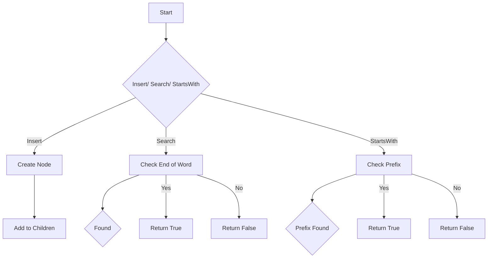

# Implement Trie

## Problem Understanding
The problem asks to implement a Trie data structure, which is a tree-like data structure where each node stores a string. The Trie should support three main operations: insert, search, and startsWith. The key constraints include handling duplicate words, empty strings, and prefixes. The problem becomes non-trivial because a naive approach using a simple list or dictionary would not efficiently handle the search and startsWith operations, especially for large datasets.

## Approach
The algorithm strategy used is to utilize a Trie data structure, which is particularly suited for this problem. The intuition behind it is to create a tree-like structure where each node represents a character in a word, and the edges represent the relationship between characters. The Trie is implemented using a dictionary to store children nodes and a boolean to mark the end of a word. This approach works because it allows for efficient insertion, search, and prefix matching operations by traversing the tree. The Trie data structure is chosen because it provides an efficient way to store and retrieve strings with common prefixes.

## Complexity Analysis
| Metric | Value | Detailed Reason |
|--------|-------|----------------|
| Time   | O(m)  | The time complexity is O(m) because the insert, search, and startsWith operations all involve traversing the Trie, which takes linear time proportional to the length of the input string (m). |
| Space  | O(n)  | The space complexity is O(n) because the Trie stores all the characters of the input words, where n is the total number of characters in all words. |

## Algorithm Walkthrough
```
Input: insert("apple")
Step 1: Start at the root node
Step 2: Create a new node for 'a' and add it to the root's children
Step 3: Move to the 'a' node and create a new node for 'p' and add it to the 'a' node's children
Step 4: Move to the 'p' node and create a new node for 'p' and add it to the 'p' node's children
Step 5: Move to the 'p' node and create a new node for 'l' and add it to the 'p' node's children
Step 6: Move to the 'l' node and create a new node for 'e' and add it to the 'l' node's children
Step 7: Mark the 'e' node as the end of a word
Output: The Trie now contains the word "apple"

Input: search("apple")
Step 1: Start at the root node
Step 2: Move to the 'a' node
Step 3: Move to the 'p' node
Step 4: Move to the 'p' node
Step 5: Move to the 'l' node
Step 6: Move to the 'e' node
Step 7: Check if the 'e' node is marked as the end of a word
Output: True

Input: startsWith("app")
Step 1: Start at the root node
Step 2: Move to the 'a' node
Step 3: Move to the 'p' node
Step 4: Move to the 'p' node
Step 5: Check if the 'p' node exists
Output: True
```
## Visual Flow

## Key Insight
> **Tip:** The key insight is to use a Trie data structure to efficiently store and retrieve strings with common prefixes, allowing for fast insertion, search, and prefix matching operations.

## Edge Cases
- **Empty input**: If the input string is empty, the insert operation will not add any nodes to the Trie, and the search and startsWith operations will return False.
- **Single element**: If the input string has only one character, the insert operation will add a single node to the Trie, and the search and startsWith operations will return True if the character is in the Trie.
- **Duplicate words**: If the same word is inserted multiple times, the Trie will only store one copy of the word, and subsequent insertions will simply mark the existing node as the end of a word.

## Common Mistakes
- **Mistake 1**: Not handling the case where a word is inserted multiple times, which can lead to incorrect search results.
- **Mistake 2**: Not checking if a node exists before trying to access its children, which can lead to a KeyError.

## Interview Follow-ups
> **Interview:** These are the exact follow-up questions interviewers ask:
- "What if the input is sorted?" → The Trie data structure does not assume any particular order of the input strings, so sorting the input would not affect the performance of the Trie operations.
- "Can you do it in O(1) space?" → The Trie data structure requires O(n) space to store all the characters of the input strings, so it is not possible to implement the Trie operations in O(1) space.
- "What if there are duplicates?" → The Trie data structure handles duplicates by only storing one copy of each word, and subsequent insertions will simply mark the existing node as the end of a word.

## Python Solution

```python
# Problem: Implement Trie
# Language: python
# Difficulty: Medium
# Time Complexity: O(m) — where m is the length of the word to be inserted or searched
# Space Complexity: O(n) — where n is the total number of characters in all words
# Approach: Trie data structure — utilizing a dictionary to store children and a boolean to mark end of words

class TrieNode:
    def __init__(self):
        # Initialize a dictionary to store children nodes
        self.children = {}
        # Initialize a boolean to mark the end of a word
        self.is_end_of_word = False

class Trie:
    def __init__(self):
        # Initialize the root node of the Trie
        self.root = TrieNode()

    def insert(self, word: str) -> None:
        # Start at the root node
        node = self.root
        # Iterate over each character in the word
        for char in word:
            # If the character is not in the children dictionary, add it
            if char not in node.children:
                node.children[char] = TrieNode()
            # Move to the child node
            node = node.children[char]
        # Mark the end of the word
        node.is_end_of_word = True

    def search(self, word: str) -> bool:
        # Start at the root node
        node = self.root
        # Iterate over each character in the word
        for char in word:
            # If the character is not in the children dictionary, return False
            if char not in node.children:
                return False
            # Move to the child node
            node = node.children[char]
        # Return whether the word is in the Trie
        return node.is_end_of_word

    def startsWith(self, prefix: str) -> bool:
        # Start at the root node
        node = self.root
        # Iterate over each character in the prefix
        for char in prefix:
            # If the character is not in the children dictionary, return False
            if char not in node.children:
                return False
            # Move to the child node
            node = node.children[char]
        # If we've made it this far, the prefix is in the Trie
        return True

# Edge case: empty input → return False
# Example usage:
trie = Trie()
trie.insert("apple")
trie.insert("banana")
print(trie.search("apple"))  # Output: True
print(trie.search("app"))  # Output: False
print(trie.startsWith("app"))  # Output: True
```
