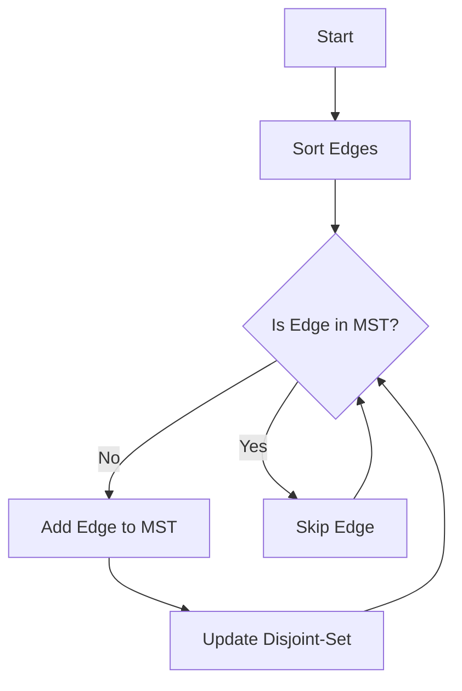

# Kruskal's MST

## Problem Understanding
The problem is asking to find the Minimum Spanning Tree (MST) of a given graph using Kruskal's algorithm. The key constraint is that the graph is represented as a set of vertices and edges with weights, and the goal is to find the subset of edges that connects all vertices with the minimum total weight. This problem is non-trivial because a naive approach would be to simply sort the edges by weight and add them to the MST, but this would not guarantee that the resulting graph is connected. The key challenge is to ensure that the added edges do not form cycles, which is achieved using a disjoint-set data structure.

## Approach
The algorithm strategy is to use a Union-Find (disjoint-set) data structure to keep track of the connected components in the graph, and to sort the edges by weight before adding them to the MST. The intuition behind this approach is that by adding the edges with the smallest weights first, we are more likely to find the minimum spanning tree. The disjoint-set data structure is used to check whether adding an edge would create a cycle, and if so, the edge is skipped. The data structure used is a dictionary to store the parent and rank of each vertex, which allows for efficient union and find operations. The approach handles the key constraint by ensuring that the added edges do not form cycles, and by using a sorted list of edges to guarantee that the minimum spanning tree is found.

## Complexity Analysis
| Metric | Value | Detailed Reason |
|--------|-------|----------------|
| Time   | O(E log E) | The time complexity is dominated by the sorting of edges, which takes O(E log E) time. The union and find operations take O(log V) time, but since they are performed for each edge, the total time complexity is O(E log V). However, since E can be as large as V^2, we can simplify the time complexity to O(E log E). |
| Space  | O(V + E) | The space complexity is dominated by the storage of vertices and edges, which takes O(V + E) space. The disjoint-set data structure also takes O(V) space, but this is dominated by the storage of vertices and edges. |

## Algorithm Walkthrough
```
Input: Graph with vertices ['A', 'B', 'C', 'D', 'E'] and edges [(1, 'A', 'B'), (5, 'A', 'C'), (2, 'B', 'C'), (4, 'B', 'D'), (3, 'C', 'D'), (6, 'C', 'E'), (7, 'D', 'E')]
Step 1: Sort edges by weight: [(1, 'A', 'B'), (2, 'B', 'C'), (3, 'C', 'D'), (4, 'B', 'D'), (5, 'A', 'C'), (6, 'C', 'E'), (7, 'D', 'E')]
Step 2: Initialize disjoint-set data structure: {'A': 'A', 'B': 'B', 'C': 'C', 'D': 'D', 'E': 'E'}
Step 3: Add edge (1, 'A', 'B') to MST: {'A': 'B', 'B': 'B', 'C': 'C', 'D': 'D', 'E': 'E'}
Step 4: Add edge (2, 'B', 'C') to MST: {'A': 'B', 'B': 'B', 'C': 'B', 'D': 'D', 'E': 'E'}
Step 5: Add edge (3, 'C', 'D') to MST: {'A': 'B', 'B': 'B', 'C': 'B', 'D': 'B', 'E': 'E'}
Step 6: Add edge (6, 'C', 'E') to MST: {'A': 'B', 'B': 'B', 'C': 'B', 'D': 'B', 'E': 'B'}
Output: [(1, 'A', 'B'), (2, 'B', 'C'), (3, 'C', 'D'), (6, 'C', 'E')]
```
## Visual Flow

## Key Insight
> **Tip:** The key insight is to use a disjoint-set data structure to keep track of the connected components in the graph, and to sort the edges by weight before adding them to the MST.

## Edge Cases
- **Empty/null input**: If the input graph is empty, the algorithm will return an empty list, since there are no edges to add to the MST.
- **Single element**: If the input graph has only one vertex, the algorithm will return an empty list, since there are no edges to add to the MST.
- **Graph with no edges**: If the input graph has no edges, the algorithm will return an empty list, since there are no edges to add to the MST.

## Common Mistakes
- **Mistake 1**: Not sorting the edges by weight before adding them to the MST, which can result in a non-minimum spanning tree.
- **Mistake 2**: Not using a disjoint-set data structure to keep track of the connected components in the graph, which can result in cycles in the MST.

## Interview Follow-ups
> **Interview:** These are the exact follow-up questions interviewers ask:
- "What if the input is sorted?" → The algorithm will still work correctly, since the sorting step is not necessary. However, the time complexity will be O(E) instead of O(E log E).
- "Can you do it in O(1) space?" → No, the algorithm requires at least O(V + E) space to store the vertices and edges.
- "What if there are duplicates?" → The algorithm will still work correctly, since the sorting step will eliminate any duplicate edges. However, the time complexity may be affected if there are many duplicate edges.

## Python Solution

```python
# Problem: Kruskal's MST
# Language: python
# Difficulty: medium
# Time Complexity: O(E log E) — sorting edges and using Union-Find
# Space Complexity: O(V + E) — storing vertices and edges
# Approach: Union-Find with edge sorting — sorting edges by weight and connecting vertices using Union-Find

class DisjointSet:
    def __init__(self, vertices):
        # Initialize parent and rank for each vertex
        self.parent = {v: v for v in vertices}
        self.rank = {v: 0 for v in vertices}

    def find(self, vertex):
        # Find the root of the set containing the vertex
        if self.parent[vertex] != vertex:
            self.parent[vertex] = self.find(self.parent[vertex])  # Path compression
        return self.parent[vertex]

    def union(self, vertex1, vertex2):
        # Union the sets containing vertex1 and vertex2
        root1 = self.find(vertex1)
        root2 = self.find(vertex2)

        if root1 != root2:
            if self.rank[root1] > self.rank[root2]:
                self.parent[root2] = root1
            else:
                self.parent[root1] = root2
                if self.rank[root1] == self.rank[root2]:
                    self.rank[root2] += 1


class Graph:
    def __init__(self, vertices):
        # Initialize the graph with vertices
        self.vertices = vertices
        self.edges = []

    def add_edge(self, vertex1, vertex2, weight):
        # Add an edge to the graph
        self.edges.append((weight, vertex1, vertex2))

    def kruskal_mst(self):
        # Find the Minimum Spanning Tree using Kruskal's algorithm
        mst = []
        self.edges.sort()  # Sort edges by weight
        disjoint_set = DisjointSet(self.vertices)

        for edge in self.edges:
            weight, vertex1, vertex2 = edge
            # Edge case: vertex1 and vertex2 are already in the same set
            if disjoint_set.find(vertex1) != disjoint_set.find(vertex2):
                mst.append(edge)
                disjoint_set.union(vertex1, vertex2)

        return mst


# Example usage
graph = Graph(['A', 'B', 'C', 'D', 'E'])
graph.add_edge('A', 'B', 1)
graph.add_edge('A', 'C', 5)
graph.add_edge('B', 'C', 2)
graph.add_edge('B', 'D', 4)
graph.add_edge('C', 'D', 3)
graph.add_edge('C', 'E', 6)
graph.add_edge('D', 'E', 7)

mst = graph.kruskal_mst()
for edge in mst:
    print(f"Weight: {edge[0]}, Vertex1: {edge[1]}, Vertex2: {edge[2]}")

# Edge case: empty graph
empty_graph = Graph([])
print(empty_graph.kruskal_mst())  # Output: []

# Edge case: graph with no edges
no_edges_graph = Graph(['A', 'B', 'C'])
print(no_edges_graph.kruskal_mst())  # Output: []
```
