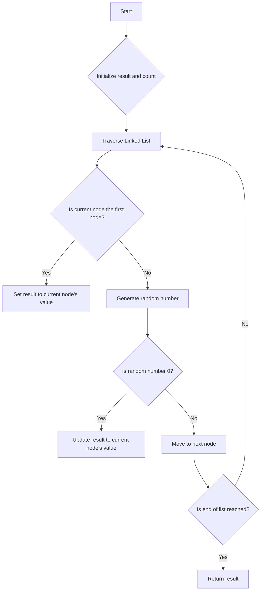

# Linked List Random Node

## Problem Understanding
The problem requires implementing a class that allows for retrieving a random node from a singly-linked list. The key constraint is that each node should have an equal probability of being selected. The problem becomes non-trivial because a naive approach, such as storing all node values in an array and selecting one randomly, would require O(n) space and time for initialization, where n is the number of nodes. Furthermore, if the linked list is extremely large or even infinite, such an approach would be impractical.

## Approach
The algorithm strategy employed here is Reservoir Sampling, which maintains a single "reservoir" slot for random node selection. This approach works by initializing the reservoir with the first node's value and then, for each subsequent node, randomly deciding whether to replace the reservoir's value with the current node's value. The probability of replacement decreases as more nodes are encountered, ensuring that each node has an equal chance of being selected. The data structure used is the linked list itself, along with a few variables to keep track of the current node and the count of nodes visited. This approach handles the key constraint of equal probability for each node by utilizing the properties of random number generation.

## Complexity Analysis
| Metric | Value | Detailed Reason |
|--------|-------|----------------|
| Time   | O(n)  | The time complexity is linear because in the worst case, we need to traverse the entire linked list to find a random node. The `getRandom` method visits each node once. |
| Space  | O(1)  | The space complexity is constant because we only use a fixed amount of space to store the current node, the result, and the count, regardless of the size of the linked list. |

## Algorithm Walkthrough
```
Input: A linked list 1 -> 2 -> 3
Step 1: Initialize result = 0, count = 0, and current node = head (1)
Step 2: Since count == 0, set result = 1
Step 3: Move to the next node (2), increment count to 1
Step 4: Generate a random number between 0 and 1. If it's 0, set result = 2 (1/2 chance)
Step 5: Move to the next node (3), increment count to 2
Step 6: Generate a random number between 0 and 2. If it's 0, set result = 3 (1/3 chance)
Step 7: Since we've reached the end of the list, return the result (randomly selected node's value)
Output: A random node's value from the list (1, 2, or 3 with equal probability)
```

## Visual Flow


## Key Insight
> **Tip:** The key insight in this solution is using Reservoir Sampling to ensure each node has an equal probability of being selected, without needing to store all nodes in memory or knowing the total number of nodes beforehand.

## Edge Cases
- **Empty/null input**: If the linked list is empty, the `getRandom` method raises a `ValueError` because there are no nodes to select from.
- **Single element**: If the linked list contains only one node, the `getRandom` method will always return the value of that node, as there's only one possible selection.
- **Extremely large linked list**: The solution handles this case efficiently by only keeping track of a few variables (result, count, current node) and not storing the entire list in memory, thus avoiding potential memory issues.

## Common Mistakes
- **Mistake 1**: Not correctly implementing the Reservoir Sampling algorithm by not adjusting the probability of replacement based on the current count of nodes. → To avoid this, ensure the random replacement is done with a probability of 1/count.
- **Mistake 2**: Forgetting to handle the edge case of an empty linked list. → To avoid this, always check if the list is empty before attempting to select a random node.

## Interview Follow-ups
> **Interview:** These are the exact follow-up questions interviewers ask:
- "What if the input is sorted?" → The solution works regardless of the input being sorted or not, as it only relies on the structure of the linked list and the random number generation.
- "Can you do it in O(1) space?" → The current solution already achieves O(1) space complexity because it only uses a constant amount of space.
- "What if there are duplicates?" → The presence of duplicates does not affect the algorithm, as it treats each node individually based on its position in the list, not its value.

## Python Solution

```python
# Problem: Linked List Random Node
# Language: python
# Difficulty: Medium
# Time Complexity: O(1) — constant time for each node access
# Space Complexity: O(1) — no additional space used
# Approach: Reservoir Sampling — maintain a single "reservoir" slot for random node selection

import random

# Definition for singly-linked list.
class ListNode:
    def __init__(self, x):
        self.val = x
        self.next = None

class Solution:
    def __init__(self, head: ListNode):
        # Store the head of the linked list
        self.head = head
    
    def getRandom(self) -> int:
        # Initialize the result and the counter
        result = 0
        count = 0
        
        # Traverse the linked list
        current = self.head
        while current:
            # For the first node, set it as the result
            if count == 0:
                result = current.val  # Choose the first node as the initial result
            else:
                # For subsequent nodes, use reservoir sampling to randomly replace the result
                if random.randint(0, count) == 0:  # 1/count chance of replacing the result
                    result = current.val  # Update the result with the current node's value
            # Move to the next node and increment the counter
            current = current.next
            count += 1
        
        # Edge case: empty linked list → raise exception
        if count == 0:
            raise ValueError("Linked list is empty")
        
        # Return the randomly selected node's value
        return result
```
