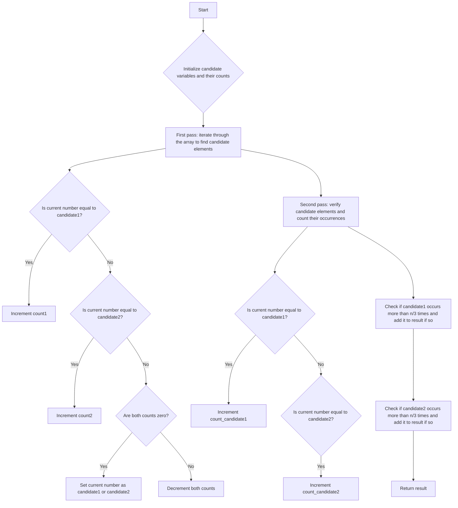

# Majority Element II

## Problem Understanding
The Majority Element II problem is asking to find all elements in an array that appear more than n/3 times, where n is the size of the array. The key constraint is that the solution should have a time complexity of O(n) and a space complexity of O(1). What makes this problem non-trivial is that a naive approach, such as sorting the array and then counting the occurrences of each element, would have a higher time complexity. The problem requires a more efficient algorithm to find the majority elements.

## Approach
The algorithm strategy used to solve this problem is an extension of the Boyer-Moore Voting Algorithm, which maintains two candidate variables for the majority elements. This approach works by essentially maintaining a counter for each candidate element. When the counter for a candidate element is zero, it is replaced with the current element. The algorithm then performs a second pass through the array to verify the candidate elements and count their occurrences. The mathematical reasoning behind this approach is that if an element occurs more than n/3 times, it is guaranteed to be one of the two candidate elements. The data structure used is a simple array to store the input elements, and two variables to store the candidate elements and their counts.

## Complexity Analysis
| Metric | Value | Detailed Reason |
|--------|-------|----------------|
| Time   | O(n)  | The algorithm makes two passes through the array: the first pass to find the candidate elements, and the second pass to verify the candidate elements and count their occurrences. The time complexity is linear because each pass takes O(n) time. |
| Space  | O(1)  | The algorithm uses a constant amount of space to store the candidate elements and their counts, regardless of the size of the input array. |

## Algorithm Walkthrough
```
Input: [3, 2, 3]
Step 1: Initialize candidate variables and their counts: count1 = 0, count2 = 0, candidate1 = 0, candidate2 = 1
Step 2: First pass: iterate through the array to find candidate elements
  - For num = 3: since count1 = 0, set candidate1 = 3, count1 = 1
  - For num = 2: since num != candidate1 and count1 != 0, decrement count1
  - For num = 3: since num == candidate1, increment count1
Step 3: Second pass: verify candidate elements and count their occurrences
  - For num = 3: increment count_candidate1
  - For num = 2: do nothing
  - For num = 3: increment count_candidate1
Step 4: Check if candidate1 occurs more than n/3 times and add it to result if so
  - Since count_candidate1 = 2 > len(nums) / 3, add candidate1 to result
Output: [3]
```

## Visual Flow


## Key Insight
> **Tip:** The key insight to this problem is that if an element occurs more than n/3 times, it is guaranteed to be one of the two candidate elements, which allows us to use the Boyer-Moore Voting Algorithm to find the majority elements in linear time.

## Edge Cases
- **Empty input**: If the input array is empty, the algorithm returns an empty list, as there are no elements to process.
- **Single element**: If the input array contains only one element, the algorithm returns a list containing that element, as it occurs more than n/3 times.
- **Duplicate elements**: If the input array contains duplicate elements, the algorithm correctly counts the occurrences of each element and returns the elements that occur more than n/3 times.

## Common Mistakes
- **Mistake 1**: Not initializing the candidate variables and their counts correctly, which can lead to incorrect results.
- **Mistake 2**: Not verifying the candidate elements and counting their occurrences correctly, which can lead to incorrect results.

## Interview Follow-ups
> **Interview:** These are the exact follow-up questions interviewers ask:
- "What if the input is sorted?" → The algorithm still works correctly, as it only relies on the relative frequencies of the elements, not their order.
- "Can you do it in O(1) space?" → The algorithm already uses O(1) space, as it only requires a constant amount of space to store the candidate elements and their counts.
- "What if there are duplicates?" → The algorithm correctly handles duplicates, as it counts the occurrences of each element and returns the elements that occur more than n/3 times.

## Python Solution

```python
# Problem: Majority Element II
# Language: python
# Difficulty: Medium
# Time Complexity: O(n) — single pass through array using Boyer-Moore Voting Algorithm
# Space Complexity: O(1) — constant space required for candidate variables
# Approach: Boyer-Moore Voting Algorithm extension — maintains two candidate variables for majority elements

class Solution:
    def majorityElement(self, nums: list[int]) -> list[int]:
        # Initialize candidate variables and their counts for Boyer-Moore Voting Algorithm
        count1, count2, candidate1, candidate2 = 0, 0, 0, 1
        
        # First pass: find two candidate elements
        for num in nums:
            # If current number matches candidate1, increment its count
            if num == candidate1:
                count1 += 1
            # If current number matches candidate2, increment its count
            elif num == candidate2:
                count2 += 1
            # If candidate1's count is zero, set current number as candidate1
            elif count1 == 0:
                candidate1, count1 = num, 1
            # If candidate2's count is zero, set current number as candidate2
            elif count2 == 0:
                candidate2, count2 = num, 1
            # If current number does not match either candidate, decrement both counts
            else:
                count1, count2 = count1 - 1, count2 - 1
        
        # Initialize lists to store counts of candidate elements
        count_candidate1, count_candidate2 = 0, 0
        
        # Edge case: empty input → return empty list
        if not nums:
            return []
        
        # Second pass: verify candidate elements and count their occurrences
        for num in nums:
            if num == candidate1:
                count_candidate1 += 1
            elif num == candidate2:
                count_candidate2 += 1
        
        # Initialize result list
        result = []
        
        # Check if candidate1 occurs more than n/3 times and add it to result if so
        if count_candidate1 > len(nums) / 3:
            result.append(candidate1)
        
        # Check if candidate2 occurs more than n/3 times and add it to result if so
        if count_candidate2 > len(nums) / 3:
            result.append(candidate2)
        
        return result
```
