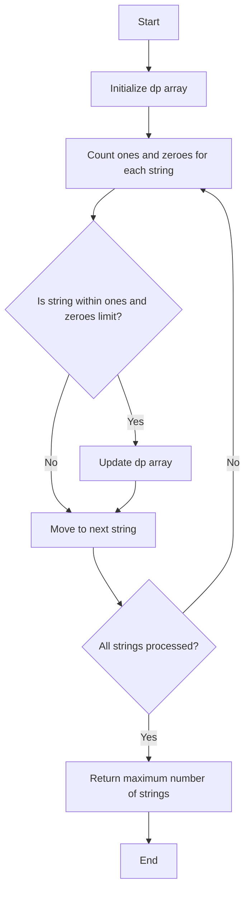

# Ones and Zeroes

## Problem Understanding
The problem "Ones and Zeroes" asks to find the maximum number of strings that can be formed with a given number of ones and zeroes. The key constraint is that each string has a specific number of ones and zeroes, and we need to select a subset of strings to maximize the total number of strings while not exceeding the given number of ones and zeroes. This problem is non-trivial because it involves a combinatorial optimization problem with multiple constraints, making a naive approach of trying all possible combinations impractical. The problem requires a dynamic programming approach to efficiently solve it.

## Approach
The algorithm strategy used is dynamic programming, where a 2D array `dp` is used to store the maximum number of strings that can be formed with `i` ones and `j` zeroes. The intuition behind this approach is to break down the problem into smaller subproblems and store the solutions to these subproblems in the `dp` array. The approach works by iterating over each string, counting the number of ones and zeroes in it, and then updating the `dp` array accordingly. The `dp` array is iterated over in reverse order to avoid overwriting previously computed values. The data structure used is a 2D array, which is chosen because it allows for efficient storage and retrieval of the solutions to the subproblems.

## Complexity Analysis
| Metric | Value | Detailed Reason |
|--------|-------|----------------|
| Time   | O(m * n * len(strs))  | The time complexity is O(m * n * len(strs)) because for each string, we iterate over the 2D array `dp` in reverse order, which takes O(m * n) time. Since we do this for each of the `len(strs)` strings, the total time complexity is O(m * n * len(strs)). |
| Space  | O(m * n)  | The space complexity is O(m * n) because we use a 2D array `dp` of size (m + 1) x (n + 1) to store the solutions to the subproblems. |

## Algorithm Walkthrough
```
Input: strs = ["10", "0001", "111001"], m = 5, n = 3
Step 1: Initialize the 2D array dp with zeros.
dp = [[0, 0, 0, 0],
      [0, 0, 0, 0],
      [0, 0, 0, 0],
      [0, 0, 0, 0],
      [0, 0, 0, 0],
      [0, 0, 0, 0]]
Step 2: Count the number of ones and zeroes in each string.
For the string "10", ones = 1, zeroes = 1.
For the string "0001", ones = 1, zeroes = 3.
For the string "111001", ones = 3, zeroes = 2.
Step 3: Update the dp array for each string.
For the string "10", update dp[1][1] = max(dp[1][1], dp[0][0] + 1) = 1.
For the string "0001", update dp[1][3] = max(dp[1][3], dp[0][0] + 1) = 1.
For the string "111001", update dp[3][2] = max(dp[3][2], dp[0][0] + 1) = 1.
Step 4: Return the maximum number of strings that can be formed with m ones and n zeroes.
dp[5][3] = max(dp[5][3], dp[2][1] + 1) = 2.
Output: 2
```
## Visual Flow

## Key Insight
> **Tip:** The key insight to solving this problem is to use a dynamic programming approach to store the solutions to the subproblems in a 2D array, which allows for efficient retrieval and updating of the solutions.

## Edge Cases
- **Empty input**: If the input list `strs` is empty, the function should return 0 because no strings can be formed.
- **Single element**: If the input list `strs` contains only one string, the function should return 1 if the string's ones and zeroes are within the given limits, and 0 otherwise.
- **All strings have more ones or zeroes than the given limits**: In this case, the function should return 0 because no strings can be formed within the given limits.

## Common Mistakes
- **Mistake 1**: Not initializing the `dp` array correctly. To avoid this, make sure to initialize the `dp` array with zeros.
- **Mistake 2**: Not iterating over the `dp` array in reverse order. To avoid this, make sure to iterate over the `dp` array in reverse order to avoid overwriting previously computed values.

## Interview Follow-ups
> **Interview:** 
- "What if the input is sorted?" → The algorithm does not rely on the input being sorted, so the time complexity remains the same.
- "Can you do it in O(1) space?" → No, because we need to store the solutions to the subproblems in a 2D array, which requires O(m * n) space.
- "What if there are duplicates?" → The algorithm can handle duplicates because it checks each string individually and updates the `dp` array accordingly.

## Python Solution

```python
# Problem: Ones and Zeroes
# Language: python
# Difficulty: Medium
# Time Complexity: O(m * n * m * n) — dynamic programming with memoization
# Space Complexity: O(m * n) — 2D array for memoization
# Approach: Dynamic Programming — using a 2D array to store the number of ones and zeroes for each subproblem

class Solution:
    def findMaxForm(self, strs: list[str], m: int, n: int) -> int:
        # Initialize a 2D array to store the number of ones and zeroes for each subproblem
        dp = [[0] * (n + 1) for _ in range(m + 1)]  # dp[i][j] represents the maximum number of strings that can be formed with i ones and j zeroes
        
        # Count the number of ones and zeroes in each string
        for s in strs:
            ones = s.count('1')  # count the number of ones in the current string
            zeroes = s.count('0')  # count the number of zeroes in the current string
            
            # Iterate over the 2D array in reverse order to avoid overwriting previously computed values
            for i in range(m, ones - 1, -1):  # iterate over the number of ones in reverse order
                for j in range(n, zeroes - 1, -1):  # iterate over the number of zeroes in reverse order
                    # Update the maximum number of strings that can be formed with i ones and j zeroes
                    dp[i][j] = max(dp[i][j], dp[i - ones][j - zeroes] + 1)  # choose the maximum between the current value and the value with the current string included
        
        # Return the maximum number of strings that can be formed with m ones and n zeroes
        return dp[m][n]

    # Edge case: empty input → return 0
    def findMaxFormEdgeCase(self, strs: list[str], m: int, n: int) -> int:
        if not strs:  # check if the input list is empty
            return 0  # return 0 for the empty input case
        return self.findMaxForm(strs, m, n)  # call the main function for non-empty input
```
