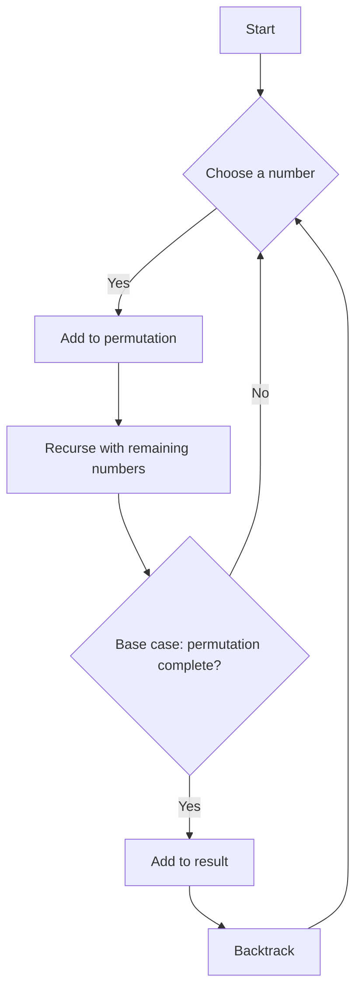

# Permutations and Combinations

## Problem Understanding
The problem involves generating all possible permutations and combinations of a given set of numbers. Permutations refer to the arrangement of objects in a specific order, while combinations refer to the selection of objects without considering their order. The problem requires us to develop algorithms to generate these permutations and combinations efficiently, considering constraints such as the input size and the desired length of the permutations or combinations. A naive approach to this problem would be to use brute force, but this would be inefficient for large inputs, as it would result in exponential time complexity.

## Approach
The algorithm strategy used to solve this problem involves backtracking recursion, which is a technique for exploring all possible solutions to a problem by building up a solution incrementally and backtracking when a dead end is reached. The intuition behind this approach is to start with an empty permutation or combination and add elements one by one, backtracking when a permutation or combination of the desired length is reached. This approach works because it ensures that all possible permutations and combinations are explored, and it does so in a way that avoids redundant computations. The data structures used in this approach are lists, which are chosen because they provide an efficient way to store and manipulate the permutations and combinations.

## Complexity Analysis
| Metric | Value | Detailed Reason |
|--------|-------|----------------|
| Time   | O(n*r) | The time complexity of the permute function is O(n*r) because in the worst-case scenario, we are generating all permutations of length r, where n is the number of elements in the input list. The time complexity of the combine function is also O(n*r) because we are generating all combinations of length r from a set of n elements. |
| Space  | O(n*r) | The space complexity of both functions is O(n*r) because in the worst-case scenario, we are storing all permutations or combinations of length r, which can be as many as n!/(n-r)! for permutations or nCr for combinations. |

## Algorithm Walkthrough
```
Input: [1, 2, 3] (for permute function)
Step 1: Initialize result list and start backtracking with an empty permutation and the input list
Step 2: Choose the first number (1), add it to the permutation, and recurse with the remaining numbers (2, 3)
Step 3: Choose the next number (2), add it to the permutation, and recurse with the remaining numbers (3)
Step 4: Choose the last number (3), add it to the permutation, and add the permutation to the result list
Step 5: Backtrack and explore other permutations
Output: [[1, 2, 3], [1, 3, 2], [2, 1, 3], [2, 3, 1], [3, 1, 2], [3, 2, 1]]
```

## Visual Flow


## Key Insight
> **Tip:** The key insight in this solution is to use backtracking recursion to efficiently explore all possible permutations and combinations, avoiding redundant computations and ensuring that all possible solutions are considered.

## Edge Cases
- **Empty input**: If the input list is empty, the permute function will return an empty list, and the combine function will also return an empty list because there are no elements to choose from.
- **Single element**: If the input list contains only one element, the permute function will return a list containing only that element, and the combine function will also return a list containing only that element if the desired length is 1.
- **Duplicate elements**: If the input list contains duplicate elements, the permute function will generate duplicate permutations, and the combine function will generate duplicate combinations.

## Common Mistakes
- **Mistake 1**: Failing to backtrack correctly, resulting in incorrect or incomplete results. To avoid this, ensure that the backtracking logic is correct and that all possible solutions are explored.
- **Mistake 2**: Not handling edge cases correctly, such as empty input or single-element input. To avoid this, add explicit checks for these cases and handle them accordingly.

## Interview Follow-ups
> **Interview:** These are the exact follow-up questions interviewers ask:
- "What if the input is sorted?" → The solution will still work correctly, but the output may be more predictable because the input is sorted.
- "Can you do it in O(1) space?" → No, it is not possible to generate all permutations or combinations in O(1) space because the output size can be exponential in the input size.
- "What if there are duplicates?" → The solution will generate duplicate permutations or combinations if there are duplicates in the input. To avoid this, you can modify the solution to skip duplicates or use a set to store unique permutations or combinations.

## Python Solution

```python
# Problem: Permutations and Combinations
# Language: python
# Difficulty: medium
# Time Complexity: O(n*r) — generating all permutations of length r
# Space Complexity: O(n*r) — storing all permutations of length r
# Approach: Backtracking recursion — exploring all possible combinations and permutations

class Solution:
    def permute(self, nums): 
        # Initialize result list to store permutations
        result = [] 
        # Define a helper function for backtracking
        def backtrack(current_permutation, remaining_nums):
            # Base case: if there are no more numbers to choose, add permutation to result
            if not remaining_nums: 
                result.append(current_permutation[:]) 
            else:
                # Iterate over all remaining numbers
                for i in range(len(remaining_nums)): 
                    # Choose the current number, add it to the permutation, and recurse
                    current_permutation.append(remaining_nums[i]) 
                    # Create a new list of remaining numbers by removing the chosen number
                    new_remaining_nums = remaining_nums[:i] + remaining_nums[i+1:] 
                    backtrack(current_permutation, new_remaining_nums) 
                    # Backtrack: remove the chosen number from the permutation
                    current_permutation.pop() 
        # Start the backtracking process with an empty permutation and the input list
        backtrack([], nums) 
        return result

    def combine(self, n, k):
        # Initialize result list to store combinations
        result = [] 
        # Define a helper function for backtracking
        def backtrack(current_combination, start_index):
            # Base case: if the combination has reached the desired length, add it to result
            if len(current_combination) == k: 
                result.append(current_combination[:]) 
            else:
                # Iterate over all possible numbers to choose
                for i in range(start_index, n + 1): 
                    # Choose the current number, add it to the combination, and recurse
                    current_combination.append(i) 
                    # Recurse with the next starting index
                    backtrack(current_combination, i + 1) 
                    # Backtrack: remove the chosen number from the combination
                    current_combination.pop() 
        # Start the backtracking process with an empty combination and a starting index of 1
        backtrack([], 1) 
        return result

    def test_permute(self):
        # Test the permute function with a sample input
        nums = [1, 2, 3]
        print("Permutations:", self.permute(nums))

    def test_combine(self):
        # Test the combine function with a sample input
        n = 4
        k = 2
        print("Combinations:", self.combine(n, k))

    def run(self):
        # Run the test cases
        self.test_permute()
        self.test_combine()

if __name__ == "__main__":
    solution = Solution()
    solution.run()
```
