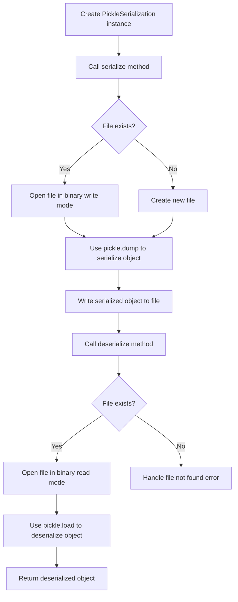

# Pickle module for object serialization

## Problem Understanding
The problem requires implementing object serialization using Python's Pickle module. Object serialization is the process of converting an object's state into a format that can be written to a file or transmitted over a network. The key constraint is to use the Pickle module, which is a built-in Python module for object serialization. What makes this problem non-trivial is handling potential exceptions and edge cases, such as file not found or corrupted data, while ensuring the serialized object can be successfully deserialized back into its original form.

## Approach
The algorithm strategy is to utilize the Pickle module's `dump` and `load` functions to serialize and deserialize objects, respectively. This approach works because the Pickle module can handle a wide range of Python object types, including custom class instances. The `serialize` method writes the object to a binary file using `pickle.dump`, while the `deserialize` method reads the object from the file using `pickle.load`. The `PickleSerialization` class encapsulates the serialization and deserialization logic, providing a simple interface for users to serialize and deserialize objects. The approach handles key constraints by using try-except blocks to catch and handle any exceptions that occur during serialization or deserialization.

## Complexity Analysis
| Metric | Value | Detailed Reason |
|--------|-------|----------------|
| Time   | O(n)  | The time complexity is O(n), where n is the size of the object being serialized or deserialized. This is because the Pickle module needs to traverse the entire object graph to serialize or deserialize it. The `pickle.dump` and `pickle.load` functions have a linear time complexity with respect to the size of the object. |
| Space  | O(n)  | The space complexity is O(n), where n is the size of the object being serialized. This is because the serialized object is stored in a binary file, which requires additional space proportional to the size of the object. The `PickleSerialization` class itself has a constant space complexity, but the serialized object dominates the space usage. |

## Algorithm Walkthrough
```
Input: obj = {"name": "John", "age": 30, "city": "New York"}
Step 1: Create a PickleSerialization instance with a filename, e.g., "serialized_obj.pkl"
Step 2: Call the serialize method, passing the object as an argument
Step 3: The serialize method opens the file in binary write mode and uses pickle.dump to serialize the object
Step 4: The serialized object is written to the file
Step 5: Call the deserialize method to retrieve the deserialized object
Step 6: The deserialize method opens the file in binary read mode and uses pickle.load to deserialize the object
Step 7: The deserialized object is returned
Output: deserialized_obj = {"name": "John", "age": 30, "city": "New York"}
```
This walkthrough demonstrates the basic usage of the `PickleSerialization` class for serializing and deserializing a Python object.

## Visual Flow

This flowchart illustrates the main decision paths and operations involved in serializing and deserializing objects using the `PickleSerialization` class.

## Key Insight
> **Tip:** The Pickle module can handle a wide range of Python object types, but it's essential to ensure that the object being serialized is compatible with the Pickle module to avoid errors during deserialization.

## Edge Cases
- **Empty/null input**: If the input object is empty or null, the `serialize` method will still write an empty or null object to the file, which can be successfully deserialized back into its original form. However, the `deserialize` method will return `None` if the file does not exist or is empty.
- **Single element**: If the input object is a single element, such as an integer or a string, the `serialize` method will still write the object to the file, and the `deserialize` method will return the original object.
- **File not found**: If the file specified in the `PickleSerialization` instance does not exist, the `deserialize` method will handle the file not found error and return `None`.

## Common Mistakes
- **Mistake 1**: Not handling exceptions during serialization or deserialization. To avoid this, use try-except blocks to catch and handle any exceptions that occur during these operations.
- **Mistake 2**: Not checking if the file exists before attempting to deserialize an object. To avoid this, use the `os.path.exists` function to check if the file exists before calling the `deserialize` method.

## Interview Follow-ups
> **Interview:** These are the exact follow-up questions interviewers ask:
- "What if the input is sorted?" → The Pickle module does not rely on the input being sorted, so this does not affect the serialization or deserialization process.
- "Can you do it in O(1) space?" → No, the Pickle module requires additional space to store the serialized object, so achieving O(1) space complexity is not possible with this approach.
- "What if there are duplicates?" → The Pickle module can handle duplicate objects, and the `deserialize` method will return the original objects with their duplicate values intact.

## Python Solution

```python
# Problem: Pickle module for object serialization
# Language: python
# Difficulty: medium
# Time Complexity: O(n) — time taken to serialize/deserialize object
# Space Complexity: O(n) — space used to store the serialized object
# Approach: Pickle module — for object serialization/deserialization

import pickle
import os

class PickleSerialization:
    def __init__(self, filename):
        # Initialize the filename for serialization/deserialization
        self.filename = filename

    def serialize(self, obj):
        # Serialize the object and write it to the file
        try:
            # Open the file in binary write mode
            with open(self.filename, 'wb') as file:
                # Use pickle.dump to serialize the object
                pickle.dump(obj, file)
            return True  # Return True to indicate successful serialization
        except Exception as e:
            # Handle any exceptions that occur during serialization
            print(f"Error serializing object: {str(e)}")
            return False  # Return False to indicate failed serialization

    def deserialize(self):
        # Deserialize the object from the file
        try:
            # Check if the file exists
            if not os.path.exists(self.filename):
                # Edge case: file does not exist
                print("File does not exist")
                return None
            # Open the file in binary read mode
            with open(self.filename, 'rb') as file:
                # Use pickle.load to deserialize the object
                obj = pickle.load(file)
            return obj  # Return the deserialized object
        except Exception as e:
            # Handle any exceptions that occur during deserialization
            print(f"Error deserializing object: {str(e)}")
            return None  # Return None to indicate failed deserialization

# Example usage:
if __name__ == "__main__":
    # Create a sample object
    obj = {
        "name": "John",
        "age": 30,
        "city": "New York"
    }
    
    # Create a PickleSerialization instance
    serializer = PickleSerialization("serialized_obj.pkl")
    
    # Serialize the object
    if serializer.serialize(obj):
        print("Object serialized successfully")
    else:
        print("Error serializing object")
    
    # Deserialize the object
    deserialized_obj = serializer.deserialize()
    if deserialized_obj:
        print("Deserialized object:", deserialized_obj)
    else:
        print("Error deserializing object")
```
