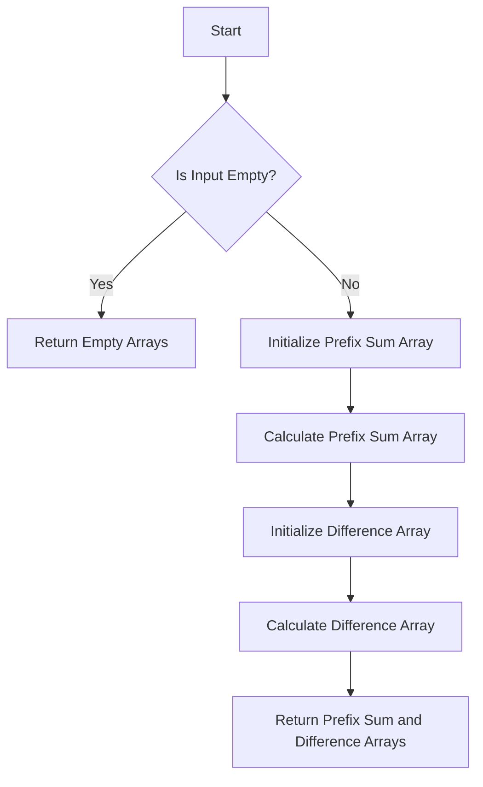

# Prefix Sum and Difference Array

## Problem Understanding
The problem requires calculating the prefix sum and difference array for a given input array of integers. The prefix sum array is an array where each element at index `i` is the sum of all elements in the input array up to index `i`. The difference array is an array where each element at index `i` is the difference between the element at index `i` and the element at index `i-1` in the input array. The key constraint is that the input array can be empty, and the problem becomes non-trivial when trying to handle edge cases such as empty input or single-element input.

## Approach
The algorithm strategy is to iterate through the input array to calculate the prefix sum and difference arrays. The intuition behind this approach is that the prefix sum at each index can be calculated by adding the current element to the prefix sum of the previous index, and the difference at each index can be calculated by subtracting the previous element from the current element. The approach uses two separate arrays to store the prefix sum and difference arrays, which are initialized with the same length as the input array. This approach works because it takes advantage of the fact that the prefix sum and difference arrays can be calculated in a single pass through the input array.

## Complexity Analysis
| Metric | Value | Detailed Reason |
|--------|-------|----------------|
| Time   | O(n)  | The algorithm iterates through the input array twice: once to calculate the prefix sum array and once to calculate the difference array. Each iteration takes O(n) time, resulting in a total time complexity of O(n) + O(n) = O(2n), which simplifies to O(n). |
| Space  | O(n)  | The algorithm uses two additional arrays to store the prefix sum and difference arrays, each with the same length as the input array. This results in a space complexity of O(n) + O(n) = O(2n), which simplifies to O(n). |

## Algorithm Walkthrough
```
Input: [1, 2, 3, 4, 5]
Step 1: Initialize prefix sum array: [0, 0, 0, 0, 0]
Step 2: Calculate prefix sum array:
  - prefix_sum[0] = 1
  - prefix_sum[1] = prefix_sum[0] + 2 = 1 + 2 = 3
  - prefix_sum[2] = prefix_sum[1] + 3 = 3 + 3 = 6
  - prefix_sum[3] = prefix_sum[2] + 4 = 6 + 4 = 10
  - prefix_sum[4] = prefix_sum[3] + 5 = 10 + 5 = 15
Step 3: Initialize difference array: [0, 0, 0, 0, 0]
Step 4: Calculate difference array:
  - difference_array[0] = 1
  - difference_array[1] = 2 - 1 = 1
  - difference_array[2] = 3 - 2 = 1
  - difference_array[3] = 4 - 3 = 1
  - difference_array[4] = 5 - 4 = 1
Output: Prefix Sum: [1, 3, 6, 10, 15], Difference Array: [1, 1, 1, 1, 1]
```

## Visual Flow


## Key Insight
> **Tip:** The key insight is that both the prefix sum and difference arrays can be calculated in a single pass through the input array, allowing for an efficient solution with a time complexity of O(n).

## Edge Cases
- **Empty/null input**: If the input array is empty, the algorithm returns two empty arrays. This is because there are no elements to calculate the prefix sum or difference from.
- **Single element**: If the input array contains only one element, the prefix sum array will contain the same element, and the difference array will contain the same element as the first element (since there is no previous element to calculate the difference from).
- **Input array with duplicate elements**: If the input array contains duplicate elements, the prefix sum array will still be calculated correctly, and the difference array will contain zeros for the duplicate elements (since the difference between the same elements is zero).

## Common Mistakes
- **Mistake 1**: Not handling the edge case where the input array is empty. To avoid this, always check if the input array is empty before attempting to calculate the prefix sum and difference arrays.
- **Mistake 2**: Not initializing the prefix sum and difference arrays correctly. To avoid this, make sure to initialize the arrays with the correct length and values.

## Interview Follow-ups
> **Interview:** These are the exact follow-up questions interviewers ask:
- "What if the input is sorted?" → The algorithm will still work correctly, but the difference array may contain more zeros if the input array is sorted in ascending or descending order.
- "Can you do it in O(1) space?" → No, the algorithm requires at least O(n) space to store the prefix sum and difference arrays.
- "What if there are duplicates?" → The algorithm will still work correctly, and the difference array will contain zeros for the duplicate elements.

## Python Solution

```python
# Problem: Prefix Sum and Difference Array
# Language: python
# Difficulty: Medium
# Time Complexity: O(n) — calculating prefix sum and difference array requires single pass through input array
# Space Complexity: O(n) — storing prefix sum and difference arrays requires additional space
# Approach: prefix sum calculation and difference array construction — iterating through input array to calculate prefix sum and difference array

class Solution:
    def getPrefixSum(self, nums):  # calculating prefix sum array
        prefix_sum = [0] * len(nums)  # initializing prefix sum array
        prefix_sum[0] = nums[0]  # base case: first element is same as prefix sum
        for i in range(1, len(nums)):  # iterating through input array
            prefix_sum[i] = prefix_sum[i - 1] + nums[i]  # calculating prefix sum
        return prefix_sum

    def getDifferenceArray(self, nums):  # calculating difference array
        difference_array = [0] * len(nums)  # initializing difference array
        difference_array[0] = nums[0]  # base case: first element is same as difference array
        for i in range(1, len(nums)):  # iterating through input array
            difference_array[i] = nums[i] - nums[i - 1]  # calculating difference
        return difference_array

    def main(self, nums):  # main function
        if not nums:  # Edge case: empty input → return empty arrays
            return [], []
        prefix_sum = self.getPrefixSum(nums)  # calculating prefix sum array
        difference_array = self.getDifferenceArray(nums)  # calculating difference array
        return prefix_sum, difference_array

# Example usage:
if __name__ == "__main__":
    solution = Solution()
    nums = [1, 2, 3, 4, 5]
    prefix_sum, difference_array = solution.main(nums)
    print("Prefix Sum:", prefix_sum)
    print("Difference Array:", difference_array)
```
