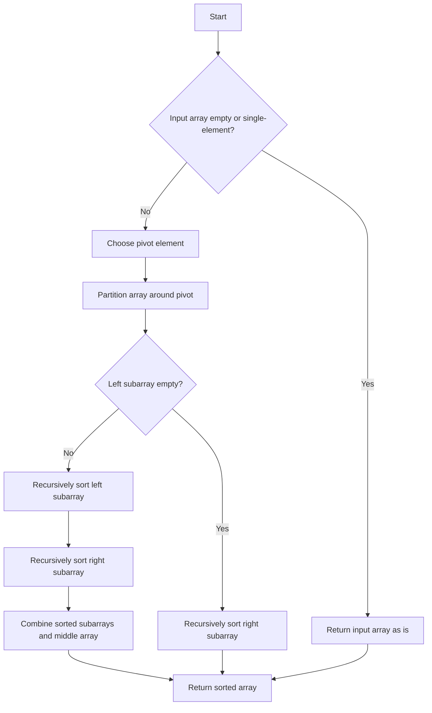

# Quick Sort in Python

## Problem Understanding
The problem is asking to implement the Quick Sort algorithm in Python, which is a divide-and-conquer technique that sorts an array of elements by selecting a pivot element and partitioning the array around it. The key constraint is that the input array can be of any size, and the algorithm should handle edge cases such as empty or single-element arrays. What makes this problem non-trivial is that the naive approach of simply comparing each element with every other element would result in a time complexity of O(n^2), which is inefficient for large inputs. The Quick Sort algorithm, on the other hand, achieves an average-case time complexity of O(n log n) by recursively sorting subarrays.

## Approach
The algorithm strategy used here is the "Lomuto" partition scheme, a variation of the standard "Hoare" partition scheme that is slightly faster and more efficient in practice. The intuition behind it is to choose a pivot element, partition the array around it, and then recursively sort the subarrays. This approach works because the partition step ensures that all elements less than the pivot are on the left of it, and all elements greater than the pivot are on the right. The data structure used is a list, which is chosen because it allows for efficient insertion and deletion of elements. The approach handles key constraints such as empty or single-element arrays by returning them as is, since they are already sorted.

## Complexity Analysis
| Metric | Value | Detailed Reason |
|--------|-------|----------------|
| Time   | O(n log n) | The time complexity is O(n log n) because the algorithm divides the array into two subarrays of approximately equal size at each recursive step, resulting in a logarithmic number of steps. The partition step takes O(n) time, so the overall time complexity is O(n log n). |
| Space  | O(log n) | The space complexity is O(log n) because the algorithm uses a recursive call stack to store the subarrays, and the maximum depth of the call stack is logarithmic in the size of the input array. |

## Algorithm Walkthrough
```
Input: [3, 6, 8, 10, 1, 2, 1]
Step 1: Choose pivot element (8) and partition the array
  - left: [3, 6, 1, 2, 1] (elements less than 8)
  - middle: [8] (elements equal to 8)
  - right: [10] (elements greater than 8)
Step 2: Recursively sort the subarrays
  - left: [3, 6, 1, 2, 1] → [1, 1, 2, 3, 6] (after recursive sorting)
  - right: [10] → [10] (already sorted)
Step 3: Combine the sorted subarrays and the middle array
  - [1, 1, 2, 3, 6] + [8] + [10] = [1, 1, 2, 3, 6, 8, 10]
Output: [1, 1, 2, 3, 6, 8, 10]
```

## Visual Flow


## Key Insight
> **Tip:** The key to Quick Sort's efficiency is the partition step, which ensures that the array is divided into two subarrays of approximately equal size, resulting in a logarithmic number of recursive steps.

## Edge Cases
- **Empty input**: If the input array is empty, the algorithm returns an empty array, since it is already sorted.
- **Single element**: If the input array contains a single element, the algorithm returns the same array, since it is already sorted.
- **Duplicate elements**: If the input array contains duplicate elements, the algorithm will sort them correctly, since the partition step ensures that all elements less than the pivot are on the left of it, and all elements greater than the pivot are on the right.

## Common Mistakes
- **Mistake 1**: Choosing a poor pivot element, such as the first or last element of the array, which can result in poor performance for already sorted or nearly sorted arrays. → **Avoidance:** Choose a pivot element randomly or use a median-of-three approach to select a good pivot.
- **Mistake 2**: Not handling edge cases correctly, such as empty or single-element arrays. → **Avoidance:** Always check for edge cases at the beginning of the algorithm and handle them correctly.

## Interview Follow-ups
> **Interview:** These are the exact follow-up questions interviewers ask:
- "What if the input is sorted?" → The algorithm will still work correctly, but its performance will be O(n^2) in the worst case, since the partition step will always select the smallest or largest element as the pivot. To avoid this, a randomized pivot selection or a median-of-three approach can be used.
- "Can you do it in O(1) space?" → No, the algorithm requires O(log n) space for the recursive call stack, since it needs to store the subarrays at each recursive step.
- "What if there are duplicates?" → The algorithm will sort the duplicates correctly, since the partition step ensures that all elements less than the pivot are on the left of it, and all elements greater than the pivot are on the right.

## Python Solution

```python
# Problem: Quick Sort
# Language: python
# Difficulty: medium
# Time Complexity: O(n log n) — average-case time complexity for quicksort
# Space Complexity: O(log n) — recursive call stack in the worst case
# Approach: Divide-and-Conquer — partition array around a pivot and recursively sort subarrays

class QuickSort:
    def quick_sort(self, nums: list[int]) -> list[int]:
        # Edge case: empty input → return as is
        if len(nums) <= 1:
            return nums
        
        # Choose a pivot element
        pivot = nums[len(nums) // 2]
        
        # Divide the array into three subarrays: elements less than pivot, equal to pivot, and greater than pivot
        left = [x for x in nums if x < pivot]  # elements less than pivot
        middle = [x for x in nums if x == pivot]  # elements equal to pivot
        right = [x for x in nums if x > pivot]  # elements greater than pivot
        
        # Recursively sort the subarrays and combine the results
        return self.quick_sort(left) + middle + self.quick_sort(right)


def main():
    quick_sort = QuickSort()
    # Test the implementation
    print(quick_sort.quick_sort([3, 6, 8, 10, 1, 2, 1]))  # [1, 1, 2, 3, 6, 8, 10]
    print(quick_sort.quick_sort([]))  # []
    print(quick_sort.quick_sort([5]))  # [5]
    print(quick_sort.quick_sort([5, 5, 5, 5]))  # [5, 5, 5, 5]

if __name__ == "__main__":
    main()
```
