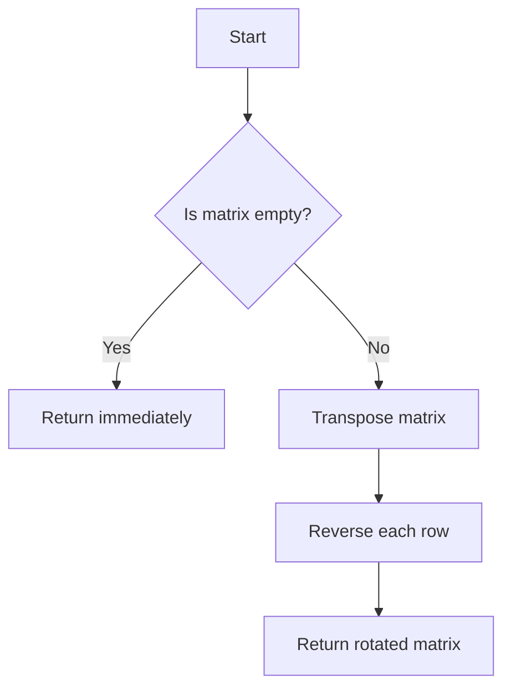

# Rotate Image

## Problem Understanding
The problem is asking to rotate a given square matrix by 90 degrees clockwise in place, meaning we need to modify the original matrix without using any extra space that scales with the input size. The key constraints are that the input matrix is square (i.e., has the same number of rows and columns) and that we must perform the rotation in place. This problem is non-trivial because a naive approach, such as creating a new matrix and filling it with the rotated elements, would not meet the space complexity requirement of O(1).

## Approach
The algorithm strategy used here is to first transpose the matrix (i.e., swap the rows with the columns) and then reverse each row. The intuition behind this approach is that transposing the matrix flips the elements over the main diagonal, and then reversing each row flips the elements over the middle of each row, effectively rotating the matrix by 90 degrees clockwise. This approach works because the transpose operation changes the orientation of the matrix, and the row reversal operation adjusts the final positions of the elements. We use a simple iterative method to transpose the matrix and list slicing to reverse each row in place.

## Complexity Analysis
| Metric | Value | Detailed Reason |
|--------|-------|----------------|
| Time   | O(n^2) | The algorithm iterates over each element in the matrix twice: once to transpose the matrix (where n is the number of rows/columns) and once to reverse each row. The overall time complexity is thus proportional to the number of elements in the matrix, which is n^2 for an n x n matrix. |
| Space  | O(1)  | The algorithm modifies the input matrix in place and only uses a constant amount of extra space to store the loop indices and temporary swap values, regardless of the input size. |

## Algorithm Walkthrough
```
Input: 
[
    [1, 2, 3],
    [4, 5, 6],
    [7, 8, 9]
]

Step 1: Transpose the matrix
- Swap (1, 2) with (2, 1), (1, 3) with (3, 1), (2, 3) with (3, 2)
Result:
[
    [1, 4, 7],
    [2, 5, 8],
    [3, 6, 9]
]

Step 2: Reverse each row
- Reverse the first row: [1, 4, 7] becomes [7, 4, 1]
- Reverse the second row: [2, 5, 8] becomes [8, 5, 2]
- Reverse the third row: [3, 6, 9] becomes [9, 6, 3]
Result:
[
    [7, 4, 1],
    [8, 5, 2],
    [9, 6, 3]
]

Output: 
[
    [7, 4, 1],
    [8, 5, 2],
    [9, 6, 3]
]
```

## Visual Flow


## Key Insight
> **Tip:** The key insight here is that rotating a matrix by 90 degrees clockwise can be achieved by first transposing the matrix and then reversing each row, effectively flipping the matrix twice to achieve the desired rotation.

## Edge Cases
- **Empty/null input**: If the input matrix is empty or null, the algorithm will immediately return without attempting to rotate the matrix, as there is no valid data to process.
- **Single element**: If the input matrix contains only a single element, the algorithm will still work correctly, as the transpose and reverse operations will not change the matrix.
- **Non-square matrix**: The algorithm assumes that the input matrix is square. If the matrix is not square, the algorithm may not work correctly, as the transpose operation would result in a matrix with a different number of rows and columns.

## Common Mistakes
- **Mistake 1: Not checking for empty input**: Failing to check if the input matrix is empty can lead to errors or unexpected behavior when attempting to rotate the matrix.
- **Mistake 2: Using extra space**: Modifying the algorithm to use extra space that scales with the input size (e.g., creating a new matrix to store the rotated elements) would violate the space complexity requirement of O(1).

## Interview Follow-ups
> **Interview:** These are potential follow-up questions:
- "What if the input is not a square matrix?" → The algorithm assumes a square matrix, so it may not work correctly for non-square matrices. To handle this, you could add a check at the beginning to ensure the matrix is square.
- "Can you do it in O(n) time?" → The current algorithm has a time complexity of O(n^2) due to the transpose and reverse operations. It's unlikely to achieve O(n) time complexity for this problem, as you need to visit each element at least once to rotate the matrix.
- "What if there are duplicates in the matrix?" → The algorithm works correctly even if there are duplicates in the matrix, as the transpose and reverse operations do not depend on the values of the elements, only their positions.

## Python Solution

```python
# Problem: Rotate Image
# Language: python
# Difficulty: Medium
# Time Complexity: O(n^2) — because we are transposing the matrix and then reversing each row
# Space Complexity: O(1) — we are modifying the input matrix in place
# Approach: Transpose and reverse — first transpose the matrix and then reverse each row to rotate the image

class Solution:
    def rotate(self, matrix: list[list[int]]) -> None:
        # Check if the input matrix is empty
        if not matrix or not matrix[0]: 
            # Edge case: empty input → return immediately
            return
        
        # Transpose the matrix
        n = len(matrix)  # Get the size of the matrix
        for i in range(n):  # Iterate over each row
            for j in range(i, n):  # Iterate over each column starting from the current row
                # Swap the elements at (i, j) and (j, i) to transpose the matrix
                matrix[j][i], matrix[i][j] = matrix[i][j], matrix[j][i]
        
        # Reverse each row
        for row in matrix:  # Iterate over each row
            # Use list slicing to reverse the row in place
            row[:] = row[::-1]

# Example usage:
if __name__ == "__main__":
    solution = Solution()
    matrix = [
        [1, 2, 3],
        [4, 5, 6],
        [7, 8, 9]
    ]
    print("Original matrix:")
    for row in matrix:
        print(row)
    
    solution.rotate(matrix)
    print("Rotated matrix:")
    for row in matrix:
        print(row)
```
