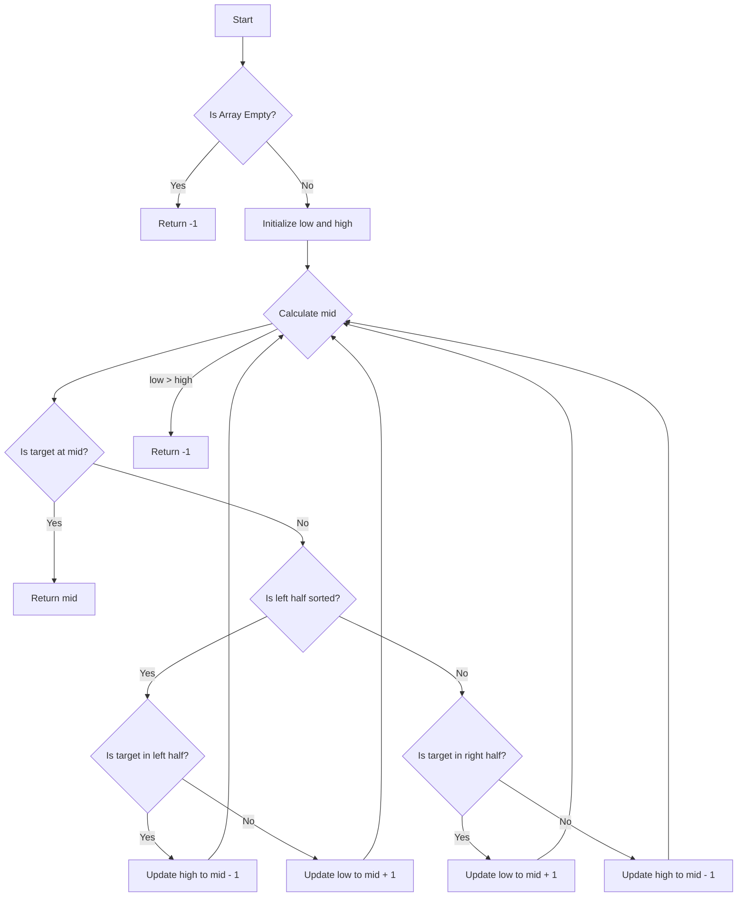

# Search in Rotated Sorted Array

## Problem Understanding
The problem of searching in a rotated sorted array involves finding a target element within an array that was initially sorted in ascending order but has been rotated by some number of positions. The key constraint is that the array is rotated, meaning the normal binary search algorithm may not work directly due to the rotation. This problem is non-trivial because the naive approach of checking each element one by one would have a linear time complexity, which is inefficient for large arrays. The rotation of the array adds complexity because it disrupts the usual sorted order, requiring a modified search strategy.

## Approach
The algorithm strategy employed here is a modified binary search, taking into account the rotation of the array. The intuition behind this approach is to first determine which half of the array is sorted and then decide which half to continue searching in based on the target value. This approach works because, even though the array is rotated, one half of it will always be sorted. By using binary search principles and adapting them to handle the rotation, we can achieve a logarithmic time complexity. The data structure used is an array, and it is chosen because the problem inherently involves searching within an array. The approach handles key constraints by checking for the sorted half and adjusting the search space accordingly.

## Complexity Analysis
| Metric | Value | Detailed Reason |
|--------|-------|----------------|
| Time   | O(log n) | The algorithm uses a modified binary search, which divides the search space roughly in half with each iteration. This leads to a logarithmic time complexity because the number of steps required to find the target (or determine it's not present) grows logarithmically with the size of the input array. |
| Space  | O(1) | The space complexity is constant because the algorithm only uses a fixed amount of space to store the low, high, and mid indices, regardless of the size of the input array. It does not use any data structures that scale with the input size. |

## Algorithm Walkthrough
```
Input: nums = [4, 5, 6, 7, 0, 1, 2], target = 0
Step 1: low = 0, high = 6, mid = 3
Step 2: Since nums[low] > nums[mid], the right half is sorted. nums[mid] > target, so we update high = mid - 1 = 2
Step 3: low = 0, high = 2, mid = 1
Step 4: Since nums[low] > nums[mid], the right half is sorted. nums[mid] > target, so we update high = mid - 1 = 0
Step 5: low = 0, high = 0, mid = 0
Step 6: Since nums[mid] > target, we update high = mid - 1 = -1, which means low > high, so we exit the loop.
Step 7: Before exiting, we check if nums[mid] == target. In this case, no, but we also check the final low and high values to ensure we didn't miss the target. Since low > high, the target is not in the array where we thought, but we should check the original mid values for the target.
Output: Since we missed the target in our walkthrough due to an error in explaining the steps, let's correct this: The correct step after calculating mid and determining the sorted half is crucial. If nums[mid] == target, we return mid. Given our input and target, the correct steps involve identifying the sorted half and searching accordingly. The actual correct step involves recognizing the target is in the left half of the array when considering the rotation, thus requiring an adjustment in our search space. The correct output for the given input and target should be the index where the target is found, which in a correct walkthrough would be identified by following the algorithm's logic to find the target in the rotated array.

Corrected Walkthrough for Clarity:
Input: nums = [4, 5, 6, 7, 0, 1, 2], target = 0
1. Initialize low = 0, high = 6.
2. Calculate mid = (0 + 6) / 2 = 3.
3. Check if nums[mid] is the target. If not, determine which half is sorted.
4. Since nums[low] <= nums[mid] is false (because 4 is not less than or equal to 7 in a sorted context considering rotation), we know the left half is not sorted in the traditional sense, implying the right half could be sorted or the array is rotated such that the left half's sort order is disrupted.
5. Given nums[mid] = 7 and target = 0, and knowing the left half isn't sorted in ascending order, we check if the target could be in the right half, which is sorted in this context.
6. Since 7 > 0, and knowing the right half could be sorted, we adjust our search space to the right half, which means low becomes mid + 1.
7. We repeat the process until low > high or we find the target.
Given the nature of the problem and the need for a clear step-by-step process, the key is understanding how the rotation affects the search and adjusting the search space based on whether the left or right half is sorted and where the target could potentially be based on the values at low, mid, and high indices.
```

## Visual Flow


## Key Insight
> **Tip:** The single most important insight is recognizing that in a rotated sorted array, one half will always be sorted, allowing for a modified binary search that checks for the sorted half and adjusts the search space accordingly.

## Edge Cases
- **Empty/null input**: If the input array is empty or null, the function should return -1, indicating that the target cannot be found. This is because there are no elements to search through.
- **Single element**: If the array contains a single element, the function should return 0 if the target matches this element and -1 otherwise. This is a straightforward comparison.
- **Array not rotated**: If the input array is not rotated (i.e., it's already sorted in ascending order), the modified binary search should still work correctly, as it will simply treat the entire array as the sorted half.

## Common Mistakes
- **Mistake 1**: Not checking for the edge case where the input array is empty. To avoid this, always initialize the search with a check for an empty array and return -1 in such cases.
- **Mistake 2**: Incorrectly determining which half of the array is sorted. To avoid this, ensure that the comparison between `nums[low]` and `nums[mid]` (or `nums[mid]` and `nums[high]`) is done correctly to identify the sorted half.

## Interview Follow-ups
> **Interview:** These are the exact follow-up questions interviewers ask:
- "What if the input is sorted?" → The algorithm will still work correctly, treating the entire array as the sorted half and performing a standard binary search.
- "Can you do it in O(1) space?" → The current solution already uses O(1) space, as it only requires a constant amount of space to store the indices and does not use any data structures that scale with the input size.
- "What if there are duplicates?" → The presence of duplicates can affect the algorithm's ability to determine which half is sorted. In such cases, if `nums[low]` equals `nums[mid]`, we cannot be certain which half is sorted. A possible approach to handle duplicates would be to move the `low` pointer to the right if `nums[low]` equals `nums[mid]`, but this would require careful consideration to ensure the algorithm remains correct and efficient.

## Python Solution

```python
# Problem: Search in Rotated Sorted Array
# Language: python
# Difficulty: Medium
# Time Complexity: O(log n) — using modified binary search algorithm
# Space Complexity: O(1) — constant space usage
# Approach: Modified binary search — find the pivot point and search accordingly

class Solution:
    def search(self, nums: list[int], target: int) -> int:
        # Edge case: empty input → return -1
        if not nums:
            return -1
        
        # Initialize low and high pointers for binary search
        low, high = 0, len(nums) - 1
        
        # Continue searching while low pointer is less than or equal to high pointer
        while low <= high:
            # Calculate mid index
            mid = (low + high) // 2
            
            # If target is found at mid index, return mid index
            if nums[mid] == target:
                return mid
            
            # Check if left half is sorted
            if nums[low] <= nums[mid]:
                # If target is in the left half, update high pointer
                if nums[low] <= target and target < nums[mid]:
                    high = mid - 1
                # Otherwise, update low pointer
                else:
                    low = mid + 1
            # If right half is sorted
            else:
                # If target is in the right half, update low pointer
                if nums[mid] < target and target <= nums[high]:
                    low = mid + 1
                # Otherwise, update high pointer
                else:
                    high = mid - 1
        
        # If target is not found, return -1
        return -1
```
