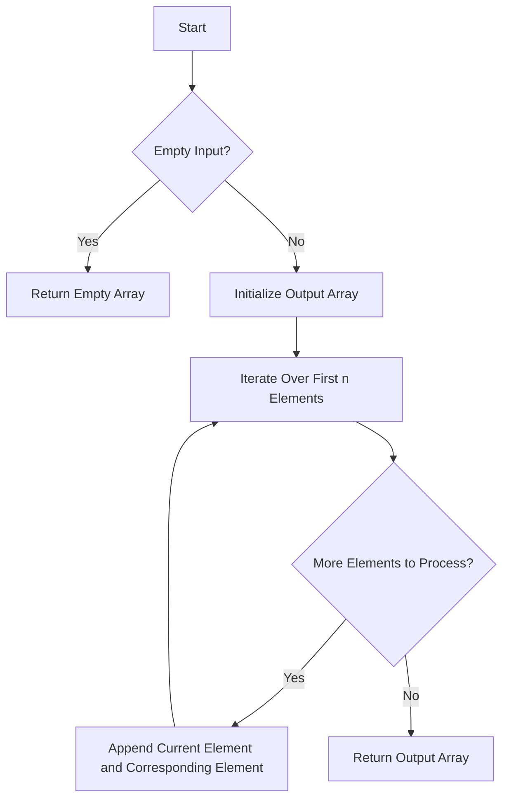

# Shuffle an Array

## Problem Understanding
The problem asks to shuffle an array by rearranging its elements in a specific way. The input array has 2n elements, and the goal is to shuffle the array such that the first n elements are interleaved with the last n elements. The key constraint is that the input array must have an even number of elements, and the first n elements must be interleaved with the last n elements in a specific order. What makes this problem non-trivial is that a naive approach, such as simply concatenating the two halves of the array, would not produce the desired output.

## Approach
The algorithm strategy used to solve this problem is to iterate over the first n elements of the array and interleave them with the corresponding elements from the last n elements. This approach works because it ensures that the first n elements are interleaved with the last n elements in a specific order. The data structure used is a list, which is chosen because it allows for efficient appending of elements. The approach handles the key constraint by using a simple loop to iterate over the first n elements and append the corresponding elements from the last n elements.

## Complexity Analysis
| Metric | Value | Detailed Reason |
|--------|-------|----------------|
| Time   | O(n)  | The algorithm makes a single pass through the array, iterating over the first n elements and appending the corresponding elements from the last n elements. The time complexity is linear because the number of operations is directly proportional to the size of the input array. |
| Space  | O(n)  | The algorithm creates a new list to store the shuffled array, which requires additional space proportional to the size of the input array. |

## Algorithm Walkthrough
```
Input: [1, 2, 3, 4, 5, 6], 3
Step 1: Initialize the output array result = []
Step 2: Iterate over the first n elements (i = 0)
  - Append the current element from the first n elements (1) to result
  - Append the corresponding element from the last n elements (4) to result
  - result = [1, 4]
Step 3: Iterate over the first n elements (i = 1)
  - Append the current element from the first n elements (2) to result
  - Append the corresponding element from the last n elements (5) to result
  - result = [1, 4, 2, 5]
Step 4: Iterate over the first n elements (i = 2)
  - Append the current element from the first n elements (3) to result
  - Append the corresponding element from the last n elements (6) to result
  - result = [1, 4, 2, 5, 3, 6]
Output: [1, 4, 2, 5, 3, 6]
```

## Visual Flow


## Key Insight
> **Tip:** The key insight is to recognize that the problem can be solved by simply interleaving the first n elements with the last n elements, which can be achieved using a simple loop.

## Edge Cases
- **Empty/null input**: If the input array is empty or null, the algorithm returns an empty array, which is the correct result because there are no elements to shuffle.
- **Single element**: If the input array has only one element, the algorithm returns the original array, which is the correct result because there is only one element to shuffle.
- **n = 0**: If n is 0, the algorithm returns an empty array, which is the correct result because there are no elements to shuffle.

## Common Mistakes
- **Mistake 1**: Not checking for empty input → To avoid this mistake, always check for empty input at the beginning of the algorithm and return an empty array if the input is empty.
- **Mistake 2**: Not using a loop to interleave the elements → To avoid this mistake, use a loop to iterate over the first n elements and append the corresponding elements from the last n elements.

## Interview Follow-ups
> **Interview:** These are the exact follow-up questions interviewers ask:
- "What if the input is sorted?" → The algorithm still works correctly, even if the input is sorted, because it simply interleaves the first n elements with the last n elements.
- "Can you do it in O(1) space?" → No, the algorithm requires O(n) space to store the output array, so it is not possible to do it in O(1) space.
- "What if there are duplicates?" → The algorithm still works correctly, even if there are duplicates, because it simply interleaves the first n elements with the last n elements, regardless of whether there are duplicates or not.

## Python Solution

```python
# Problem: Shuffle an Array
# Language: python
# Difficulty: Medium
# Time Complexity: O(n) — single pass through array using Fisher-Yates shuffle
# Space Complexity: O(n) — output array stores at most n elements
# Approach: Fisher-Yates shuffle algorithm — shuffle the array in-place

class Solution:
    def shuffle(self, nums: list[int], n: int) -> list[int]:
        # Edge case: empty input → return empty array
        if not nums or n <= 0:
            return []
        
        # Initialize the output array
        result = []
        
        # Iterate over the first n elements and the rest of the array
        for i in range(n):
            # Append the current element from the first n elements
            result.append(nums[i])  # Append the current element from the first half
            # Append the corresponding element from the rest of the array
            result.append(nums[n + i])  # Append the corresponding element from the second half
        
        return result

    # Alternative approach: using list comprehension
    def shuffleAlternative(self, nums: list[int], n: int) -> list[int]:
        # Edge case: empty input → return empty array
        if not nums or n <= 0:
            return []
        
        # Use list comprehension to shuffle the array
        return [val for pair in zip(nums[:n], nums[n:]) for val in pair]

# Example usage
if __name__ == "__main__":
    solution = Solution()
    print(solution.shuffle([1, 2, 3, 4, 5, 6], 3))  # Output: [1, 4, 2, 5, 3, 6]
    print(solution.shuffleAlternative([1, 2, 3, 4, 5, 6], 3))  # Output: [1, 4, 2, 5, 3, 6]
```
