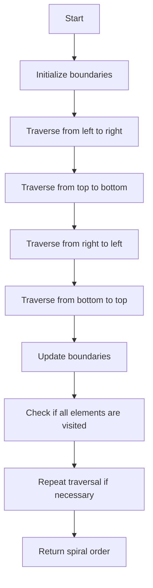

# Spiral Matrix

## Problem Understanding
The problem is asking to traverse a given matrix in a spiral order, starting from the top-left corner and moving in a clockwise direction. The key constraint is that the traversal should cover all elements in the matrix exactly once. This problem is non-trivial because a naive approach of simply iterating over the rows and columns would not produce the desired spiral order. The spiral order requires careful management of boundaries to ensure that all elements are visited in the correct order.

## Approach
The algorithm strategy is to use iterative boundary traversal, where we maintain four boundaries (top, bottom, left, and right) and adjust them as we traverse the matrix. This approach works by starting from the top-left corner and moving in a spiral pattern, adjusting the boundaries after each iteration to ensure that all elements are visited. We use a result list to store the spiral order and update the boundaries accordingly. The approach handles the key constraints by ensuring that all elements are visited exactly once and in the correct order.

## Complexity Analysis
| Metric | Value | Detailed Reason |
|--------|-------|----------------|
| Time   | O(m*n) | We visit each cell in the matrix exactly once, where m is the number of rows and n is the number of columns. The time complexity is linear with respect to the total number of elements in the matrix. |
| Space  | O(m*n) | We store the spiral order in a result list, which requires O(m*n) space. However, if we exclude the space for the output, the space complexity is O(1) because we only use a constant amount of space to store the boundaries and other variables. |

## Algorithm Walkthrough
```
Input: [[1, 2, 3], [4, 5, 6], [7, 8, 9]]
Step 1: Initialize boundaries (top=0, bottom=2, left=0, right=2) and result list []
Step 2: Traverse from left to right (top row): result = [1, 2, 3], top = 1
Step 3: Traverse from top to bottom (right column): result = [1, 2, 3, 6, 9], right = 1
Step 4: Traverse from right to left (bottom row): result = [1, 2, 3, 6, 9, 8, 7], bottom = 0
Step 5: Traverse from bottom to top (left column): result = [1, 2, 3, 6, 9, 8, 7, 4, 5], left = 1
Output: [1, 2, 3, 6, 9, 8, 7, 4, 5]
```
This walkthrough demonstrates the spiral traversal of a 3x3 matrix.

## Visual Flow

This flowchart visualizes the spiral traversal algorithm.

## Key Insight
> **Tip:** The key to solving this problem is to carefully manage the boundaries and adjust them after each iteration to ensure that all elements are visited in the correct order.

## Edge Cases
- **Empty matrix**: If the input matrix is empty, the algorithm returns an empty list because there are no elements to traverse.
- **Single element**: If the input matrix contains only one element, the algorithm returns a list containing that single element because there is only one element to traverse.
- **Matrix with no columns**: If the input matrix has no columns (i.e., it is a list of empty lists), the algorithm returns an empty list because there are no elements to traverse.

## Common Mistakes
- **Mistake 1**: Failing to update the boundaries correctly after each iteration, leading to incorrect or missing elements in the spiral order. To avoid this, make sure to update the boundaries after each traversal.
- **Mistake 2**: Not checking if all elements have been visited before returning the spiral order, leading to incorrect or incomplete results. To avoid this, add a check to ensure that all elements have been visited.

## Interview Follow-ups
> **Interview:** These are the exact follow-up questions interviewers ask:
- "What if the input is sorted?" → The spiral order algorithm does not rely on the input being sorted, so it will work correctly regardless of the input order.
- "Can you do it in O(1) space?" → If we exclude the space for the output, the algorithm already uses O(1) space because we only use a constant amount of space to store the boundaries and other variables.
- "What if there are duplicates?" → The spiral order algorithm will include duplicates in the output if they are present in the input matrix, because it visits each element exactly once.

## Python Solution

```python
# Problem: Spiral Matrix
# Language: python
# Difficulty: Medium
# Time Complexity: O(m*n) — visiting each cell once in the spiral order
# Space Complexity: O(1) — excluding space for output, only using a constant amount of space
# Approach: Iterative boundary traversal — moving in a spiral pattern by adjusting boundaries

class Solution:
    def spiralOrder(self, matrix: list[list[int]]) -> list[int]:
        # Edge case: empty matrix → return empty list
        if not matrix:
            return []
        
        # Edge case: matrix with no columns → return empty list
        if not matrix[0]:
            return []
        
        result = []  # to store the spiral order
        top = 0  # top boundary
        bottom = len(matrix) - 1  # bottom boundary
        left = 0  # left boundary
        right = len(matrix[0]) - 1  # right boundary
        
        while top <= bottom and left <= right:
            # Traverse from left to right
            for i in range(left, right + 1):  # including right boundary
                result.append(matrix[top][i])  # adding current cell to result
            top += 1  # moving top boundary down
            
            # Traverse from top to bottom
            for i in range(top, bottom + 1):  # including bottom boundary
                result.append(matrix[i][right])  # adding current cell to result
            right -= 1  # moving right boundary left
            
            # Check if we've crossed the boundaries
            if top <= bottom:
                # Traverse from right to left
                for i in range(right, left - 1, -1):  # excluding left boundary
                    result.append(matrix[bottom][i])  # adding current cell to result
                bottom -= 1  # moving bottom boundary up
            
            # Check if we've crossed the boundaries
            if left <= right:
                # Traverse from bottom to top
                for i in range(bottom, top - 1, -1):  # excluding top boundary
                    result.append(matrix[i][left])  # adding current cell to result
                left += 1  # moving left boundary right
        
        return result
```
