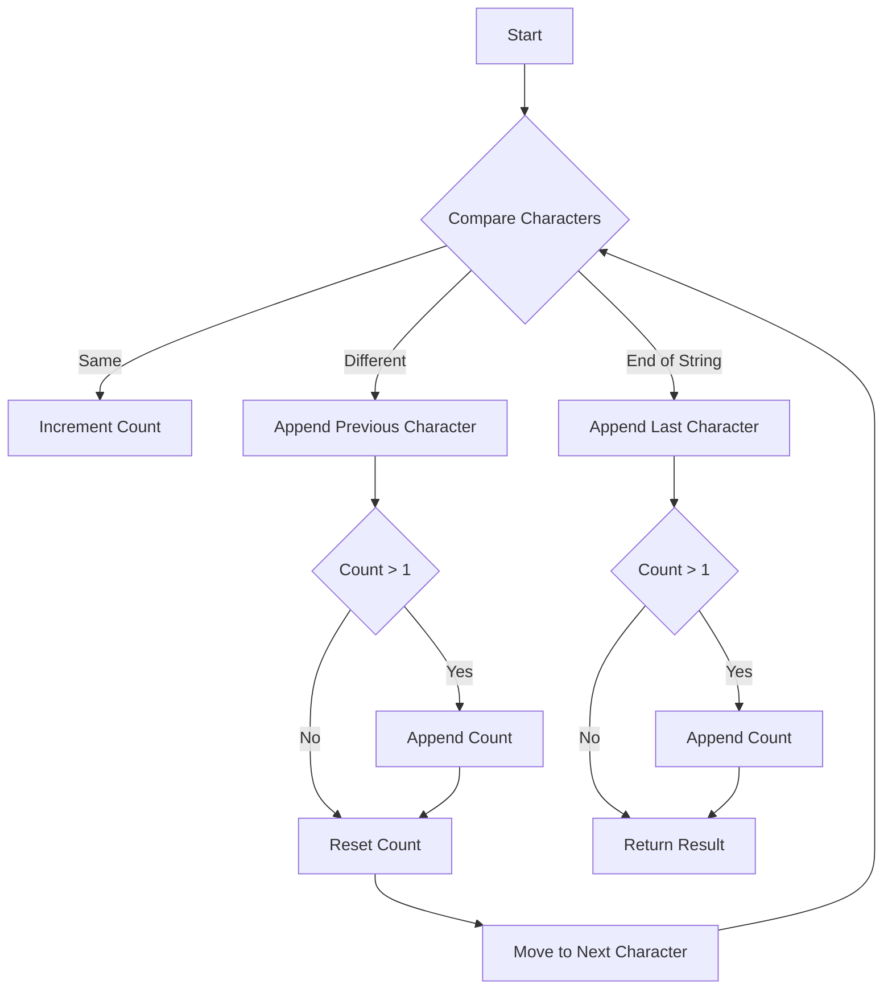

# String Compression Medium

## Problem Understanding
The problem is asking to compress a given string by replacing sequences of repeated characters with the character and count, while storing the result in the same input array. The key constraint is that the input array should be modified in-place, and the function should return the length of the compressed string. This problem is non-trivial because a naive approach would involve creating a new string to store the compressed result, which would require extra space and may not be efficient for large inputs. The given solution uses run-length encoding, which replaces sequences of repeated characters with the character and count, to achieve the desired compression.

## Approach
The algorithm strategy used is run-length encoding, where sequences of repeated characters are replaced with the character and count. This approach works by iterating over the input string and keeping track of the current character and its count. When a different character is encountered, the previous character and its count are appended to the result. The use of a result index (`res_idx`) allows the function to modify the input array in-place, while the count variable (`count`) keeps track of the consecutive occurrences of each character. The approach handles key constraints by iterating over the input string only once, resulting in a time complexity of O(n), and by modifying the input array in-place, resulting in a space complexity of O(1).

## Complexity Analysis
| Metric | Value | Detailed Reason |
|--------|-------|----------------|
| Time   | O(n)  | The function iterates over the input string once, where n is the length of the string. Each iteration involves a constant amount of work, such as comparing characters and appending to the result. |
| Space  | O(1)  | The function modifies the input array in-place, so it does not require any additional space that scales with the input size. The only extra space used is for a few variables, such as the result index and count, which is constant. |

## Algorithm Walkthrough
```
Input: ["a", "a", "b", "b", "c", "c", "c"]
Step 1: Initialize result index (`res_idx`) to 0 and count to 1.
Step 2: Compare the first two characters ("a" and "a"). Since they are the same, increment the count to 2.
Step 3: Compare the second and third characters ("a" and "b"). Since they are different, append the previous character ("a") to the result and increment the result index (`res_idx`) to 1. Since the count is greater than 1, append the count ("2") to the result and increment the result index (`res_idx`) to 3. Reset the count to 1.
Step 4: Compare the third and fourth characters ("b" and "b"). Since they are the same, increment the count to 2.
Step 5: Compare the fourth and fifth characters ("b" and "c"). Since they are different, append the previous character ("b") to the result and increment the result index (`res_idx`) to 4. Since the count is greater than 1, append the count ("2") to the result and increment the result index (`res_idx`) to 5. Reset the count to 1.
Step 6: Compare the fifth and sixth characters ("c" and "c"). Since they are the same, increment the count to 2.
Step 7: Compare the sixth and seventh characters ("c" and "c"). Since they are the same, increment the count to 3.
Step 8: Since the end of the input string is reached, append the last character ("c") to the result and increment the result index (`res_idx`) to 6. Since the count is greater than 1, append the count ("3") to the result and increment the result index (`res_idx`) to 7.
Output: The length of the compressed string is 6, and the compressed string is ["a", "2", "b", "2", "c", "3"].
```

## Visual Flow


## Key Insight
> **Tip:** The key insight to solving this problem is to use run-length encoding to replace sequences of repeated characters with the character and count, and to modify the input array in-place to achieve the desired compression.

## Edge Cases
- **Empty input**: If the input array is empty, the function will return 0, since there are no characters to compress.
- **Single element**: If the input array contains only one character, the function will return 1, since there is no sequence of repeated characters to compress.
- **No repeated characters**: If the input array contains no repeated characters, the function will return the length of the input array, since no compression is possible.

## Common Mistakes
- **Mistake 1**: Not resetting the count variable after appending the previous character and count to the result. This can be avoided by resetting the count variable to 1 after each append operation.
- **Mistake 2**: Not handling the case where the count is greater than 1 correctly. This can be avoided by appending the count to the result only when the count is greater than 1.

## Interview Follow-ups
> **Interview:** These are the exact follow-up questions interviewers ask:
- "What if the input is sorted?" → The function will still work correctly, since it only cares about the sequences of repeated characters, not the overall order of the characters.
- "Can you do it in O(1) space?" → Yes, the function already uses O(1) space, since it modifies the input array in-place and only uses a few variables to keep track of the result index and count.
- "What if there are duplicates?" → The function will handle duplicates correctly, since it uses run-length encoding to replace sequences of repeated characters with the character and count.

## Python Solution

```python
# Problem: String Compression Medium
# Language: python
# Difficulty: Medium
# Time Complexity: O(n) — single pass through the string
# Space Complexity: O(n) — StringBuilder stores at most n characters
# Approach: Run-length encoding — replacing sequences of repeated characters with the character and count

class Solution:
    def compress(self, chars: list[str]) -> int:
        # Initialize the result index and count
        res_idx = 0  # result index
        count = 1  # count of consecutive occurrences

        # Edge case: empty input → return 0
        if not chars:
            return 0

        # Iterate over the characters
        for i in range(1, len(chars)):
            # If the current character is the same as the previous one, increment the count
            if chars[i] == chars[i - 1]:
                count += 1
            # If the current character is different from the previous one, append the previous character and count to the result
            else:
                chars[res_idx] = chars[i - 1]  # append the previous character
                res_idx += 1  # move to the next position in the result
                # If the count is greater than 1, append the count to the result
                if count > 1:
                    for c in str(count):
                        chars[res_idx] = c  # append the digit
                        res_idx += 1  # move to the next position in the result
                count = 1  # reset the count

        # Handle the last character and its count
        chars[res_idx] = chars[-1]  # append the last character
        res_idx += 1  # move to the next position in the result
        # If the count is greater than 1, append the count to the result
        if count > 1:
            for c in str(count):
                chars[res_idx] = c  # append the digit
                res_idx += 1  # move to the next position in the result

        # Return the length of the compressed string
        return res_idx
```
