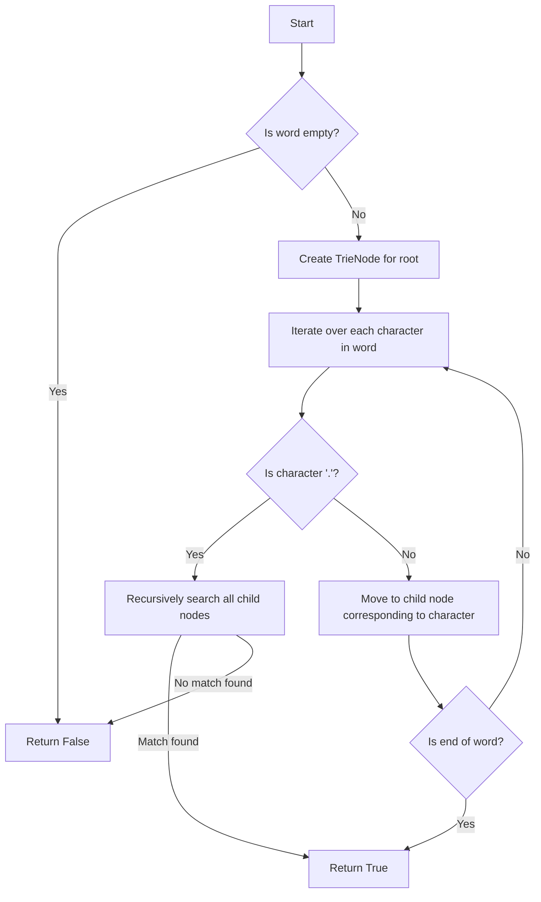

# Word Dictionary

## Problem Understanding
The Word Dictionary problem asks to design a data structure that supports adding words and searching for words with a wildcard '.' character. The key constraint is to handle the '.' character, which can match any single character. The problem becomes non-trivial because a naive approach using a simple hash table or array would not efficiently handle the '.' character, requiring a more sophisticated data structure like a Trie. The Trie data structure is particularly useful here as it allows for efficient prefix matching and word lookups.

## Approach
The algorithm strategy is to use a Hash Table with a Trie data structure to store the words. The TrieNode class represents each node in the Trie, containing a dictionary to store child nodes and a boolean to mark the end of a word. The WordDictionary class initializes the root of the Trie and provides methods to add words and search for words. The search method uses a helper function dfs to perform a depth-first search of the Trie, handling the '.' character by recursively searching all child nodes. This approach works because the Trie allows for efficient lookup and matching of prefixes, and the dfs function can handle the '.' character by exploring all possible matches.

## Complexity Analysis
| Metric | Value | Detailed Reason |
|--------|-------|----------------|
| Time   | O(n*m) | The time complexity of adding a word is O(m), where m is the length of the word, because we iterate over each character in the word. The time complexity of searching for a word is O(m * 26^k), where k is the number of '.' characters, because in the worst case, we recursively search all child nodes for each '.' character. However, since the number of '.' characters is at most m, the overall time complexity is O(n*m), where n is the number of words. |
| Space  | O(n*m) | The space complexity is O(n*m), where n is the number of words and m is the average length of a word, because we store all words in the Trie data structure. |

## Algorithm Walkthrough
```
Input: wordDictionary.addWord("bad")
Step 1: Create a new TrieNode for the root
Step 2: Iterate over each character in the word "bad"
  - Create a new TrieNode for 'b' and add it to the root's children
  - Create a new TrieNode for 'a' and add it to the 'b' node's children
  - Create a new TrieNode for 'd' and add it to the 'a' node's children
  - Mark the 'd' node as the end of a word
Step 3: wordDictionary.search("bad")
  - Start a depth-first search at the root
  - Iterate over each character in the word "bad"
    - Move to the child node corresponding to the current character
  - Return whether the final node marks the end of a word (True)
```
Output: True

## Visual Flow


## Key Insight
> **Tip:** The key insight is to use a Trie data structure to efficiently store and look up words, and to use a depth-first search approach to handle the '.' character by exploring all possible matches.

## Edge Cases
- **Empty/null input**: If the input word is empty, the search method returns False, as there is no word to match.
- **Single element**: If the input word has only one character, the search method returns True if the character is in the Trie, and False otherwise.
- **Word with multiple '.' characters**: The search method can handle words with multiple '.' characters by recursively searching all child nodes for each '.' character.

## Common Mistakes
- **Mistake 1**: Not handling the '.' character correctly, by not recursively searching all child nodes. To avoid this, use a depth-first search approach to explore all possible matches.
- **Mistake 2**: Not marking the end of a word correctly, by not setting the `is_word` attribute to True. To avoid this, make sure to mark the end of each word when adding it to the Trie.

## Interview Follow-ups
> **Interview:** These are the exact follow-up questions interviewers ask:
- "What if the input is sorted?" → The algorithm does not rely on the input being sorted, so it would still work correctly.
- "Can you do it in O(1) space?" → No, because we need to store all words in the Trie data structure, which requires O(n*m) space.
- "What if there are duplicates?" → The algorithm can handle duplicates by simply adding each word to the Trie, and the search method will return True if the word is in the Trie, regardless of duplicates.

## Python Solution

```python
# Problem: Word Dictionary
# Language: python
# Difficulty: Medium
# Time Complexity: O(n*m) — n is the number of words and m is the average length of a word
# Space Complexity: O(n) — storing all words in a data structure
# Approach: Hash Table with Trie data structure — for efficient word lookups and prefix matching

class TrieNode:
    def __init__(self): 
        # Create a dictionary to store child nodes and a boolean to mark the end of a word
        self.children = {}
        self.is_word = False

class WordDictionary:
    def __init__(self):
        # Initialize the root of the Trie
        self.root = TrieNode()

    def addWord(self, word: str) -> None:
        # Start at the root and create new nodes as necessary
        node = self.root
        for char in word: 
            # If the character is not in the children dictionary, add it
            if char not in node.children:
                node.children[char] = TrieNode()
            # Move to the child node
            node = node.children[char]
        # Mark the end of the word
        node.is_word = True

    def search(self, word: str) -> bool:
        # Helper function to perform a depth-first search of the Trie
        def dfs(node, index):
            # If we've reached the end of the word
            if index == len(word):
                # Return whether the current node marks the end of a word
                return node.is_word
            # If the current character is a dot (wildcard), try all possible characters
            if word[index] == '.':
                # Iterate over all child nodes
                for child in node.children.values():
                    # Recursively search each child node
                    if dfs(child, index + 1):
                        return True
                # If no match is found, return False
                return False
            # If the current character is not a dot, try to move to the corresponding child node
            elif word[index] in node.children:
                # Recursively search the child node
                return dfs(node.children[word[index]], index + 1)
            # If the character is not in the children dictionary, return False
            else:
                return False

        # Edge case: empty input → return False
        if not word:
            return False

        # Start the depth-first search at the root
        return dfs(self.root, 0)

# Example usage:
wordDictionary = WordDictionary()
wordDictionary.addWord("bad")
wordDictionary.addWord("dad")
wordDictionary.addWord("mad")
print(wordDictionary.search("pad"))  # returns False
print(wordDictionary.search("bad"))  # returns True
print(wordDictionary.search(".ad"))  # returns True
print(wordDictionary.search("b.."))  # returns True
```
