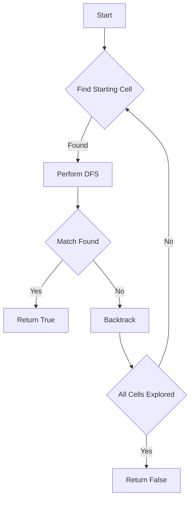

# Word Search

## Problem Understanding
The problem is asking to determine if a given word exists in a 2D grid of characters, where the word can be constructed from letters of sequentially adjacent cells (horizontally or vertically). The key constraints are that each cell can only be used once in the word and the word must be found in the grid without using any cell more than once. What makes this problem non-trivial is the need to efficiently explore all possible paths in the grid that could match the word, which a naive approach might struggle to do due to the combinatorial explosion of possible paths.

## Approach
The algorithm strategy is to use a depth-first search (DFS) approach, starting from each cell in the grid that matches the first character of the word. The intuition behind this is to explore all possible paths from each starting cell that could potentially match the word. This approach works because it systematically checks all possible sequences of cells that could match the word, ensuring that no potential solution is overlooked. The DFS function uses a recursive approach to explore all four directions (up, down, left, right) from each cell, and it uses a temporary marking of visited cells to avoid revisiting the same cell in the same path.

## Complexity Analysis
| Metric | Value | Detailed Reason |
|--------|-------|----------------|
| Time   | O(n*m*4^L) | The algorithm iterates over each cell in the grid (O(n*m)), and for each cell, it potentially explores all four directions recursively up to the length of the word (O(4^L)). This represents the worst-case scenario where every path of length L is explored from every cell. |
| Space  | O(L) | The space complexity is determined by the maximum depth of the recursion stack, which corresponds to the length of the word (L). This is because the recursion stack will hold the state of each recursive call up to the length of the word. |

## Algorithm Walkthrough
```
Input: 
board = [
    ['A', 'B', 'C', 'E'],
    ['S', 'F', 'C', 'S'],
    ['A', 'D', 'E', 'E']
],
word = "ABCCED"

Step 1: Initialize the board dimensions and directions for DFS.
- rows = 3, cols = 4
- directions = [(0, 1), (0, -1), (1, 0), (-1, 0)]

Step 2: Iterate over all cells in the board to find a match for the first character of the word.
- Starting from the first cell (0,0) with 'A', which matches the first character of the word.

Step 3: Perform DFS from the starting cell.
- Mark the current cell as visited and explore all four directions.
- From cell (0,0), moving right to (0,1) with 'B', which matches the second character of the word.

Step 4: Continue DFS until the entire word is matched or all paths are exhausted.
- The path "ABCCED" is found by moving right, down, right, right, down, right from the starting cell (0,0).

Output: True
```

## Visual Flow


## Key Insight
> **Tip:** The key insight is to use a depth-first search with backtracking to efficiently explore all possible paths in the grid that could match the word, avoiding the need to manually check every possible sequence of cells.

## Edge Cases
- **Empty board or word**: The function immediately returns False, as there's no grid to search or no word to find.
- **Single element in the board**: If the single element matches the first character of the word and the word length is 1, the function returns True; otherwise, it returns False.
- **Word longer than the grid's dimensions**: The function will not find a match because it checks for out-of-bounds conditions at each step of the DFS.

## Common Mistakes
- **Mistake 1: Not marking visited cells**: Failing to mark cells as visited can lead to infinite loops and incorrect results. To avoid this, temporarily modify the cell's value to indicate it's visited.
- **Mistake 2: Not backtracking correctly**: Failing to restore the original value of a cell after exploring all its neighbors can lead to incorrect results. Ensure that after exploring all paths from a cell, its original value is restored.

## Interview Follow-ups
> **Interview:** 
- "What if the input is sorted?" → The algorithm does not rely on the input being sorted, so it will work regardless of the order of characters in the grid.
- "Can you do it in O(1) space?" → No, because the recursion stack will always require O(L) space, where L is the length of the word, to store the state of each recursive call.
- "What if there are duplicates?" → The algorithm can handle duplicates in the grid by exploring all possible paths and checking each character against the word; duplicates in the word are handled by the DFS ensuring each cell is used only once in a path.

## Python Solution

```python
# Problem: Word Search
# Language: python
# Difficulty: Medium
# Time Complexity: O(n*m*4^L) — where n and m are board dimensions and L is the word length
# Space Complexity: O(L) — for the recursion stack
# Approach: Depth-First Search — explore all four directions for each cell

class Solution:
    def exist(self, board: list[list[str]], word: str) -> bool:
        # Edge case: empty board or word
        if not board or not word:
            return False
        
        # Get the dimensions of the board
        rows, cols = len(board), len(board[0])
        
        # Define the possible directions for DFS
        directions = [(0, 1), (0, -1), (1, 0), (-1, 0)]  # right, left, down, up
        
        def dfs(row: int, col: int, index: int) -> bool:
            # Base case: if we've checked all characters in the word
            if index == len(word):
                return True
            
            # Edge case: out of bounds or character mismatch
            if row < 0 or row >= rows or col < 0 or col >= cols or board[row][col] != word[index]:
                return False
            
            # Mark the current cell as visited
            temp, board[row][col] = board[row][col], '/'  # use '/' to mark as visited
            
            # Recursively explore all four directions
            for dr, dc in directions:
                if dfs(row + dr, col + dc, index + 1):
                    return True
            
            # Backtrack: restore the original value of the cell
            board[row][col] = temp
            
            # If no direction leads to a solution, return False
            return False
        
        # Iterate over all cells in the board
        for row in range(rows):
            for col in range(cols):
                # If the current cell matches the first character of the word, start DFS
                if board[row][col] == word[0]:
                    if dfs(row, col, 0):
                        return True
        
        # If no cell leads to a solution, return False
        return False
```
