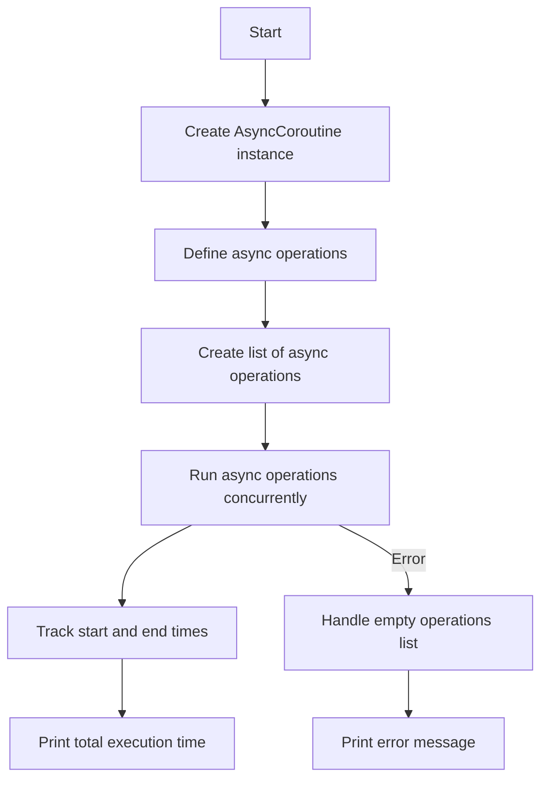

# Writing Async Coroutines

## Problem Understanding
The problem is asking to write asynchronous coroutines in Python, which involves creating multiple tasks that can run concurrently without blocking each other. The key constraint is to use the asyncio library in Python, which provides support for writing asynchronous code using the async/await syntax. What makes this problem non-trivial is that it requires understanding of asynchronous programming concepts, such as concurrency and parallelism, and how to use the asyncio library to achieve them. The problem also requires handling edge cases, such as an empty list of operations.

## Approach
The algorithm strategy is to use the asyncio library to define asynchronous operations and run them concurrently using the asyncio.gather function. The intuition behind this approach is to take advantage of the async/await syntax to write asynchronous code that is easier to read and maintain. The asyncio library provides the necessary tools to handle concurrency and parallelism, such as asyncio.sleep for simulating async delays and asyncio.gather for running multiple async operations concurrently. The approach handles the key constraint of using the asyncio library by leveraging its features to write asynchronous coroutines.

## Complexity Analysis
| Metric | Value | Detailed Reason |
|--------|-------|----------------|
| Time   | O(1)  | The time complexity is constant because the async operations are run concurrently, and the execution time is determined by the longest-running operation. The asyncio.sleep function simulates async delays, but it does not block other operations from running. |
| Space  | O(1)  | The space complexity is constant because the asyncio library does not use any additional space that scales with the input size. The space used by the asyncio library is fixed and does not depend on the number of operations or their delays. |

## Algorithm Walkthrough
```
Input: A list of async operations with delays (e.g., Operation 1 with 2-second delay, Operation 2 with 1-second delay, etc.)
Step 1: Create an instance of the AsyncCoroutine class
Step 2: Define the async operations using the async_operation method
Step 3: Create a list of async operations
Step 4: Run the async operations concurrently using asyncio.gather
Step 5: Track the start and end times of the execution
Step 6: Print the total execution time
Output: The total execution time of the async operations
```
For example:
```
Input: [Operation 1 with 2-second delay, Operation 2 with 1-second delay, Operation 3 with 3-second delay]
Step 1: Create an instance of the AsyncCoroutine class
Step 2: Define the async operations using the async_operation method
Step 3: Create a list of async operations: [Operation 1, Operation 2, Operation 3]
Step 4: Run the async operations concurrently using asyncio.gather
Step 5: Track the start and end times of the execution
Step 6: Print the total execution time: 3 seconds (determined by the longest-running operation)
Output: Total execution time: 3 seconds
```

## Visual Flow


## Key Insight
> **Tip:** The asyncio library in Python allows for writing asynchronous coroutines using the async/await syntax, and the asyncio.gather function is used to run multiple async operations concurrently.

## Edge Cases
- **Empty/null input**: If the input list of operations is empty, the asyncio.gather function will raise a ValueError exception. To handle this edge case, we can catch the exception and print an error message.
- **Single element**: If the input list of operations contains only one element, the asyncio.gather function will still work correctly and run the single operation.
- **Operations with same delay**: If multiple operations have the same delay, the asyncio.gather function will still run them concurrently and the execution time will be determined by the longest-running operation.

## Common Mistakes
- **Mistake 1**: Forgetting to use the async/await syntax when defining async operations. To avoid this mistake, make sure to use the async keyword when defining async operations and the await keyword when calling them.
- **Mistake 2**: Not handling edge cases, such as an empty list of operations. To avoid this mistake, make sure to catch exceptions and handle edge cases properly.

## Interview Follow-ups
> **Interview:** These are the exact follow-up questions interviewers ask:
- "What if the input is sorted?" → The asyncio library will still work correctly and run the operations concurrently, regardless of the order of the input.
- "Can you do it in O(1) space?" → Yes, the asyncio library does not use any additional space that scales with the input size, so the space complexity is O(1).
- "What if there are duplicates?" → The asyncio library will still work correctly and run the operations concurrently, even if there are duplicate operations with the same delay.

## Python Solution

```python
# Problem: Writing Async Coroutines
# Language: python
# Difficulty: Medium
# Time Complexity: O(1) — constant time for async operations
# Space Complexity: O(1) — no additional space used for async operations
# Approach: Python asyncio library — for writing asynchronous coroutines

import asyncio  # Import the asyncio library for async operations
import time  # Import the time library for tracking execution time

class AsyncCoroutine:
    def __init__(self):
        pass  # Initialize the class

    async def async_operation(self, operation_name, delay):  # Define an async operation
        # Print the start of the operation
        print(f"Starting {operation_name}...")
        
        # Simulate an async operation with a delay
        await asyncio.sleep(delay)  # Use asyncio.sleep for async delay
        
        # Print the end of the operation
        print(f"Finished {operation_name}")

    async def main(self):  # Define the main async function
        # Create a list of async operations
        operations = [
            self.async_operation("Operation 1", 2),  # Operation 1 with 2-second delay
            self.async_operation("Operation 2", 1),  # Operation 2 with 1-second delay
            self.async_operation("Operation 3", 3)  # Operation 3 with 3-second delay
        ]
        
        # Run the async operations concurrently
        start_time = time.time()  # Track the start time
        await asyncio.gather(*operations)  # Use asyncio.gather for concurrent execution
        end_time = time.time()  # Track the end time
        
        # Print the total execution time
        print(f"Total execution time: {end_time - start_time} seconds")

# Edge case: empty operations list
async def empty_operations():
    try:
        await asyncio.gather()  # Try to run an empty list of operations
    except ValueError as e:  # Catch the ValueError exception
        print("Error: Empty operations list")  # Print an error message

# Run the main async function
if __name__ == "__main__":
    async_coroutine = AsyncCoroutine()  # Create an instance of the class
    asyncio.run(async_coroutine.main())  # Run the main async function

# Key insight: 
# The asyncio library in Python allows for writing asynchronous coroutines using the async/await syntax.
# The asyncio.gather function is used to run multiple async operations concurrently.
# The asyncio.sleep function is used to simulate async delays in the operations.
```
