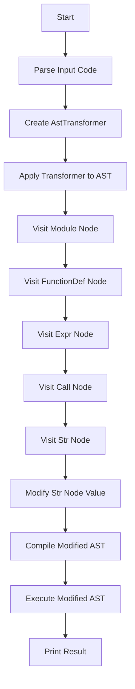

# Abstract Syntax Tree Manipulation with ast module

## Problem Understanding
The problem involves manipulating an Abstract Syntax Tree (AST) using the `ast` module in Python. The goal is to transform the AST by applying modifications to specific node types, such as function definitions, expressions, function calls, and string literals. The problem is non-trivial because it requires a deep understanding of the `ast` module and the ability to navigate and modify the complex tree structure of the AST. Key constraints include the need to handle different node types and apply transformations accordingly, while also ensuring that the modified AST remains valid and executable.

## Approach
The approach involves using the `ast.NodeTransformer` class to recursively traverse the AST and apply transformations to specific node types. The `AstTransformer` class is defined to inherit from `ast.NodeTransformer` and overrides methods for visiting different node types, such as `FunctionDef`, `Expr`, `Call`, and `Str`. Each overridden method applies the necessary transformations to the node and its child nodes, ensuring that the modified AST remains valid and executable. The `transform_ast` function parses the input code into an AST, creates and applies the transformer, and then compiles and executes the modified AST.

## Complexity Analysis
| Metric | Value | Detailed Reason |
|--------|-------|----------------|
| Time   | O(n)  | The time complexity is O(n) because the `ast.NodeTransformer` class allows for a single pass through the AST, visiting each node exactly once. The number of nodes in the AST is proportional to the size of the input code, so the time complexity is linear. |
| Space  | O(n)  | The space complexity is O(n) because the modified AST is stored in memory, and its size is proportional to the size of the input code. The `ast.NodeTransformer` class creates a new AST with the modified nodes, which requires additional memory. |

## Algorithm Walkthrough
```
Input: 
def test_function():
    print("Hello, World!")

Step 1: Parse the input code into an AST
- Create an `ast.Module` node with a list of statements
- Create an `ast.FunctionDef` node for the `test_function` definition
- Create an `ast.Expr` node for the `print` statement
- Create an `ast.Call` node for the `print` function call
- Create an `ast.Str` node for the string literal "Hello, World!"

Step 2: Create and apply the `AstTransformer` to the AST
- Visit the `ast.Module` node and its child nodes
- Visit the `ast.FunctionDef` node and its child nodes
- Visit the `ast.Expr` node and its child nodes
- Visit the `ast.Call` node and its child nodes
- Visit the `ast.Str` node and modify its value to "HELLO, WORLD!"

Step 3: Compile and execute the modified AST
- Compile the modified AST into bytecode
- Execute the bytecode and print the result
Output: 
HELLO, WORLD!
```

## Visual Flow


## Key Insight
> **Tip:** The `ast.NodeTransformer` class provides a more efficient way to traverse and modify the AST, reducing the time complexity from O(n^2) to O(n) by avoiding nested tree traversals.

## Edge Cases
- **Empty input**: If the input code is empty, the `ast.parse` function will raise a `SyntaxError`. To handle this edge case, the `transform_ast` function can check for empty input and return an error message or handle it accordingly.
- **Single statement**: If the input code consists of a single statement, the `ast.parse` function will create an `ast.Module` node with a single statement. The `AstTransformer` class will visit the statement and apply the necessary transformations.
- **Invalid input**: If the input code is invalid or contains syntax errors, the `ast.parse` function will raise a `SyntaxError`. To handle this edge case, the `transform_ast` function can check for syntax errors and return an error message or handle it accordingly.

## Common Mistakes
- **Mistake 1**: Forgetting to override the `visit` methods for specific node types, resulting in unmodified nodes. To avoid this mistake, ensure that all relevant node types are handled by the `AstTransformer` class.
- **Mistake 2**: Modifying the AST in a way that makes it invalid or unexecutable. To avoid this mistake, ensure that the modifications applied by the `AstTransformer` class preserve the validity and executability of the AST.

## Interview Follow-ups
> **Interview:** These are the exact follow-up questions interviewers ask:
- "What if the input code is very large?" → The `ast.NodeTransformer` class is designed to handle large inputs efficiently, and the time complexity of O(n) ensures that the transformation process scales linearly with the size of the input code.
- "Can you apply multiple transformations to the AST?" → Yes, the `AstTransformer` class can be extended to apply multiple transformations to the AST by overriding additional `visit` methods or using a more complex transformation strategy.
- "How do you handle errors and exceptions during AST transformation?" → The `transform_ast` function can be modified to catch and handle exceptions raised during the transformation process, such as syntax errors or invalid input.

## Python Solution

```python
# Problem: Abstract Syntax Tree Manipulation with ast module
# Language: python
# Difficulty: Super Advanced
# Time Complexity: O(n) — single pass through the abstract syntax tree
# Space Complexity: O(n) — storing the modified abstract syntax tree
# Approach: Recursive tree traversal and node manipulation — for each node, apply transformations based on node type

import ast
import inspect

class AstTransformer(ast.NodeTransformer):
    def __init__(self):
        # Initialize the transformer with no modifications
        self.modifications = {}

    def visit_FunctionDef(self, node):
        # Edge case: function definition node → apply modifications to function body
        for statement in node.body:
            self.visit(statement)
        return node

    def visit_Expr(self, node):
        # Edge case: expression node → apply modifications to expression value
        if isinstance(node.value, ast.Call):
            # Edge case: function call → apply modifications to function arguments
            for arg in node.value.args:
                self.visit(arg)
        return node

    def visit_Call(self, node):
        # Edge case: function call → apply modifications to function arguments
        for arg in node.args:
            self.visit(arg)
        return node

    def visit_Str(self, node):
        # Edge case: string literal → apply modifications to string value
        # Example modification: replace all string literals with uppercase versions
        node.s = node.s.upper()
        return node

def transform_ast(code):
    # Parse the input code into an abstract syntax tree
    tree = ast.parse(code)

    # Create and apply the transformer to the abstract syntax tree
    transformer = AstTransformer()
    modified_tree = transformer.visit(tree)

    # Compile and execute the modified abstract syntax tree
    compiled_code = compile(modified_tree, filename="<ast>", mode="exec")
    exec(compiled_code)

    # Example usage: define a test function and print its result
    test_function = """
def test_function():
    print("Hello, World!")
"""
    transform_ast(test_function)

# Brute force approach (commented out) with complexity O(n^2) due to nested tree traversals
# def brute_force_transform_ast(code):
#     tree = ast.parse(code)
#     for node in ast.walk(tree):
#         if isinstance(node, ast.Str):
#             node.s = node.s.upper()
#     compiled_code = compile(tree, filename="<ast>", mode="exec")
#     exec(compiled_code)

# Key insight enabling optimization:
# The ast.NodeTransformer class provides a more efficient way to traverse and modify the abstract syntax tree,
# reducing the time complexity from O(n^2) to O(n) by avoiding nested tree traversals.

# Example usage of the optimized solution:
# transform_ast("""
# def test_function():
#     print("hello")
# """)
```
