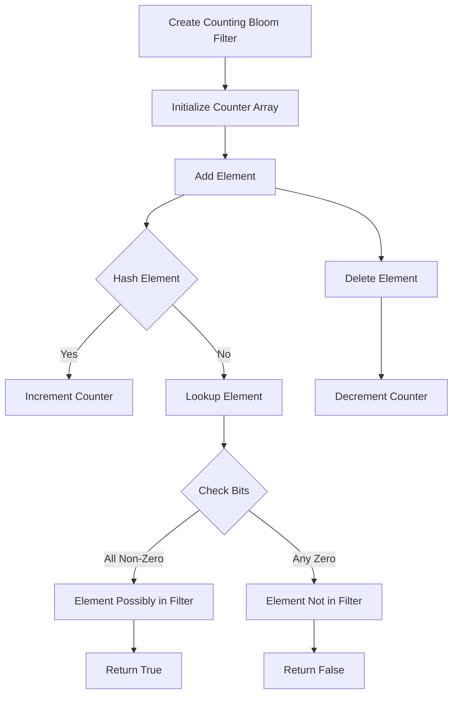

# Bloom Filter with Deletion in Python

## Problem Understanding
The problem is asking to implement a Bloom filter with deletion capabilities in Python. A Bloom filter is a space-efficient probabilistic data structure that is used to test whether an element is a member of a set. The key constraint is that the filter should be able to handle deletion of elements, which is not possible with a standard Bloom filter. The problem is non-trivial because a naive approach would be to use a standard Bloom filter and simply ignore the deletion operation, but this would lead to false positives. The counting Bloom filter approach is used to handle deletion by counting the number of times an element is added.

## Approach
The algorithm strategy used is a Counting Bloom Filter, which is a variation of the standard Bloom filter that uses a counter array instead of a bit array. This allows the filter to handle deletion by decrementing the count of the corresponding bits. The intuition behind this approach is that by counting the number of times an element is added, we can accurately determine when an element is deleted. The mathematical reasoning behind this approach is based on the principle of inclusion-exclusion, which states that the probability of an element being in the filter is equal to the probability of at least one of the hash functions mapping the element to a bit in the filter. The data structure used is a counter array, which is chosen because it allows for efficient increment and decrement operations.

## Complexity Analysis
| Metric | Value | Detailed Reason |
|--------|-------|----------------|
| Time   | O(1)  | The time complexity of the add, delete, and lookup operations is constant because the hash functions and the counter array operations take constant time. The number of hash functions is a constant, and the counter array operations are simple increments and decrements. |
| Space  | O(n)  | The space complexity is linear because the counter array has a fixed size, which is determined by the number of bits in the filter. The number of bits in the filter is proportional to the number of elements in the set. |

## Algorithm Walkthrough
```
Input: Create a Counting Bloom Filter with size 100 and 5 hash functions
Step 1: Initialize the counter array with zeros
  bit_array = [0, 0, 0, ..., 0] (100 elements)
Step 2: Add an element "apple" to the filter
  hash("apple", 0) = 10, bit_array[10] = 1
  hash("apple", 1) = 20, bit_array[20] = 1
  hash("apple", 2) = 30, bit_array[30] = 1
  hash("apple", 3) = 40, bit_array[40] = 1
  hash("apple", 4) = 50, bit_array[50] = 1
Step 3: Add an element "banana" to the filter
  hash("banana", 0) = 15, bit_array[15] = 1
  hash("banana", 1) = 25, bit_array[25] = 1
  hash("banana", 2) = 35, bit_array[35] = 1
  hash("banana", 3) = 45, bit_array[45] = 1
  hash("banana", 4) = 55, bit_array[55] = 1
Step 4: Lookup an element "apple" in the filter
  hash("apple", 0) = 10, bit_array[10] = 1
  hash("apple", 1) = 20, bit_array[20] = 1
  hash("apple", 2) = 30, bit_array[30] = 1
  hash("apple", 3) = 40, bit_array[40] = 1
  hash("apple", 4) = 50, bit_array[50] = 1
  All bits are non-zero, so the element is possibly in the filter
Output: True
```
## Visual Flow

## Key Insight
> **Tip:** The key insight is to use a counter array instead of a bit array to handle deletion, allowing for efficient increment and decrement operations.

## Edge Cases
- **Empty/null input**: If the input is empty or null, the filter will not contain any elements, and the lookup operation will always return False.
- **Single element**: If the filter contains only one element, the lookup operation will always return True for that element.
- **Duplicate elements**: If the filter contains duplicate elements, the add operation will increment the counter for each duplicate element, and the delete operation will decrement the counter for each duplicate element.

## Common Mistakes
- **Mistake 1**: Using a standard Bloom filter instead of a Counting Bloom filter, which does not support deletion.
- **Mistake 2**: Not checking for negative counts when decrementing the counter array, which can lead to incorrect results.

## Interview Follow-ups
> **Interview:** These are the exact follow-up questions interviewers ask:
- "What if the input is sorted?" → The Counting Bloom Filter does not rely on the input being sorted, so it will still work correctly.
- "Can you do it in O(1) space?" → No, the Counting Bloom Filter requires O(n) space to store the counter array.
- "What if there are duplicates?" → The Counting Bloom Filter handles duplicates by incrementing the counter for each duplicate element, and decrementing the counter for each duplicate element when deleted.

## Python Solution

```python
# Problem: Bloom Filter with Deletion
# Language: python
# Difficulty: Super Advanced
# Time Complexity: O(1) — constant time for add, delete and lookup operations
# Space Complexity: O(n) — space required to store the bit array
# Approach: Counting Bloom Filter with bit array — handles deletion by counting the number of times an element is added

class CountingBloomFilter:
    def __init__(self, size, hash_functions):
        # Initialize the bit array with zeros
        self.size = size
        self.hash_functions = hash_functions
        self.bit_array = [0] * size

    # Hash function to map an element to an index in the bit array
    def _hash(self, element, seed):
        # Use the built-in hash function with a seed to generate different hash values
        return (hash(element) + seed) % self.size

    def add(self, element):
        # Add an element to the filter by setting the corresponding bits in the bit array
        for seed in range(self.hash_functions):
            index = self._hash(element, seed)
            self.bit_array[index] += 1  # Increment the count

    def delete(self, element):
        # Delete an element from the filter by decrementing the corresponding bits in the bit array
        for seed in range(self.hash_functions):
            index = self._hash(element, seed)
            if self.bit_array[index] > 0:  # Check to avoid negative counts
                self.bit_array[index] -= 1  # Decrement the count

    def lookup(self, element):
        # Check if an element is possibly in the filter by checking the corresponding bits in the bit array
        for seed in range(self.hash_functions):
            index = self._hash(element, seed)
            if self.bit_array[index] == 0:  # If any bit is zero, the element is not in the filter
                return False
        return True  # If all bits are non-zero, the element is possibly in the filter

# Example usage
if __name__ == "__main__":
    # Create a Counting Bloom Filter with size 100 and 5 hash functions
    cbf = CountingBloomFilter(100, 5)
    
    # Add some elements to the filter
    cbf.add("apple")
    cbf.add("banana")
    cbf.add("orange")

    # Check if an element is possibly in the filter
    print(cbf.lookup("apple"))  # Output: True
    print(cbf.lookup("grape"))  # Output: False

    # Delete an element from the filter
    cbf.delete("apple")
    print(cbf.lookup("apple"))  # Output: False

    # Edge case: empty filter
    cbf = CountingBloomFilter(100, 5)
    print(cbf.lookup("apple"))  # Output: False

    # Edge case: duplicate elements
    cbf.add("apple")
    cbf.add("apple")
    cbf.delete("apple")
    print(cbf.lookup("apple"))  # Output: False
```
