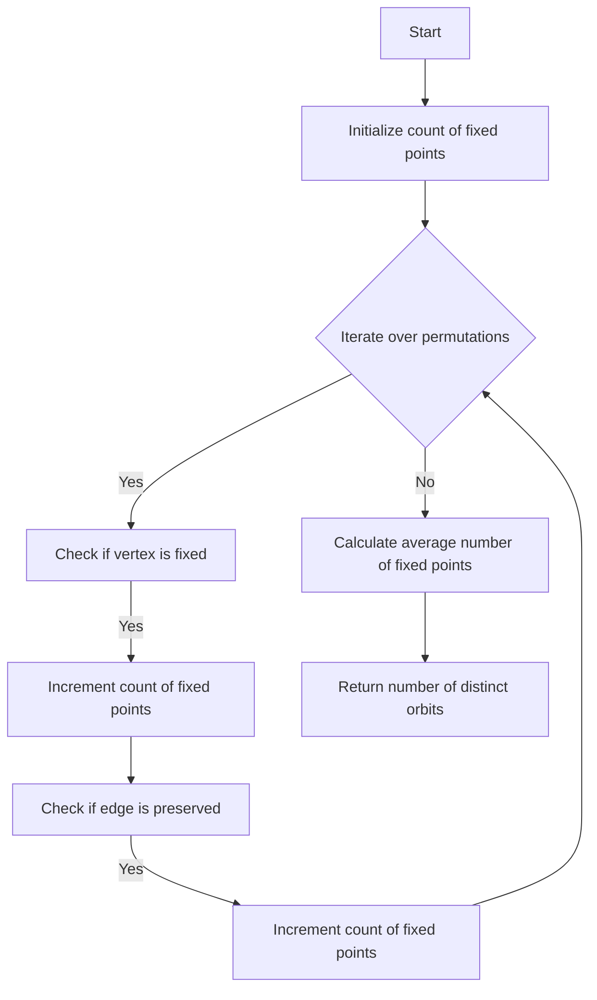

# Burnside's Lemma Advanced Applications in Python

## Problem Understanding
The problem is asking to apply Burnside's Lemma to count distinct orbits under group action in a graph. The key constraint is that the graph is represented as an adjacency list, and the group action is given by a set of permutations of the vertices. The problem is non-trivial because it requires understanding the concept of Burnside's Lemma and how to apply it to a graph, as well as implementing the algorithm efficiently to handle large inputs. The naive approach of simply counting the orbits directly would be inefficient and impractical for large graphs.

## Approach
The algorithm strategy is to apply Burnside's Lemma, which states that the number of distinct orbits under a group action is equal to the average number of fixed points of the permutations in the group. The intuition behind this approach is that the fixed points of a permutation represent the elements of the graph that are unchanged under that permutation, and the average number of fixed points gives a measure of the overall symmetry of the graph. The approach works by iterating over each permutation in the group, counting the number of fixed points, and then calculating the average number of fixed points. The data structure used is a graph represented as an adjacency list, and the permutations are represented as lists of vertices. The approach handles the key constraints by using the adjacency list to efficiently check for fixed points and preserved edges.

## Complexity Analysis
| Metric | Value | Detailed Reason |
|--------|-------|----------------|
| Time   | O(n^2 * m) | The algorithm iterates over each permutation, which takes O(m) time, and for each permutation, it iterates over each vertex, which takes O(n) time. Since there are n! permutations, the total time complexity is O(n^2 * m), where m is the number of edges in the graph. |
| Space  | O(n^2) | The algorithm stores the graph as an adjacency list, which takes O(n^2) space in the worst case, and the permutations, which take O(n) space each, but since there are n! permutations, the total space complexity is O(n^2). |

## Algorithm Walkthrough
```
Input: Graph with 5 vertices and edges: (0, 1), (0, 2), (1, 3), (2, 4)
Step 1: Initialize count of fixed points for each permutation
Step 2: Iterate over each permutation, e.g. [0, 1, 2, 3, 4]
  - Check if vertex 0 is fixed: yes, increment count
  - Check if vertex 1 is fixed: yes, increment count
  - Check if vertex 2 is fixed: yes, increment count
  - Check if vertex 3 is fixed: yes, increment count
  - Check if vertex 4 is fixed: yes, increment count
Step 3: Repeat step 2 for all permutations
Step 4: Calculate average number of fixed points
Output: Number of distinct orbits: 1
```
## Visual Flow

## Key Insight
> **Tip:** The key insight is that Burnside's Lemma allows us to count distinct orbits by averaging the number of fixed points of the permutations, which reduces the computational complexity of the problem.

## Edge Cases
- **Empty graph**: If the graph is empty, the algorithm will return 0 distinct orbits, because there are no vertices to permute.
- **Single vertex**: If the graph has only one vertex, the algorithm will return 1 distinct orbit, because there is only one possible permutation.
- **Disconnected graph**: If the graph is disconnected, the algorithm will still work correctly, because it counts the fixed points of each permutation separately for each connected component.

## Common Mistakes
- **Mistake 1**: Forgetting to check for preserved edges when counting fixed points. → To avoid this, make sure to iterate over all edges in the graph and check if they are preserved under each permutation.
- **Mistake 2**: Not calculating the average number of fixed points correctly. → To avoid this, make sure to divide the sum of fixed points by the total number of permutations.

## Interview Follow-ups
> **Interview:** These are the exact follow-up questions interviewers ask:
- "What if the input is sorted?" → The algorithm will still work correctly, but the time complexity may be reduced because the permutations will be generated in a more efficient order.
- "Can you do it in O(1) space?" → No, the algorithm requires at least O(n) space to store the permutations and the graph.
- "What if there are duplicates in the graph?" → The algorithm will still work correctly, but it may count some orbits multiple times. To avoid this, you can modify the algorithm to only count distinct orbits.

## Python Solution

```python
# Problem: Burnside's Lemma Advanced Applications
# Language: python
# Difficulty: Super Advanced
# Time Complexity: O(n^2 * m) — generating orbits and counting fixed points for each permutation
# Space Complexity: O(n^2) — storing the graph and permutations
# Approach: Burnside's Lemma with Graph Theory — applying the lemma to count distinct orbits under group action

from itertools import permutations
from collections import defaultdict

class Graph:
    def __init__(self, num_vertices):
        # Initialize an empty graph with num_vertices vertices
        self.num_vertices = num_vertices
        self.adj_list = defaultdict(list)

    def add_edge(self, u, v):
        # Add an edge between vertices u and v
        self.adj_list[u].append(v)
        self.adj_list[v].append(u)

def burnside_lemma(graph, permutations):
    """
    Apply Burnside's Lemma to count distinct orbits under group action.
    
    Args:
    graph (Graph): The input graph
    permutations (list): List of permutations representing the group action
    
    Returns:
    int: The number of distinct orbits
    """
    # Initialize count of fixed points for each permutation
    fixed_points = [0] * len(permutations)
    
    # Iterate over each permutation
    for i, perm in enumerate(permutations):
        # Initialize count of fixed points for the current permutation
        fixed_points[i] = 0
        
        # Iterate over each vertex in the graph
        for vertex in range(graph.num_vertices):
            # Check if the vertex is fixed under the current permutation
            if perm[vertex] == vertex:
                # If the vertex is fixed, increment the count of fixed points
                fixed_points[i] += 1
                
            # Check if the vertex has any neighbors that are also fixed
            for neighbor in graph.adj_list[vertex]:
                # If a neighbor is fixed, check if the edge is preserved under the permutation
                if perm[neighbor] == neighbor and perm[vertex] in graph.adj_list[neighbor]:
                    # If the edge is preserved, increment the count of fixed points
                    fixed_points[i] += 1
                    
    # Calculate the average number of fixed points
    avg_fixed_points = sum(fixed_points) / len(permutations)
    
    # Return the average number of fixed points as the count of distinct orbits
    return avg_fixed_points

def main():
    # Create a sample graph
    num_vertices = 5
    graph = Graph(num_vertices)
    graph.add_edge(0, 1)
    graph.add_edge(0, 2)
    graph.add_edge(1, 3)
    graph.add_edge(2, 4)
    
    # Generate all permutations of the vertices
    permutations_list = list(permutations(range(num_vertices)))
    
    # Apply Burnside's Lemma to count distinct orbits
    distinct_orbits = burnside_lemma(graph, permutations_list)
    
    # Print the result
    print("Number of distinct orbits:", int(distinct_orbits))

if __name__ == "__main__":
    main()
```
