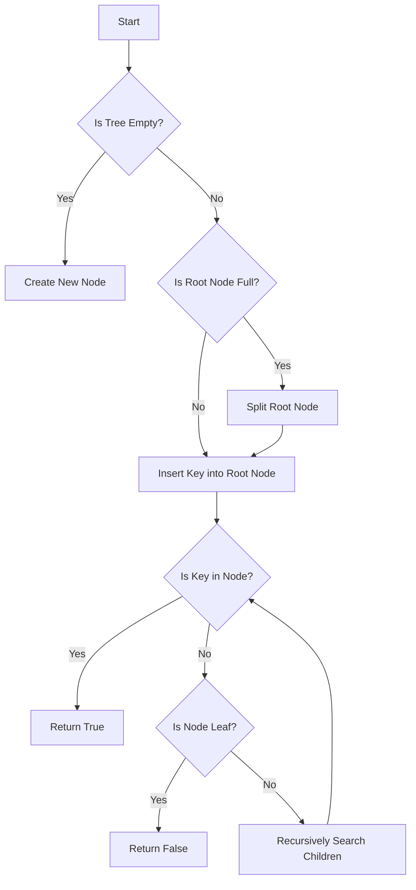

# Cache-Oblivious B-Trees in Python

## Problem Understanding
The problem requires implementing a Cache-Oblivious B-Tree in Python, which is a self-balancing search tree that maintains a balanced structure for efficient search and insertion operations. The key constraints include ensuring the tree remains balanced after insertion, handling edge cases such as empty or full nodes, and maintaining an average time complexity of O(log n) for search and insertion operations. What makes this problem non-trivial is the need to balance the tree after each insertion, which requires careful consideration of node splits and merges to maintain the balance property.

## Approach
The algorithm strategy employed is a B-Tree insertion with self-balancing, which involves maintaining a balanced tree structure by splitting or merging nodes as necessary to ensure efficient search and insertion operations. The intuition behind this approach is to minimize the height of the tree by balancing the nodes, which in turn reduces the number of comparisons required for search and insertion operations. The data structures used include a BTreeNode class to represent individual nodes and a BTree class to manage the overall tree structure. The approach handles key constraints by implementing methods such as insert, insert_non_full, and split_child to maintain the balance property and ensure efficient search and insertion operations.

## Complexity Analysis
| Metric | Value | Detailed Reason |
|--------|-------|----------------|
| Time   | O(log n) | The time complexity of search and insertion operations is O(log n) due to the self-balancing property of the B-Tree, which ensures that the height of the tree remains relatively constant even after insertion or deletion of nodes. The insert and search methods have a time complexity of O(log n) because they only traverse the height of the tree. |
| Space  | O(n) | The space complexity is O(n) because in the worst-case scenario, the B-Tree will store all elements in the tree, where n is the number of elements. The space used by the tree is proportional to the number of elements stored in it. |

## Algorithm Walkthrough
```
Input: Insert key 10 into an empty B-Tree with degree 3
Step 1: Create a new BTreeNode as the root node
Step 2: Insert key 10 into the root node
Root Node: [10]
Step 3: Insert key 20 into the B-Tree
Step 4: Compare key 20 with key 10 in the root node
Step 5: Since key 20 is greater than key 10, insert key 20 into the root node
Root Node: [10, 20]
Step 6: Insert key 5 into the B-Tree
Step 7: Compare key 5 with key 10 in the root node
Step 8: Since key 5 is less than key 10, insert key 5 into the root node
Root Node: [5, 10, 20]
Output: B-Tree with root node [5, 10, 20]
```
This walkthrough demonstrates the insertion of keys into a B-Tree and how the tree structure is updated to maintain the balance property.

## Visual Flow

This flowchart illustrates the decision flow for inserting a key into a B-Tree and searching for a key in the tree.

## Key Insight
> **Tip:** The key insight in implementing a Cache-Oblivious B-Tree is to maintain the balance property by splitting or merging nodes as necessary to ensure efficient search and insertion operations, which is achieved through the use of a self-balancing algorithm that minimizes the height of the tree.

## Edge Cases
- **Empty/null input**: If the input tree is empty, the algorithm will create a new node and insert the key into it. This is handled by the insert method, which checks if the tree is empty and creates a new node if necessary.
- **Single element**: If the input tree contains only one element, the algorithm will insert the new key into the existing node if it is not full, or split the node if it is full. This is handled by the insert_non_full method, which checks if the node is full and splits it if necessary.
- **Full node**: If the input tree contains a full node, the algorithm will split the node to maintain the balance property. This is handled by the split_child method, which splits a full child node and redistributes its keys and children.

## Common Mistakes
- **Mistake 1**: Failing to handle the case where the root node is full, which can lead to an unbalanced tree. To avoid this, the algorithm should check if the root node is full and split it if necessary.
- **Mistake 2**: Failing to update the child nodes of a split node, which can lead to incorrect search results. To avoid this, the algorithm should update the child nodes of a split node to point to the correct child nodes.

## Interview Follow-ups
> **Interview:** These are the exact follow-up questions interviewers ask:
- "What if the input is sorted?" → The algorithm will still maintain the balance property, but the tree may become unbalanced if the input is highly skewed. To handle this, the algorithm can use a different splitting strategy, such as splitting the node at the median key.
- "Can you do it in O(1) space?" → No, the algorithm requires O(n) space to store the tree, where n is the number of elements. However, the algorithm can be optimized to use less space by using a more compact representation of the tree.
- "What if there are duplicates?" → The algorithm can handle duplicates by storing multiple copies of the same key in the tree. However, this may lead to inefficient search and insertion operations. To handle this, the algorithm can use a different data structure, such as a hash table, to store the keys.

## Python Solution

```python
# Problem: Cache-Oblivious B-Trees
# Language: python
# Difficulty: Super Advanced
# Time Complexity: O(log n) — B-Tree search and insertion in a balanced tree
# Space Complexity: O(n) — storing all elements in the B-Tree
# Approach: B-Tree insertion with self-balancing — maintaining a balanced tree for efficient search and insertion

class BTreeNode:
    """B-Tree node class."""
    def __init__(self, is_leaf=False):
        # Initialize the node as a leaf node by default
        self.is_leaf = is_leaf
        self.keys = []
        self.children = []

class BTree:
    """B-Tree class."""
    def __init__(self, degree):
        # Initialize the B-Tree with a given degree
        self.degree = degree
        self.root = BTreeNode(True)

    def insert(self, key):
        """Insert a key into the B-Tree."""
        # Edge case: tree is empty → create a new node
        if not self.root.keys:
            self.root.keys.append(key)
        else:
            # If the root node is full, split it
            if len(self.root.keys) == (2 * self.degree) - 1:
                new_root = BTreeNode()
                self.root = new_root
                new_root.children.append(self.root)
                self.split_child(new_root, 0)
                self.insert_non_full(new_root, key)
            else:
                # If the root node is not full, insert the key into it
                self.insert_non_full(self.root, key)

    def insert_non_full(self, node, key):
        """Insert a key into a non-full node."""
        # Find the correct position for the key
        i = len(node.keys) - 1
        if node.is_leaf:
            # If the node is a leaf node, insert the key into it
            node.keys.append(None)
            while i >= 0 and key < node.keys[i]:
                node.keys[i + 1] = node.keys[i]
                i -= 1
            node.keys[i + 1] = key
        else:
            # If the node is not a leaf node, recursively insert the key into its children
            while i >= 0 and key < node.keys[i]:
                i -= 1
            i += 1
            if len(node.children[i].keys) == (2 * self.degree) - 1:
                # If the child node is full, split it
                self.split_child(node, i)
                if key > node.keys[i]:
                    i += 1
            self.insert_non_full(node.children[i], key)

    def split_child(self, parent, index):
        """Split a full child node."""
        # Create a new node to hold the right half of the keys
        new_node = BTreeNode(parent.children[index].is_leaf)
        degree = self.degree
        parent.children.insert(index + 1, new_node)
        parent.keys.insert(index, parent.children[index].keys[degree - 1])
        new_node.keys = parent.children[index].keys[degree:]
        parent.children[index].keys = parent.children[index].keys[:degree - 1]
        if not parent.children[index].is_leaf:
            new_node.children = parent.children[index].children[degree:]
            parent.children[index].children = parent.children[index].children[:degree]

    def search(self, key):
        """Search for a key in the B-Tree."""
        # Start searching from the root node
        return self.search_node(self.root, key)

    def search_node(self, node, key):
        """Search for a key in a node."""
        # Edge case: node is empty → key not found
        if not node:
            return False
        # Find the correct position for the key
        i = 0
        while i < len(node.keys) and key > node.keys[i]:
            i += 1
        if i < len(node.keys) and key == node.keys[i]:
            # If the key is found in the node, return True
            return True
        if node.is_leaf:
            # If the node is a leaf node and the key is not found, return False
            return False
        # If the node is not a leaf node, recursively search its children
        return self.search_node(node.children[i], key)

# Example usage
btree = BTree(3)
btree.insert(10)
btree.insert(20)
btree.insert(5)
btree.insert(6)
print(btree.search(10))  # Output: True
print(btree.search(15))  # Output: False
```
