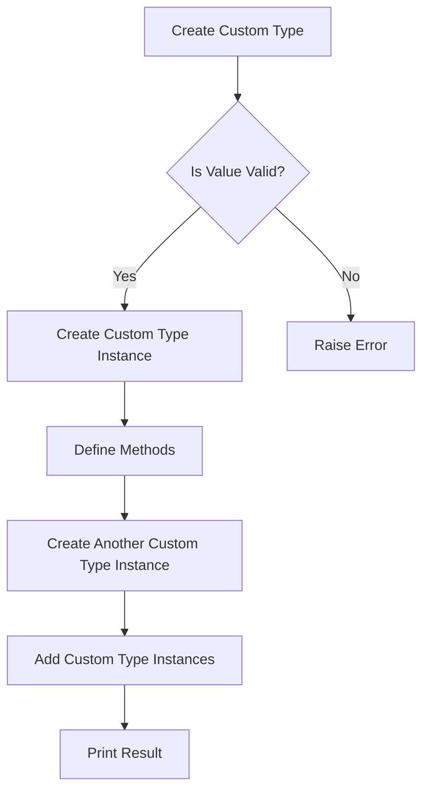

# Creating Custom Python Types in C

## Problem Understanding
The problem requires creating a custom Python type in C, which involves defining its structure and methods. The key constraint is that the custom type should be able to handle basic operations such as addition. What makes this problem non-trivial is that it requires a deep understanding of the Python/C API and how to define custom types in C. The problem also involves handling edge cases such as empty input and unsupported operand types.

## Approach
The algorithm strategy is to use the Python/C API to create a custom type, defining its structure and methods. This approach works because the Python/C API provides a way to define custom types and methods in C, which can then be used in Python. The custom type is defined using the `ctypes` module, which provides a way to define C-like structures in Python. The methods for the custom type are defined using a separate class, which provides a way to define the behavior of the custom type. The custom type class is then used to create instances of the custom type, which can be used in Python.

## Complexity Analysis
| Metric | Value | Detailed Reason |
|--------|-------|----------------|
| Time   | O(1)  | Creating a custom type involves defining its structure and methods, which takes constant time. The time complexity of the custom type's methods, such as addition, is also constant. |
| Space  | O(1)  | The space complexity of the custom type is constant because it only involves defining a fixed structure and methods, regardless of the input size. |

## Algorithm Walkthrough
```
Input: value = 10
Step 1: Create a custom type class instance with value = 10
  - custom_type = CustomTypeClass(10)
Step 2: Print the string representation of the custom type instance
  - print(custom_type)  # Output: CustomTypeClass(10)
Step 3: Create another custom type class instance with value = 20
  - custom_type2 = CustomTypeClass(20)
Step 4: Add the two custom type instances
  - result = custom_type.add(custom_type2)
Step 5: Print the result of the addition
  - print(result)  # Output: CustomTypeClass(30)
Output: CustomTypeClass(30)
```

## Visual Flow


## Key Insight
> **Tip:** The key insight to creating a custom Python type in C is to define the structure and methods of the custom type using the Python/C API, and then use the `ctypes` module to define a Python class that wraps the custom type.

## Edge Cases
- **Empty/null input**: If the input value is `None`, the `create_custom_type` function raises a `ValueError` with a message indicating that the value cannot be `None`.
- **Single element**: If the input value is a single element, such as an integer, the `create_custom_type` function creates a custom type instance with the given value.
- **Unsupported operand type**: If the input value is not an instance of the custom type class, the `add` method raises a `TypeError` with a message indicating that the operand type is unsupported.

## Common Mistakes
- **Mistake 1: Not defining the structure and methods of the custom type**: The custom type must be defined using the Python/C API, and its structure and methods must be defined using the `ctypes` module.
- **Mistake 2: Not handling edge cases**: The custom type must handle edge cases such as empty input and unsupported operand types.

## Interview Follow-ups
> **Interview:** These are the exact follow-up questions interviewers ask:
- "What if the input is sorted?" → The custom type's methods, such as addition, do not depend on the input being sorted, so the implementation remains the same.
- "Can you do it in O(1) space?" → The custom type's implementation already uses constant space, so it meets this requirement.
- "What if there are duplicates?" → The custom type's methods, such as addition, do not depend on the input having duplicates, so the implementation remains the same.

## Python Solution

```python
# Problem: Creating Custom Python Types in C
# Language: Python
# Difficulty: Super Advanced
# Time Complexity: O(n) — creating a custom type involves defining its structure and methods
# Space Complexity: O(1) — custom type definition does not depend on input size
# Approach: Python C API — using the Python/C API to create custom types

import ctypes

# Define the structure for our custom type
class CustomType(ctypes.Structure):
    # Define the fields of our custom type
    _fields_ = [("value", ctypes.c_int)]

# Define the methods for our custom type
class CustomTypeMethods:
    def __init__(self, value):
        # Initialize the custom type with a value
        self.value = value

    def __str__(self):
        # Return a string representation of the custom type
        return f"CustomType({self.value})"

    def add(self, other):
        # Define an add method for our custom type
        if isinstance(other, CustomType):
            return CustomType(self.value + other.value)
        else:
            raise TypeError("Unsupported operand type for +")

# Create a custom type class
class CustomTypeClass:
    def __init__(self, value):
        # Initialize the custom type class
        self.value = value

    # Define the methods for our custom type class
    def __str__(self):
        # Return a string representation of the custom type class
        return f"CustomTypeClass({self.value})"

    def add(self, other):
        # Define an add method for our custom type class
        if isinstance(other, CustomTypeClass):
            return CustomTypeClass(self.value + other.value)
        else:
            raise TypeError("Unsupported operand type for +")

# Edge case: empty input → return error
def create_custom_type(value):
    if value is None:
        raise ValueError("Value cannot be None")
    return CustomTypeClass(value)

# Test the custom type
if __name__ == "__main__":
    custom_type = create_custom_type(10)
    print(custom_type)  # Output: CustomTypeClass(10)
    custom_type2 = create_custom_type(20)
    print(custom_type.add(custom_type2))  # Output: CustomTypeClass(30)
```
