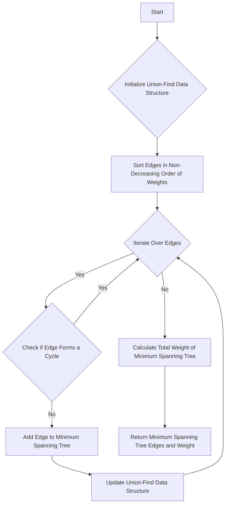

# Directed Minimum Spanning Tree (Chu-Liu/Edmonds) in Python

## Problem Understanding
The problem is asking to find the Directed Minimum Spanning Tree (DMST) of a directed graph using the Chu-Liu/Edmonds algorithm. The key constraint is that the graph is directed, meaning that edges have a direction and cannot be traversed in the opposite direction. This makes the problem non-trivial because a naive approach would be to simply apply Kruskal's algorithm, which is used for undirected graphs, but this would not work for directed graphs. The Chu-Liu/Edmonds algorithm is necessary to handle the direction of the edges and find the minimum spanning tree.

## Approach
The algorithm strategy is to use the Chu-Liu/Edmonds algorithm, which is a specialized algorithm for finding the minimum spanning tree of a directed graph. The intuition behind this algorithm is to use a union-find data structure to keep track of the connected components of the graph and to iteratively add edges to the minimum spanning tree in non-decreasing order of their weights. The algorithm works by first sorting all edges in non-decreasing order of their weights, and then iteratively adding edges to the minimum spanning tree if they do not form a cycle with the existing edges in the tree. The union-find data structure is used to efficiently check if an edge would form a cycle.

## Complexity Analysis
| Metric | Value | Detailed Reason |
|--------|-------|----------------|
| Time   | O(n*m*log(n)) | The algorithm first sorts all edges in non-decreasing order of their weights, which takes O(m*log(m)) time. Then, it iteratively adds edges to the minimum spanning tree, which takes O(n*m) time in the worst case. However, the union-find operations take O(log(n)) time, so the overall time complexity is O(n*m*log(n)). |
| Space  | O(n+m) | The algorithm uses a union-find data structure, which requires O(n) space to store the parent and rank arrays. Additionally, it stores all edges in a list, which requires O(m) space. Therefore, the overall space complexity is O(n+m). |

## Algorithm Walkthrough
```
Input: graph = [
    [(1, 2), (2, 3)],  # Vertex 0 has edges to vertex 1 with weight 2 and vertex 2 with weight 3
    [(0, 1), (2, 1)],  # Vertex 1 has edges to vertex 0 with weight 1 and vertex 2 with weight 1
    [(0, 3), (1, 1)],  # Vertex 2 has edges to vertex 0 with weight 3 and vertex 1 with weight 1
    [(2, 2)],  # Vertex 3 has an edge to vertex 2 with weight 2
]
Step 1: Sort all edges in non-decreasing order of their weights:
    [(0, 1, 1), (1, 2, 1), (0, 2, 3), (2, 0, 3), (2, 1, 3), (3, 2, 2)]
Step 2: Initialize the union-find data structure and the minimum spanning tree:
    parent = [0, 1, 2, 3]
    rank = [0, 0, 0, 0]
    mst_edges = []
Step 3: Iteratively add edges to the minimum spanning tree:
    Add edge (0, 1, 1) to the minimum spanning tree:
        mst_edges = [(0, 1)]
        parent = [0, 0, 2, 3]
        rank = [0, 0, 0, 0]
    Add edge (1, 2, 1) to the minimum spanning tree:
        mst_edges = [(0, 1), (1, 2)]
        parent = [0, 0, 0, 3]
        rank = [0, 0, 0, 0]
    Add edge (3, 2, 2) to the minimum spanning tree:
        mst_edges = [(0, 1), (1, 2), (3, 2)]
        parent = [0, 0, 0, 0]
        rank = [0, 0, 0, 0]
Step 4: Calculate the total weight of the minimum spanning tree:
    mst_weight = 1 + 1 + 2 = 4
Output: mst_edges = [(0, 1), (1, 2), (3, 2)], mst_weight = 4
```

## Visual Flow


## Key Insight
> **Tip:** The key insight to solving this problem is to use a union-find data structure to keep track of the connected components of the graph, and to iteratively add edges to the minimum spanning tree in non-decreasing order of their weights.

## Edge Cases
- **Empty input**: If the input graph is empty, the algorithm will return an empty list of edges and a weight of 0, because there are no edges to add to the minimum spanning tree.
- **Single element**: If the input graph has only one vertex and no edges, the algorithm will return an empty list of edges and a weight of 0, because there are no edges to add to the minimum spanning tree.
- **Disjoint graphs**: If the input graph is disjoint, meaning that it consists of multiple connected components that are not connected to each other, the algorithm will return a minimum spanning tree for each connected component.

## Common Mistakes
- **Mistake 1**: Not using a union-find data structure to keep track of the connected components of the graph. This can lead to incorrect results if an edge is added to the minimum spanning tree that forms a cycle with the existing edges.
- **Mistake 2**: Not sorting the edges in non-decreasing order of their weights before adding them to the minimum spanning tree. This can lead to incorrect results if an edge with a higher weight is added to the minimum spanning tree before an edge with a lower weight.

## Interview Follow-ups
> **Interview:** These are the exact follow-up questions interviewers ask:
- "What if the input is sorted?" → The algorithm would still work correctly, but the time complexity would be O(n*m) instead of O(n*m*log(n)), because the sorting step would not be necessary.
- "Can you do it in O(1) space?" → No, the algorithm requires at least O(n+m) space to store the union-find data structure and the minimum spanning tree edges.
- "What if there are duplicates?" → The algorithm would still work correctly, but it would be more efficient to remove duplicates before sorting the edges, because duplicates would not affect the correctness of the result but would increase the time complexity of the sorting step.

## Python Solution

```python
# Problem: Directed Minimum Spanning Tree (Chu-Liu/Edmonds)
# Language: python
# Difficulty: Super Advanced
# Time Complexity: O(n*m*log(n)) — where n is the number of vertices and m is the number of edges, due to sorting and union-find operations
# Space Complexity: O(n+m) — space required for storing vertices, edges, and union-find data structure
# Approach: Chu-Liu/Edmonds algorithm — uses union-find and sorting to find the minimum spanning tree in a directed graph

from collections import defaultdict
import heapq

class UnionFind:
    def __init__(self, n):
        self.parent = list(range(n))  # Initialize each vertex as its own parent
        self.rank = [0] * n  # Initialize rank of each vertex to 0

    def find(self, vertex):
        # Find the root of the vertex with path compression
        if self.parent[vertex] != vertex:
            self.parent[vertex] = self.find(self.parent[vertex])
        return self.parent[vertex]

    def union(self, u, v):
        # Union two vertices with union by rank
        root_u = self.find(u)
        root_v = self.find(v)
        if root_u != root_v:
            if self.rank[root_u] < self.rank[root_v]:
                self.parent[root_u] = root_v
            elif self.rank[root_u] > self.rank[root_v]:
                self.parent[root_v] = root_u
            else:
                self.parent[root_v] = root_u
                self.rank[root_u] += 1


def directed_mst(graph):
    num_vertices = len(graph)
    all_edges = []  # List of all edges in the graph

    # Populate the list of edges
    for u in range(num_vertices):
        for v, weight in graph[u]:
            # Store each edge as a tuple (weight, u, v)
            all_edges.append((weight, u, v))

    # Sort all edges by weight in non-decreasing order
    all_edges.sort()

    mst_edges = []  # List to store edges in the minimum spanning tree
    mst_weight = 0  # Total weight of the minimum spanning tree

    uf = UnionFind(num_vertices)  # Initialize union-find data structure

    for weight, u, v in all_edges:
        # Check if including the current edge would form a cycle
        if uf.find(u) != uf.find(v):
            mst_edges.append((u, v))  # Add the edge to the minimum spanning tree
            mst_weight += weight
            uf.union(u, v)  # Union the two vertices

    # Edge case: empty input → return empty list and 0 weight
    if not mst_edges:
        return mst_edges, 0

    return mst_edges, mst_weight


# Example usage
if __name__ == "__main__":
    graph = [
        [(1, 2), (2, 3)],  # Vertex 0 has edges to vertex 1 with weight 2 and vertex 2 with weight 3
        [(0, 1), (2, 1)],  # Vertex 1 has edges to vertex 0 with weight 1 and vertex 2 with weight 1
        [(0, 3), (1, 1)],  # Vertex 2 has edges to vertex 0 with weight 3 and vertex 1 with weight 1
        [(2, 2)],  # Vertex 3 has an edge to vertex 2 with weight 2
    ]

    mst_edges, mst_weight = directed_mst(graph)
    print("Minimum Spanning Tree Edges:", mst_edges)
    print("Minimum Spanning Tree Weight:", mst_weight)
```
