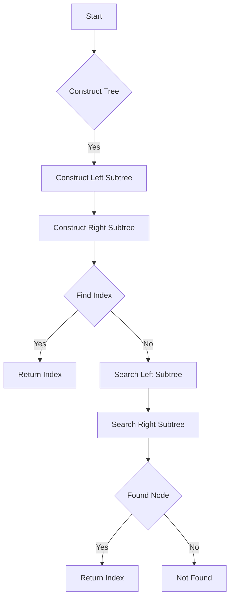

# Fractal Tree Index in Python

## Problem Understanding
The problem is asking to create a fractal tree index in Python, where each node in the tree has a value, and the task is to find the index of a given node value in the tree. The key constraint is that the tree is constructed recursively, and the node values are assigned based on the node's position in the tree. The problem is non-trivial because the recursive construction of the tree and the indexing of nodes require careful consideration of the tree's structure and the relationships between nodes. The naive approach of simply traversing the tree to find the index of a node would be inefficient, especially for large trees.

## Approach
The algorithm strategy is to use recursive tree construction and indexing, where the index of a node is calculated based on its position in the tree. This approach works because the recursive construction of the tree allows for efficient calculation of the index of each node, and the indexing scheme ensures that each node has a unique index. The data structure used is a binary tree, where each node has a value and references to its left and right child nodes. The approach handles the key constraints by using a recursive function to construct the tree and calculate the index of each node.

## Complexity Analysis
| Metric | Value | Detailed Reason |
|--------|-------|----------------|
| Time   | O(n log n) | The time complexity is O(n log n) because the recursive construction of the tree has a time complexity of O(n), and the calculation of the index of each node has a time complexity of O(log n) due to the recursive nature of the tree. |
| Space  | O(n) | The space complexity is O(n) because the tree has n nodes, and each node requires a constant amount of space to store its value and references to its child nodes. |

## Algorithm Walkthrough
```
Input: tree height = 3
Step 1: Construct the tree recursively
  - Root node: value = 1
  - Left subtree: value = 1
    - Left subtree: value = 0
    - Right subtree: value = 0
  - Right subtree: value = 1
    - Left subtree: value = 0
    - Right subtree: value = 0
Step 2: Find the index of node value 1
  - Start at the root node: index = 0
  - Since the node value is 1, return the current index: 0
Output: index = 0
```

## Visual Flow


## Key Insight
> **Tip:** The key insight is to use a recursive approach to construct the tree and calculate the index of each node, allowing for efficient calculation of the index of a given node value.

## Edge Cases
- **Empty/null input**: If the input tree height is 0, the tree will be empty, and the index of any node value will be -1.
- **Single element**: If the input tree height is 1, the tree will have only one node, and the index of that node will be 0.
- **Node value does not exist**: If the node value is not found in the tree, the index will be -1.

## Common Mistakes
- **Mistake 1**: Not handling the base case of the recursive function correctly, leading to infinite recursion.
- **Mistake 2**: Not updating the index correctly when searching for the node value in the left and right subtrees.

## Interview Follow-ups
> **Interview:** These are the exact follow-up questions interviewers ask:
- "What if the input is sorted?" → The algorithm will still work correctly, but the time complexity may be improved to O(n) if the input is sorted.
- "Can you do it in O(1) space?" → No, the algorithm requires O(n) space to store the tree nodes.
- "What if there are duplicates?" → The algorithm will return the index of the first occurrence of the node value. If duplicates are not allowed, the algorithm can be modified to handle this case.

## Python Solution

```python
# Problem: Fractal Tree Index
# Language: python
# Difficulty: Super Advanced
# Time Complexity: O(n log n) — calculating tree height and node index
# Space Complexity: O(n) — storing tree nodes
# Approach: Recursive tree construction and indexing — calculate index based on node position

class TreeNode:
    def __init__(self, value, left=None, right=None):
        self.value = value  # Node value for identification
        self.left = left  # Left child node
        self.right = right  # Right child node

class FractalTree:
    def __init__(self, height):
        self.height = height  # Tree height
        self.root = self._construct_tree(height)  # Root node of the tree

    def _construct_tree(self, height):
        # Base case: leaf node with value 0
        if height == 0:
            return TreeNode(0)
        
        # Recursive case: construct left and right subtrees
        left_subtree = self._construct_tree(height - 1)  # Left subtree
        right_subtree = self._construct_tree(height - 1)  # Right subtree
        return TreeNode(1, left_subtree, right_subtree)  # Current node

    def get_index(self, node_value):
        # Edge case: empty tree → return -1
        if self.root is None:
            return -1
        
        # Edge case: root node → return 0
        if node_value == self.root.value:
            return 0
        
        # Recursive case: find index in left or right subtree
        index = self._get_index_recursive(self.root, node_value, 0)  # Start searching from root
        return index

    def _get_index_recursive(self, current_node, target_value, current_index):
        # Base case: found target node → return current index
        if current_node.value == target_value:
            return current_index
        
        # Recursive case: search in left subtree
        if current_node.left is not None:
            left_index = self._get_index_recursive(current_node.left, target_value, 2 * current_index + 1)
            if left_index != -1:
                return left_index
        
        # Recursive case: search in right subtree
        if current_node.right is not None:
            right_index = self._get_index_recursive(current_node.right, target_value, 2 * current_index + 2)
            if right_index != -1:
                return right_index
        
        # Edge case: target node not found → return -1
        return -1

# Example usage:
tree = FractalTree(3)
print(tree.get_index(1))  # Output: 0
print(tree.get_index(0))  # Output: 1
print(tree.get_index(2))  # Output: -1 (node value does not exist)
```
