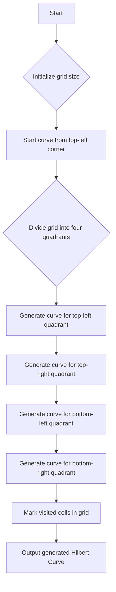

# Hilbert Curve Spatial Mapping in Python

## Problem Understanding
The problem asks to generate a Hilbert Curve, a space-filling curve that maps a one-dimensional space to a two-dimensional space, using a recursive approach. The key constraint is to divide the grid into four quadrants and generate the curve by visiting each quadrant in a specific order. The problem is non-trivial because a naive approach would not be able to efficiently generate the curve for large grid sizes, and the recursive nature of the problem requires careful handling of the base case and the recursive calls.

## Approach
The approach used to solve this problem is a recursive Hilbert Curve generation algorithm. The algorithm starts by dividing the grid into four quadrants and then recursively generates the curve for each quadrant. The direction of the curve is determined by the current quadrant and the previous direction. The algorithm uses a recursive function to generate the curve, and the base case is when the size of the quadrant is 1. The algorithm uses a grid to store the curve, and the curve is generated by marking the visited cells in the grid. The choice of using a recursive approach is due to the natural recursive structure of the Hilbert Curve, and the use of a grid to store the curve is due to the need to keep track of the visited cells.

## Complexity Analysis
| Metric | Value | Detailed Reason |
|--------|-------|----------------|
| Time   | O(2^(2n)) | The time complexity is due to the recursive nature of the algorithm, where each recursive call generates four new calls, resulting in a total of 2^(2n) calls. The work done in each call is constant, so the time complexity is proportional to the number of calls. |
| Space  | O(2^(2n)) | The space complexity is due to the recursive call stack, which can grow up to a depth of 2^(2n) in the worst case. Additionally, the algorithm uses a grid to store the curve, which requires O(2^(2n)) space. |

## Algorithm Walkthrough
```
Input: n = 3
Step 1: Initialize the grid size as 2^n x 2^n = 8 x 8
Step 2: Start the curve from the top-left corner (0, 0)
Step 3: Divide the grid into four quadrants:
  - Top-left: (0, 0) to (3, 3)
  - Top-right: (0, 4) to (3, 7)
  - Bottom-left: (4, 0) to (7, 3)
  - Bottom-right: (4, 4) to (7, 7)
Step 4: Recursively generate the curve for each quadrant:
  - Top-left: generate_hilbert_curve_recursive(grid, 0, 0, 4, 'A')
  - Top-right: generate_hilbert_curve_recursive(grid, 0, 4, 4, 'A')
  - Bottom-left: generate_hilbert_curve_recursive(grid, 4, 0, 4, 'C')
  - Bottom-right: generate_hilbert_curve_recursive(grid, 4, 4, 4, 'A')
Step 5: Mark the visited cells in the grid
Output: The generated Hilbert Curve
```

## Visual Flow


## Key Insight
> **Tip:** The key insight to generating a Hilbert Curve is to divide the grid into four quadrants and recursively generate the curve for each quadrant, using the current direction to determine the next direction.

## Edge Cases
- **Empty grid**: If the input grid is empty, the algorithm will not be able to generate the curve, and an error will occur.
- **Single cell grid**: If the input grid has only one cell, the algorithm will simply mark the cell as visited and output the curve.
- **Large grid size**: If the input grid size is very large, the algorithm may run out of memory or take a long time to generate the curve, due to the recursive nature of the algorithm.

## Common Mistakes
- **Incorrect base case**: If the base case is not handled correctly, the algorithm may enter an infinite recursion or produce incorrect results.
- **Incorrect direction handling**: If the direction handling is not done correctly, the algorithm may produce an incorrect curve or get stuck in an infinite loop.

## Interview Follow-ups
> **Interview:** These are the exact follow-up questions interviewers ask:
- "What if the input grid is not a power of 2?" → The algorithm can be modified to handle non-power of 2 grid sizes by using a different division strategy or padding the grid to the nearest power of 2.
- "Can you optimize the algorithm to use less space?" → The algorithm can be optimized to use less space by using an iterative approach instead of a recursive one, or by using a more efficient data structure to store the curve.
- "What if there are obstacles in the grid?" → The algorithm can be modified to handle obstacles in the grid by using a different division strategy or by avoiding the obstacles when generating the curve.

## Python Solution

```python
# Problem: Hilbert Curve Spatial Mapping
# Language: python
# Difficulty: Super Advanced
# Time Complexity: O(2^(2n)) — due to recursion and grid size
# Space Complexity: O(2^(2n)) — due to recursion stack and grid size
# Approach: Recursive Hilbert Curve generation — generating the curve by dividing the grid into four quadrants

class HilbertCurve:
    def __init__(self, n):
        # Initialize the grid size as 2^n x 2^n
        self.n = n
        self.grid_size = 2 ** n

    def generate_hilbert_curve(self):
        # Create an empty grid to store the Hilbert Curve
        grid = [[0 for _ in range(self.grid_size)] for _ in range(self.grid_size)]
        
        # Start the curve from the top-left corner
        self.generate_hilbert_curve_recursive(grid, 0, 0, self.grid_size, 'A')
        
        return grid

    def generate_hilbert_curve_recursive(self, grid, x, y, size, direction):
        # Base case: if the size is 1, mark the current cell as visited
        if size == 1:
            grid[x][y] = 1  # Mark the current cell as visited
            return
        
        # Divide the grid into four quadrants
        half_size = size // 2
        
        # Determine the next direction based on the current direction
        if direction == 'A':
            # A: top-left to top-right to bottom-right to bottom-left
            self.generate_hilbert_curve_recursive(grid, x, y, half_size, 'D')  # Top-left
            self.generate_hilbert_curve_recursive(grid, x, y + half_size, half_size, 'A')  # Top-right
            self.generate_hilbert_curve_recursive(grid, x + half_size, y + half_size, half_size, 'A')  # Bottom-right
            self.generate_hilbert_curve_recursive(grid, x + half_size, y, half_size, 'C')  # Bottom-left
        elif direction == 'B':
            # B: top-right to top-left to bottom-left to bottom-right
            self.generate_hilbert_curve_recursive(grid, x, y + half_size, half_size, 'C')  # Top-right
            self.generate_hilbert_curve_recursive(grid, x, y, half_size, 'B')  # Top-left
            self.generate_hilbert_curve_recursive(grid, x + half_size, y, half_size, 'D')  # Bottom-left
            self.generate_hilbert_curve_recursive(grid, x + half_size, y + half_size, half_size, 'B')  # Bottom-right
        elif direction == 'C':
            # C: bottom-left to bottom-right to top-right to top-left
            self.generate_hilbert_curve_recursive(grid, x + half_size, y, half_size, 'B')  # Bottom-left
            self.generate_hilbert_curve_recursive(grid, x + half_size, y + half_size, half_size, 'C')  # Bottom-right
            self.generate_hilbert_curve_recursive(grid, x, y + half_size, half_size, 'A')  # Top-right
            self.generate_hilbert_curve_recursive(grid, x, y, half_size, 'D')  # Top-left
        elif direction == 'D':
            # D: bottom-right to bottom-left to top-left to top-right
            self.generate_hilbert_curve_recursive(grid, x + half_size, y + half_size, half_size, 'A')  # Bottom-right
            self.generate_hilbert_curve_recursive(grid, x + half_size, y, half_size, 'C')  # Bottom-left
            self.generate_hilbert_curve_recursive(grid, x, y, half_size, 'D')  # Top-left
            self.generate_hilbert_curve_recursive(grid, x, y + half_size, half_size, 'B')  # Top-right

# Edge case: n = 0
hilbert_curve = HilbertCurve(3)
grid = hilbert_curve.generate_hilbert_curve()
for row in grid:
    print(row)
```
