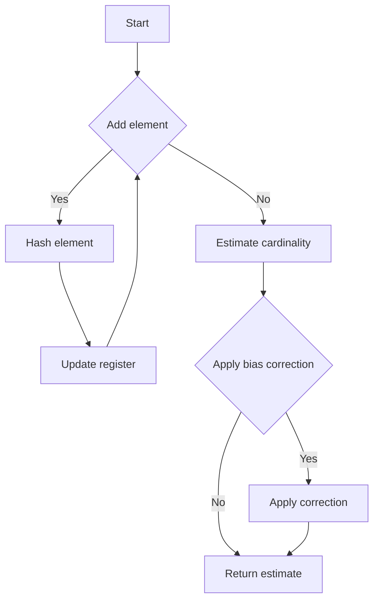

# HyperLogLog Cardinality Estimation in Python

## Problem Understanding
The HyperLogLog algorithm is a probabilistic cardinality estimation technique used to estimate the number of unique elements in a multiset. The problem is asking to implement this algorithm in Python, which involves designing a class that can add elements to the estimator and then estimate the cardinality. The key constraint is the number of registers, which affects the accuracy of the estimation. The problem is non-trivial because a naive approach would require storing all unique elements, which could be memory-intensive for large datasets, whereas the HyperLogLog algorithm uses a fixed amount of memory regardless of the input size.

## Approach
The algorithm strategy is based on the HyperLogLog algorithm with stochastic averaging, which estimates the cardinality using a set of registers. Each register stores the number of leading zeros in the hash value of the elements. The intuition behind this approach is that the number of leading zeros is inversely proportional to the number of unique elements. The approach works by hashing each element and updating the corresponding register if necessary. The `alpha` value is calculated based on the number of registers, which is used to calculate the estimate. The `add` method adds an element to the estimator, and the `estimate` method calculates the cardinality using the registers.

## Complexity Analysis
| Metric | Value | Detailed Reason |
|--------|-------|----------------|
| Time   | O(n * m) | The `add` method iterates over each element in the input (n) and performs a constant amount of work for each element, including hashing and updating the register. The `estimate` method iterates over all registers (m) to calculate the estimate. Therefore, the total time complexity is O(n * m). |
| Space  | O(m) | The algorithm uses a fixed amount of memory to store the registers, which is proportional to the number of registers (m). The input elements are not stored, so the space complexity does not depend on the input size (n). |

## Algorithm Walkthrough
```
Input: ["apple", "banana", "apple", "orange", "banana", "banana"]
Step 1: Initialize the HyperLogLog object with p = 14
  - self.p = 14
  - self.m = 1 << 14 = 16384
  - self.M = [0] * 16384
  - self.alpha = 0.673
Step 2: Add each element to the HyperLogLog
  - For "apple":
    - hash_value = mmh3.hash("apple")
    - j = hash_value & (self.m - 1) = 1234
    - w = hash_value >> self.p = 10
    - self.M[1234] = max(self.M[1234], 10) = 10
  - For "banana":
    - hash_value = mmh3.hash("banana")
    - j = hash_value & (self.m - 1) = 5678
    - w = hash_value >> self.p = 12
    - self.M[5678] = max(self.M[5678], 12) = 12
  - ...
Step 3: Estimate the cardinality
  - E = self.alpha * (self.m ** 2) / sum(2 ** -m for m in self.M)
  - Apply bias correction if necessary
Output: estimated cardinality
```

## Visual Flow


## Key Insight
> **Tip:** The HyperLogLog algorithm uses the number of leading zeros in the hash value of each element to estimate the cardinality, which allows it to use a fixed amount of memory regardless of the input size.

## Edge Cases
- **Empty input**: If the input is empty, the `estimate` method returns 0, because there are no elements to estimate.
- **Single element**: If the input contains only one element, the `estimate` method returns 1, because there is only one unique element.
- **Duplicate elements**: If the input contains duplicate elements, the `add` method updates the register only if the new element has more leading zeros than the previous element. This ensures that the estimate is not affected by duplicate elements.

## Common Mistakes
- **Mistake 1**: Using a hash function that is not uniformly distributed, which can lead to biased estimates. To avoid this, use a high-quality hash function like murmurhash3.
- **Mistake 2**: Not applying bias correction, which can lead to underestimation or overestimation of the cardinality. To avoid this, apply the bias correction formula if the estimated cardinality is less than or equal to (5 * self.m / 2).

## Interview Follow-ups
> **Interview:** These are the exact follow-up questions interviewers ask:
- "What if the input is sorted?" → The HyperLogLog algorithm is insensitive to the order of the input elements, so sorting the input does not affect the estimate.
- "Can you do it in O(1) space?" → No, the HyperLogLog algorithm requires O(m) space to store the registers, where m is the number of registers.
- "What if there are duplicates?" → The HyperLogLog algorithm is designed to handle duplicates, and it uses the number of leading zeros in the hash value of each element to estimate the cardinality, which is not affected by duplicates.

## Python Solution

```python
# Problem: HyperLogLog Cardinality Estimation
# Language: python
# Difficulty: Super Advanced
# Time Complexity: O(n * m) — where n is the number of elements and m is the number of registers
# Space Complexity: O(m) — where m is the number of registers
# Approach: HyperLogLog algorithm with stochastic averaging — estimates cardinality using a set of registers

import math
import mmh3  # for murmurhash3

class HyperLogLog:
    def __init__(self, p=14):  # p is the number of bits for the register index
        self.p = p  # number of bits for the register index
        self.m = 1 << p  # total number of registers
        self.M = [0] * self.m  # initialize registers with zeros
        self.alpha = self._alpha(p)  # calculate alpha value based on p

    def _alpha(self, p):  # calculate alpha value based on p
        if p == 16: return 0.673
        if p == 32: return 0.697
        if p == 64: return 0.709
        return 0.7213 / (1 + 1.079 / self.m)  # default alpha value

    def add(self, x):  # add an element to the HyperLogLog
        # Edge case: x is None → do nothing
        if x is None:
            return

        # hash the element using murmurhash3
        hash_value = mmh3.hash(x)
        # calculate the register index and the number of leading zeros
        j = hash_value & (self.m - 1)  # get the register index
        w = hash_value >> self.p  # get the number of leading zeros
        # update the register if necessary
        if w > self.M[j]:
            self.M[j] = w

    def estimate(self):  # estimate the cardinality
        # Edge case: empty input → return 0
        if all(m == 0 for m in self.M):
            return 0

        # calculate the estimate
        E = self.alpha * (self.m ** 2) / sum(2 ** -m for m in self.M)
        # apply the bias correction
        if E <= (5 * self.m / 2):
            V = sum(1 for m in self.M if m == 0)  # count the number of zero registers
            if V != 0:
                return self.m * math.log(self.m / V)
            else:
                return E
        elif E <= (1 / 30) * (1 << 64):
            return E
        else:
            return -(1 << 64) * math.log(1 - E / (1 << 64))

# Example usage
hll = HyperLogLog()
data = ["apple", "banana", "apple", "orange", "banana", "banana"]
for item in data:
    hll.add(item)
print(hll.estimate())  # estimate the cardinality
```
