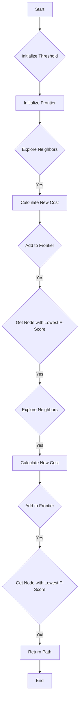

# IDA* (Iterative Deepening A*) in Python

## Problem Understanding
The IDA* (Iterative Deepening A*) algorithm is a pathfinding algorithm that combines the benefits of Breadth-First Search and Depth-First Search with heuristic guidance. The problem is asking to implement this algorithm in Python, given a graph represented as an adjacency list, a starting node, a goal node, and a heuristic function. The key constraints are that the algorithm should find the shortest path from the start node to the goal node, and it should handle cases where the graph is empty or the goal node is not reachable. The problem is non-trivial because the naive approach of exploring all possible paths would result in exponential time complexity, and the algorithm needs to balance the trade-off between exploring nodes and using the heuristic function to guide the search.

## Approach
The algorithm strategy is to use iterative deepening, which gradually increases the threshold until a path is found or the maximum depth is exceeded. The intuition behind this approach is that the heuristic function provides an estimate of the cost from a node to the goal, and by using this estimate, the algorithm can guide the search towards the goal and avoid exploring nodes that are unlikely to be on the shortest path. The algorithm uses a priority queue to keep track of the nodes to be explored, and it uses the heuristic function to calculate the f-score of each node. The approach handles the key constraints by checking if the goal node is reached and by increasing the threshold if the cost exceeds the current threshold.

## Complexity Analysis
| Metric | Value | Detailed Reason |
|--------|-------|----------------|
| Time   | O(b^d) | The algorithm has to explore the entire graph in the worst case, where b is the branching factor and d is the depth of the graph. The iterative deepening approach does not change the worst-case time complexity. |
| Space  | O(b*d) | The space used by the recursion stack and the frontier is proportional to the number of nodes in the graph, which is O(b*d) in the worst case. |

## Algorithm Walkthrough
```
Input: graph = {
    'A': {'B': 1, 'C': 3},
    'B': {'A': 1, 'D': 2},
    'C': {'A': 3, 'D': 1},
    'D': {'B': 2, 'C': 1}
}, start = 'A', goal = 'D', heuristic = manhattan_distance
Step 1: Initialize the threshold = heuristic('A', 'D') = 2
Step 2: Initialize the frontier = [(0, 'A', [])]
Step 3: Explore the neighbors of 'A': 'B' and 'C'
Step 4: Calculate the new cost for 'B': 1 + heuristic('B', 'D') = 3
Step 5: Calculate the new cost for 'C': 3 + heuristic('C', 'D') = 4
Step 6: Add 'B' and 'C' to the frontier: [(3, 'B', ['A']), (4, 'C', ['A'])]
Step 7: Get the node with the lowest f-score: 'B'
Step 8: Explore the neighbors of 'B': 'A' and 'D'
Step 9: Calculate the new cost for 'D': 2 + heuristic('D', 'D') = 2
Step 10: Add 'D' to the frontier: [(2, 'D', ['A', 'B'])]
Step 11: Get the node with the lowest f-score: 'D'
Step 12: Return the path: ['A', 'B', 'D']
Output: ['A', 'B', 'D']
```
## Visual Flow

## Key Insight
> **Tip:** The key insight that enables the optimization is that the heuristic function provides an estimate of the cost from a node to the goal, allowing the algorithm to guide the search towards the goal and avoid exploring nodes that are unlikely to be on the shortest path.

## Edge Cases
- **Empty graph**: If the graph is empty, the algorithm returns None.
- **Single element**: If the graph has only one node, the algorithm returns the node if it is the goal, otherwise it returns None.
- **Goal node not reachable**: If the goal node is not reachable from the start node, the algorithm returns None.

## Common Mistakes
- **Mistake 1**: Not checking if the goal node is reached before exploring its neighbors. To avoid this, add a check for the goal node before exploring its neighbors.
- **Mistake 2**: Not using the heuristic function to guide the search. To avoid this, use the heuristic function to calculate the f-score of each node and guide the search towards the goal.

## Interview Follow-ups
> **Interview:** These are the exact follow-up questions interviewers ask:
- "What if the input is sorted?" → The algorithm still works, but the time complexity remains O(b^d) in the worst case.
- "Can you do it in O(1) space?" → No, the algorithm requires O(b*d) space to store the frontier and the recursion stack.
- "What if there are duplicates?" → The algorithm handles duplicates by skipping nodes that are already in the path.

## Python Solution

```python
# Problem: IDA* (Iterative Deepening A*)
# Language: python
# Difficulty: Super Advanced
# Time Complexity: O(b^d) — in the worst case, the algorithm has to explore the entire graph
# Space Complexity: O(b*d) — the space used by the recursion stack and the frontier
# Approach: Iterative Deepening A* search — combines the benefits of Breadth-First Search and Depth-First Search with heuristic guidance

import heapq

class IDAStar:
    def __init__(self, graph, start, goal, heuristic):
        """
        Initialize the IDA* search algorithm.

        Args:
        graph: The graph represented as an adjacency list.
        start: The starting node.
        goal: The goal node.
        heuristic: The heuristic function.
        """
        self.graph = graph
        self.start = start
        self.goal = goal
        self.heuristic = heuristic

    def search(self):
        """
        Perform the IDA* search.

        Returns:
        The shortest path from the start node to the goal node, or None if no path is found.
        """
        # Edge case: empty graph → return None
        if not self.graph:
            return None

        # Initialize the threshold
        threshold = self.heuristic(self.start, self.goal)

        # Initialize the frontier
        frontier = [(0, self.start, [])]

        # Loop until the goal is found or the threshold is exceeded
        while frontier:
            # Get the node with the lowest f-score
            (cost, node, path) = heapq.heappop(frontier)

            # Check if the node is the goal
            if node == self.goal:
                # Return the path
                return path + [node]

            # Check if the cost exceeds the threshold
            if cost > threshold:
                # Increase the threshold and restart the search
                threshold = cost
                frontier = [(0, self.start, [])]
                continue

            # Explore the neighbors
            for neighbor, neighbor_cost in self.graph[node].items():
                # Calculate the new cost
                new_cost = cost + neighbor_cost

                # Check if the neighbor is already in the path
                if neighbor in path:
                    # Skip the neighbor
                    continue

                # Add the neighbor to the frontier
                heapq.heappush(frontier, (new_cost + self.heuristic(neighbor, self.goal), neighbor, path + [node]))

        # No path found
        return None


# Brute force approach (commented out)
# def brute_force_search(graph, start, goal):
#     # Initialize the queue
#     queue = [(start, [start])]
#
#     # Loop until the queue is empty
#     while queue:
#         # Get the node and path
#         (node, path) = queue.pop(0)
#
#         # Check if the node is the goal
#         if node == goal:
#             # Return the path
#             return path
#
#         # Explore the neighbors
#         for neighbor in graph[node].keys():
#             # Add the neighbor to the queue
#             queue.append((neighbor, path + [neighbor]))
#
#     # No path found
#     return None


# Key insight:
# The key insight that enables the optimization is that the heuristic function provides an estimate of the cost from a node to the goal.
# By using this estimate, we can guide the search towards the goal and avoid exploring nodes that are unlikely to be on the shortest path.
# The iterative deepening approach allows us to gradually increase the threshold until we find a path or exceed the maximum depth.

# Example usage:
graph = {
    'A': {'B': 1, 'C': 3},
    'B': {'A': 1, 'D': 2},
    'C': {'A': 3, 'D': 1},
    'D': {'B': 2, 'C': 1}
}

def heuristic(node, goal):
    # Manhattan distance heuristic
    coordinates = {
        'A': (0, 0),
        'B': (1, 0),
        'C': (0, 1),
        'D': (1, 1)
    }
    dx = abs(coordinates[node][0] - coordinates[goal][0])
    dy = abs(coordinates[node][1] - coordinates[goal][1])
    return dx + dy

ida_star = IDAStar(graph, 'A', 'D', heuristic)
path = ida_star.search()
print(path)  # Output: ['A', 'B', 'D']
```
