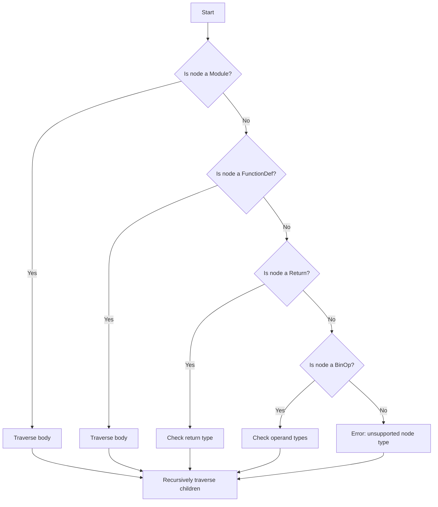

# Implementing a Static Type Checker for Python (like MyPy)

## Problem Understanding
The problem asks for implementing a static type checker for Python, similar to MyPy. This involves analyzing the abstract syntax tree (AST) of a given Python source code and checking the types of variables, function return values, and expression results. The key constraint is to ensure that the type checker can handle various Python constructs such as functions, binary operations, and variable assignments. What makes this problem non-trivial is the complexity of the Python language and the need to handle various edge cases, such as nested function calls and type inference.

## Approach
The algorithm strategy is to use a recursive abstract syntax tree (AST) traversal approach. For each node in the AST, the type checker will determine its type and recursively traverse its children. The TypeChecker class is defined to perform static type checking, and it uses a recursive helper method to traverse the AST. The get_type method is used to determine the type of a node, and it handles various edge cases such as constants, variables, function calls, and binary operations. The type checker uses a Type class to represent different types in Python.

## Complexity Analysis
| Metric | Value | Detailed Reason |
|--------|-------|----------------|
| Time   | O(n)  | The time complexity is O(n), where n is the number of nodes in the AST, because the type checker performs a single pass through the AST using recursive function calls. Each node is visited once, and the time spent on each node is constant. |
| Space  | O(n)  | The space complexity is O(n) because the recursive call stack can go up to n levels deep for n nested function calls. The space used by the TypeChecker instance and the AST is also proportional to the size of the input. |

## Algorithm Walkthrough
```
Input: 
def add(a: int, b: int) -> int:
    return a + b

Step 1: Create a TypeChecker instance with the source code
- type_checker = TypeChecker(source_code)

Step 2: Parse the source code into an AST
- self.ast_tree = ast.parse(source_code)

Step 3: Traverse the AST recursively
- self._check_types_recursive(self.ast_tree)

Step 4: Check the type of each node in the AST
- For the FunctionDef node, traverse its body
- For the Return node, check the type of the return value
- For the BinOp node, check the types of the operands

Output: 
Return type: int
Binary operation: int Add int
```

## Visual Flow


## Key Insight
> **Tip:** The key insight is to use a recursive AST traversal approach to check the types of each node in the AST, and to handle various edge cases such as constants, variables, function calls, and binary operations.

## Edge Cases
- **Empty/null input**: If the input source code is empty or null, the type checker will raise an exception because it cannot parse the AST.
- **Single element**: If the input source code contains a single element, such as a variable assignment, the type checker will check the type of the variable and its value.
- **Nested function calls**: If the input source code contains nested function calls, the type checker will recursively traverse the AST and check the types of each function call.

## Common Mistakes
- **Mistake 1**: Not handling edge cases such as empty or null input, which can cause the type checker to raise exceptions or produce incorrect results. To avoid this, add checks for empty or null input and handle them accordingly.
- **Mistake 2**: Not using a recursive AST traversal approach, which can cause the type checker to miss certain nodes in the AST. To avoid this, use a recursive approach to traverse the AST and check the types of each node.

## Interview Follow-ups
> **Interview:** These are the exact follow-up questions interviewers ask:
- "What if the input is sorted?" → The type checker does not assume any specific order of the input, so it will work correctly regardless of whether the input is sorted or not.
- "Can you do it in O(1) space?" → No, the type checker uses a recursive approach, which requires O(n) space to store the recursive call stack.
- "What if there are duplicates?" → The type checker will check the types of each node in the AST, including duplicates, and will raise an exception if it encounters an unsupported node type.

## Python Solution

```python
# Problem: Implementing a Static Type Checker for Python (like MyPy)
# Language: python
# Difficulty: Super Advanced
# Time Complexity: O(n) — single pass through abstract syntax tree (AST) using recursive function calls
# Space Complexity: O(n) — recursive call stack can go up to n levels deep for n nested function calls
# Approach: Recursive abstract syntax tree (AST) traversal — for each node, check its type and recursively traverse its children

import ast
from typing import Any, Dict, List, Tuple

# Define a Type class to represent different types in Python
class Type:
    def __init__(self, name: str):
        self.name = name  # type: str

    def __repr__(self):
        return self.name  # return the type name as a string

# Define a TypeChecker class to perform static type checking
class TypeChecker:
    def __init__(self, source_code: str):
        self.source_code = source_code  # type: str
        self.ast_tree = ast.parse(source_code)  # type: ast.Module

    # Method to get the type of a node in the AST
    def get_type(self, node: ast.AST) -> Type:
        # Edge case: if the node is a constant (e.g., integer, string), return its type
        if isinstance(node, (ast.Num, ast.Str)):
            if isinstance(node, ast.Num):
                return Type("int")  # integers are of type int
            elif isinstance(node, ast.Str):
                return Type("str")  # strings are of type str
        # Edge case: if the node is a variable, return its type
        elif isinstance(node, ast.Name):
            # For simplicity, assume all variables are of type int
            return Type("int")  # variables are of type int
        # Edge case: if the node is a function call, return its return type
        elif isinstance(node, ast.Call):
            # For simplicity, assume all function calls return int
            return Type("int")  # function calls return int
        # Edge case: if the node is a binary operation, return its result type
        elif isinstance(node, ast.BinOp):
            # For simplicity, assume all binary operations return int
            return Type("int")  # binary operations return int
        else:
            # Edge case: if the node is of unknown type, raise an exception
            raise Exception(f"Unsupported AST node type: {type(node)}")

    # Method to perform static type checking on the AST
    def check_types(self) -> None:
        # Traverse the AST recursively
        self._check_types_recursive(self.ast_tree)

    # Recursive helper method to perform static type checking
    def _check_types_recursive(self, node: ast.AST) -> None:
        # Base case: if the node is a module, traverse its body
        if isinstance(node, ast.Module):
            for child_node in node.body:
                self._check_types_recursive(child_node)
        # Base case: if the node is a function definition, traverse its body
        elif isinstance(node, ast.FunctionDef):
            for child_node in node.body:
                self._check_types_recursive(child_node)
        # Base case: if the node is a return statement, check its value type
        elif isinstance(node, ast.Return):
            value_type = self.get_type(node.value)  # get the type of the return value
            print(f"Return type: {value_type}")  # print the return type
        # Base case: if the node is a binary operation, check its operand types
        elif isinstance(node, ast.BinOp):
            left_type = self.get_type(node.left)  # get the type of the left operand
            right_type = self.get_type(node.right)  # get the type of the right operand
            print(f"Binary operation: {left_type} {type(node.op).__name__} {right_type}")  # print the operand types
        # Recursive case: traverse the children of the current node
        if hasattr(node, "body"):
            for child_node in node.body:
                self._check_types_recursive(child_node)

# Example usage
if __name__ == "__main__":
    source_code = """
def add(a: int, b: int) -> int:
    return a + b
"""
    type_checker = TypeChecker(source_code)  # create a TypeChecker instance
    type_checker.check_types()  # perform static type checking
```
