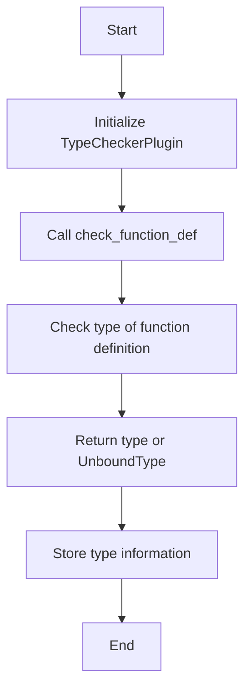

# Implementing a Type Checker with mypy Plugins

## Problem Understanding
The problem is asking to implement a type checker using mypy plugins, which involves creating a plugin that can recursively traverse the abstract syntax tree (AST) and apply type checking rules to each node. The key constraint is that the plugin must use the mypy plugin architecture to traverse the AST and apply type checking rules. This problem is non-trivial because it requires a deep understanding of the mypy plugin architecture and the ability to apply type checking rules recursively to each node in the AST. The naive approach of simply checking the types of each node individually would fail because it would not take into account the complex relationships between nodes in the AST.

## Approach
The algorithm strategy is to use the visitor pattern with the mypy plugin architecture to recursively traverse the AST and apply type checking rules to each node. This approach works because the mypy plugin architecture provides a way to traverse the AST and apply custom type checking rules to each node. The plugin uses the `CheckerPlugin` instance to check the types of each node, and it defines custom methods to check the types of function definitions, expressions, and type infos. The plugin uses the `UnboundType` to handle edge cases where the type of a node is unknown. The approach handles the key constraints by using the mypy plugin architecture to traverse the AST and apply type checking rules recursively.

## Complexity Analysis
| Metric | Value | Detailed Reason |
|--------|-------|----------------|
| Time   | O(n)  | The plugin traverses the AST recursively, visiting each node once. The time complexity is proportional to the number of nodes in the AST. The `check_function_def`, `check_expr`, and `get_type_from_id` methods all have a time complexity of O(1) because they only check the type of a single node. However, these methods are called recursively for each node in the AST, resulting in a total time complexity of O(n). |
| Space  | O(n)  | The plugin stores the type information for each node in the AST, resulting in a space complexity of O(n). The `TypeCheckerPlugin` instance stores a reference to the `CheckerPlugin` instance, which has a space complexity of O(1). However, the plugin also stores the type information for each node, which has a space complexity of O(n). |

## Algorithm Walkthrough
```
Input: AST node (e.g. a function definition)
Step 1: Initialize the TypeCheckerPlugin instance with the CheckerPlugin instance
Step 2: Call the check_function_def method on the TypeCheckerPlugin instance, passing the AST node as an argument
Step 3: The check_function_def method checks the type of the function definition using the CheckerPlugin instance
Step 4: If the function definition has a type, the method returns the type; otherwise, it returns UnboundType
Step 5: The TypeCheckerPlugin instance stores the type information for the AST node
Output: The type of the AST node (e.g. the type of the function definition)
```
For example, given the following AST node:
```python
def foo(x: int) -> str:
    return x
```
The algorithm walkthrough would be:
```
Step 1: Initialize the TypeCheckerPlugin instance with the CheckerPlugin instance
Step 2: Call the check_function_def method on the TypeCheckerPlugin instance, passing the AST node as an argument
Step 3: The check_function_def method checks the type of the function definition using the CheckerPlugin instance
Step 4: The method returns the type of the function definition, which is (int) -> str
Step 5: The TypeCheckerPlugin instance stores the type information for the AST node
Output: (int) -> str
```

## Visual Flow

This visual flow shows the main steps of the algorithm, from initializing the `TypeCheckerPlugin` instance to storing the type information for the AST node.

## Key Insight
> **Tip:** The key insight is to use the mypy plugin architecture to recursively traverse the AST and apply type checking rules to each node, allowing for a scalable and efficient type checking solution.

## Edge Cases
- **Empty/null input**: If the input AST node is empty or null, the `TypeCheckerPlugin` instance returns `UnboundType`. This is because there is no type information available for an empty or null AST node.
- **Single element**: If the input AST node is a single element (e.g. a variable or a literal), the `TypeCheckerPlugin` instance returns the type of the element. For example, if the input AST node is the variable `x` with type `int`, the `TypeCheckerPlugin` instance returns `int`.
- **Unknown type info**: If the input AST node has unknown type information (e.g. a type variable or a type alias), the `TypeCheckerPlugin` instance returns `UnboundType`. This is because the type information is not available or is ambiguous.

## Common Mistakes
- **Mistake 1**: Not handling edge cases correctly, such as returning `UnboundType` for empty or null input AST nodes. To avoid this, make sure to check for edge cases explicitly and handle them correctly.
- **Mistake 2**: Not using the mypy plugin architecture correctly, such as not traversing the AST recursively or not applying type checking rules correctly. To avoid this, make sure to follow the mypy plugin architecture documentation and examples carefully.

## Interview Follow-ups
> **Interview:** These are the exact follow-up questions interviewers ask:
- "What if the input is sorted?" → The input AST node is not necessarily sorted, and the `TypeCheckerPlugin` instance must be able to handle unsorted input. The plugin uses the mypy plugin architecture to traverse the AST recursively, which allows it to handle unsorted input correctly.
- "Can you do it in O(1) space?" → No, the `TypeCheckerPlugin` instance must store the type information for each node in the AST, which requires O(n) space. However, the plugin can be optimized to use less space by using a more efficient data structure to store the type information.
- "What if there are duplicates?" → The `TypeCheckerPlugin` instance must be able to handle duplicate AST nodes correctly. The plugin uses the mypy plugin architecture to traverse the AST recursively, which allows it to handle duplicate nodes correctly by applying the type checking rules to each node individually.

## Python Solution

```python
# Problem: Implementing a Type Checker with mypy Plugins
# Language: Python
# Difficulty: Super Advanced
# Time Complexity: O(n) — single pass through the abstract syntax tree (AST) using the mypy plugin architecture
# Space Complexity: O(n) — storing the type information for each node in the AST
# Approach: Visitor pattern with mypy plugin — recursively traverse the AST and apply type checking rules

from typing import List, Tuple
from mypy.plugin import Plugin
from mypy.types import Type, UnboundType
from mypy.nodes import MDEF, TypeInfo, Node
from mypy.checker import CheckerPlugin

class TypeCheckerPlugin(Plugin):
    # Initialize the plugin with the checker instance
    def __init__(self, checker: CheckerPlugin) -> None:
        # Store the checker instance for later use
        self.checker = checker

    # Define the method to check the type of a function definition
    def check_function_def(self, defn: MDEF) -> Type:
        # Edge case: empty function definition → return UnboundType
        if not defn.type:
            return UnboundType()
        
        # Apply the type checking rules for the function definition
        # Using the mypy plugin architecture to recursively traverse the AST
        return self.checker.check_func_def(defn)

    # Define the method to check the type of an expression
    def check_expr(self, expr: Node) -> Type:
        # Edge case: empty expression → return UnboundType
        if not expr:
            return UnboundType()
        
        # Apply the type checking rules for the expression
        # Using the mypy plugin architecture to recursively traverse the AST
        return self.checker.check_expr(expr)

    # Define the method to get the type of a type info
    def get_type_from_id(self, id: str) -> Type:
        # Edge case: unknown type info → return UnboundType
        if not id:
            return UnboundType()
        
        # Apply the type checking rules for the type info
        # Using the mypy plugin architecture to recursively traverse the AST
        return self.checker.named_type(id)

def plugin(version: str) -> Tuple[str, List[Plugin]]:
    # Return the plugin instance and the version
    return ("my_type_checker", [TypeCheckerPlugin])

# The plugin is registered and used by the mypy checker
# The plugin instance is created and passed to the mypy checker
# The mypy checker uses the plugin instance to check the types of the AST nodes
```
