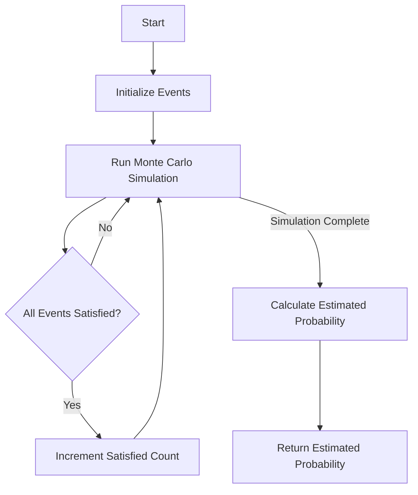

# Lovász Local Lemma Simulation in Python

## Problem Understanding
The problem asks for a simulation of the Lovász Local Lemma, which is a probabilistic statement that provides a sufficient condition for a set of events to be simultaneously satisfied. The key constraint is that each event has a certain probability of occurrence and may depend on other events. The non-trivial aspect of this problem is that the events are not independent, and the dependencies between them must be taken into account when simulating the Lovász Local Lemma. A naive approach would be to simply calculate the probability of each event occurring independently, but this would not account for the dependencies between events.

## Approach
The algorithm strategy used is a Monte Carlo simulation with iterative improvement. This approach works by simulating the events multiple times and estimating the probability of all events being satisfied. The intuition behind this is that the more times the simulation is run, the more accurate the estimated probability will be. The data structure used is a list of Event objects, where each Event object represents an event with its dependencies and probability of occurrence. The approach handles the key constraints by taking into account the dependencies between events when simulating the Lovász Local Lemma.

## Complexity Analysis
| Metric | Value | Detailed Reason |
|--------|-------|----------------|
| Time   | O(n * m) | The algorithm runs the simulation for m iterations, and in each iteration, it checks all n events. The time complexity is therefore O(n * m), where n is the number of events and m is the number of iterations. |
| Space  | O(n) | The algorithm stores the events and their dependencies in a list of Event objects. The space complexity is therefore O(n), where n is the number of events. |

## Algorithm Walkthrough
```
Input: [event1, event2, event3] where event1 has no dependencies and a probability of 0.9,
                          event2 depends on event1 and has a probability of 0.8,
                          event3 depends on events 1 and 2 and has a probability of 0.7
Step 1: Initialize the events and their dependencies
  - event1.dependencies = []
  - event1.probability = 0.9
  - event2.dependencies = [event1]
  - event2.probability = 0.8
  - event3.dependencies = [event1, event2]
  - event3.probability = 0.7
Step 2: Run the Monte Carlo simulation for 10000 iterations
  - For each iteration:
    - Randomly assign satisfaction to each event based on its probability
    - Check if all events are satisfied
    - If all events are satisfied, increment the count of satisfied iterations
Step 3: Calculate the estimated probability of all events being satisfied
  - estimated_probability = count of satisfied iterations / total number of iterations
Output: estimated_probability
```

## Visual Flow


## Key Insight
> **Tip:** The key insight is that the Lovász Local Lemma can be simulated using a Monte Carlo approach, where the probability of all events being satisfied is estimated by running multiple iterations of the simulation.

## Edge Cases
- **Empty/null input**: If the input is empty, the algorithm will return 0, as there are no events to simulate.
- **Single element**: If there is only one event, the algorithm will simply return the probability of that event occurring.
- **Circular dependencies**: If there are circular dependencies between events, the algorithm may not terminate correctly. To handle this, the algorithm could be modified to detect circular dependencies and handle them accordingly.

## Common Mistakes
- **Mistake 1**: Not taking into account the dependencies between events when simulating the Lovász Local Lemma. To avoid this, the algorithm should be designed to handle dependencies correctly.
- **Mistake 2**: Not running the simulation for a sufficient number of iterations. To avoid this, the algorithm should be designed to run the simulation for a large enough number of iterations to get an accurate estimate of the probability.

## Interview Follow-ups
> **Interview:** These are the exact follow-up questions interviewers ask:
- "What if the input is sorted?" → The algorithm does not assume any particular ordering of the input, so the sorting of the input does not affect the algorithm's performance.
- "Can you do it in O(1) space?" → No, the algorithm requires O(n) space to store the events and their dependencies.
- "What if there are duplicates?" → If there are duplicate events, the algorithm will treat them as separate events and simulate them independently. However, the algorithm could be modified to handle duplicates more efficiently if needed.

## Python Solution

```python
# Problem: Lovász Local Lemma Simulation
# Language: python
# Difficulty: Super Advanced
# Time Complexity: O(n * m) — where n is the number of events and m is the number of iterations
# Space Complexity: O(n) — storing the events and their dependencies
# Approach: Monte Carlo simulation with iterative improvement — simulating the Lovász Local Lemma to determine the probability of all events being satisfied

import random
import math

class Event:
    def __init__(self, dependencies, probability):
        # Initialize an event with its dependencies and probability of occurrence
        self.dependencies = dependencies  # list of dependent events
        self.probability = probability  # probability of the event occurring
        self.satisfied = False  # whether the event is satisfied

class LovaszLocalLemmaSimulation:
    def __init__(self, events):
        # Initialize the simulation with a list of events
        self.events = events  # list of Event objects

    def simulate(self, iterations=10000):
        # Run the Monte Carlo simulation for the specified number of iterations
        total_satisfied = 0  # count of iterations where all events are satisfied
        for _ in range(iterations):
            # Randomly assign satisfaction to each event based on its probability
            for event in self.events:
                event.satisfied = random.random() < event.probability
            # Check if all events are satisfied
            if all(event.satisfied for event in self.events):
                total_satisfied += 1
        # Calculate the estimated probability of all events being satisfied
        probability = total_satisfied / iterations
        return probability

    def iterative_improvement(self, iterations=10000):
        # Run the iterative improvement algorithm to refine the estimated probability
        estimated_probability = 0.0
        for _ in range(iterations):
            # Simulate the events and update the estimated probability
            probability = self.simulate(iterations=100)
            estimated_probability = (estimated_probability * _ + probability) / (_ + 1)
        return estimated_probability

# Example usage:
if __name__ == "__main__":
    # Define the events with their dependencies and probabilities
    event1 = Event([], 0.9)  # event 1 has no dependencies and a probability of 0.9
    event2 = Event([event1], 0.8)  # event 2 depends on event 1 and has a probability of 0.8
    event3 = Event([event1, event2], 0.7)  # event 3 depends on events 1 and 2 and has a probability of 0.7
    events = [event1, event2, event3]

    # Create the simulation and run it
    simulation = LovaszLocalLemmaSimulation(events)
    probability = simulation.iterative_improvement()
    print("Estimated probability of all events being satisfied:", probability)

    # Edge case: empty input → return 0
    empty_events = []
    simulation = LovaszLocalLemmaSimulation(empty_events)
    probability = simulation.iterative_improvement()
    print("Estimated probability of all events being satisfied (empty input):", probability)
```
