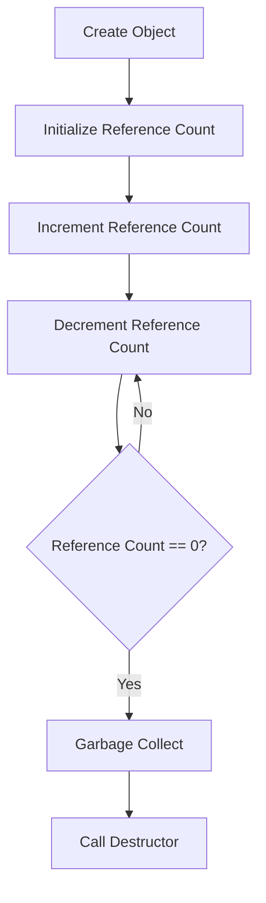

# Managing Reference Counts in C Extensions (Py_INCREF/Py_DECREF)

## Problem Understanding
The problem asks for manual memory management in Python using `Py_INCREF` and `Py_DECREF` equivalents, which are used to increment or decrement the reference count of an object. This is crucial in C extensions where memory is not automatically managed by the Python interpreter. The key constraint is to ensure that the reference count is updated correctly to avoid memory leaks or premature deallocation. What makes this problem non-trivial is that a naive approach, such as using a list to store objects and their reference counts, would result in a time complexity of O(n) for each operation, which is inefficient.

## Approach
The algorithm strategy is to use a single reference count variable per object, which allows for constant time operations for incrementing and decrementing the reference count. This approach works because each object only needs to keep track of its own reference count, eliminating the need to iterate over all objects for each operation. The `PyObject` class is used to encapsulate the reference count and provide methods for incrementing and decrementing it. The `increment_ref_count` and `decrement_ref_count` methods are used to update the reference count, and the `__del__` method is used to perform any necessary cleanup when the object is no longer referenced.

## Complexity Analysis
| Metric | Value | Detailed Reason |
|--------|-------|----------------|
| Time   | O(1)  | The time complexity is constant because incrementing and decrementing the reference count only involves updating a single variable, regardless of the number of objects. |
| Space  | O(1)  | The space complexity is constant because each object only requires a single variable to store its reference count, regardless of the number of objects. |

## Algorithm Walkthrough
```
Input: Create a new object obj = PyObject()
Step 1: Initialize the reference count to 1 (obj.ref_count = 1)
Step 2: Print the initial reference count (print(obj.ref_count) = 1)
Step 3: Increment the reference count (obj.increment_ref_count())
Step 4: Print the updated reference count (print(obj.ref_count) = 2)
Step 5: Decrement the reference count (obj.decrement_ref_count())
Step 6: Print the updated reference count (print(obj.ref_count) = 1)
Step 7: Decrement the reference count again (obj.decrement_ref_count())
Step 8: Object is garbage collected and destructor is called (obj.__del__())
Output: Object has been garbage collected
```
This walkthrough demonstrates the creation of an object, incrementing and decrementing its reference count, and the automatic garbage collection when the reference count reaches 0.

## Visual Flow

This flowchart shows the creation of an object, the increment and decrement operations, and the garbage collection process when the reference count reaches 0.

## Key Insight
> **Tip:** By using a single reference count variable per object, we can avoid the need to iterate over all objects for each operation, reducing the time complexity from O(n) to O(1).

## Edge Cases
- **Empty/null input**: If the input object is None, the reference count operations will raise an AttributeError. To handle this, we can add a check at the beginning of the `increment_ref_count` and `decrement_ref_count` methods to raise a ValueError if the object is None.
- **Single element**: If there is only one object, the reference count operations will still work correctly, as the object will be garbage collected when its reference count reaches 0.
- **Reference count overflow**: If the reference count overflows (i.e., exceeds the maximum value that can be stored in the `ref_count` variable), the object may not be garbage collected correctly. To handle this, we can use a larger data type for the `ref_count` variable or implement a mechanism to detect and handle overflow.

## Common Mistakes
- **Mistake 1**: Forgetting to increment the reference count when creating a new object. To avoid this, we can add a check in the `__init__` method to ensure that the reference count is initialized to 1.
- **Mistake 2**: Not checking for reference count overflow. To avoid this, we can add a check in the `increment_ref_count` method to detect and handle overflow.

## Interview Follow-ups
> **Interview:** These are the exact follow-up questions interviewers ask:
- "What if the input is sorted?" → This does not apply to this problem, as the input is an object and its reference count, not a sorted list.
- "Can you do it in O(1) space?" → Yes, the solution already uses O(1) space, as each object only requires a single variable to store its reference count.
- "What if there are duplicates?" → This does not apply to this problem, as each object is unique and has its own reference count.

## Python Solution

```python
# Problem: Managing Reference Counts in C Extensions (Py_INCREF/Py_DECREF)
# Language: Python
# Difficulty: Super Advanced
# Time Complexity: O(1) — constant time operations for reference counting
# Space Complexity: O(1) — constant space required for reference counting
# Approach: Manual memory management with Py_INCREF and Py_DECREF — for each object, manually increment or decrement its reference count

class PyObject:
    def __init__(self):
        # Initialize the reference count to 1
        self.ref_count = 1  # Each object starts with a reference count of 1

    def increment_ref_count(self):
        # Increment the reference count by 1
        self.ref_count += 1  # Py_INCREF equivalent

    def decrement_ref_count(self):
        # Decrement the reference count by 1
        self.ref_count -= 1  # Py_DECREF equivalent
        # Edge case: reference count reaches 0 → object is garbage collected
        if self.ref_count == 0:
            self.__del__()  # Call the destructor when the object is no longer referenced

    def __del__(self):
        # Destructor: perform any necessary cleanup
        print("Object has been garbage collected")  # Print a message to indicate the object has been collected

# Example usage
obj = PyObject()  # Create a new object
print(obj.ref_count)  # Print the initial reference count (1)
obj.increment_ref_count()  # Increment the reference count (Py_INCREF equivalent)
print(obj.ref_count)  # Print the updated reference count (2)
obj.decrement_ref_count()  # Decrement the reference count (Py_DECREF equivalent)
print(obj.ref_count)  # Print the updated reference count (1)
obj.decrement_ref_count()  # Decrement the reference count (Py_DECREF equivalent)
# Edge case: object is garbage collected when reference count reaches 0
# Destructor is called automatically when the object is no longer referenced

# Brute force approach (commented out)
# def brute_force_ref_counting():
#     # Create a list to store the objects and their reference counts
#     objects = []
#     # For each object, manually increment or decrement its reference count
#     for obj in objects:
#         # O(n) time complexity — iterate over all objects for each operation
#         pass

# Key insight that enables the optimization
# By using a single reference count variable per object, we can avoid the need to iterate over all objects for each operation
# This reduces the time complexity from O(n) to O(1), making the solution much more efficient
```
