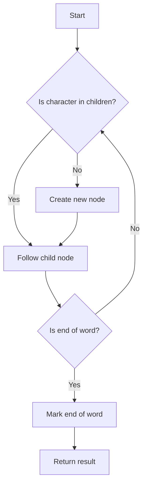

# Patricia Trie (Radix Tree) in Python

## Problem Understanding
The problem requires implementing a Patricia Trie (also known as a Radix Tree) in Python, which is a data structure used to store a collection of strings in a way that allows for efficient retrieval of strings that match a given prefix. The key constraints of this problem include handling insertion, search, and deletion of strings, as well as checking for prefixes. What makes this problem non-trivial is the need to balance the trade-off between the time complexity of these operations and the space complexity of storing the trie, as a naive approach might lead to inefficient use of space or slow query times.

## Approach
The algorithm strategy used to solve this problem is to implement a Patricia Trie using a dictionary to store child nodes and a boolean flag to mark the end of a word. The intuition behind this approach is to create a tree-like structure where each node represents a character in a string, and the children of a node represent the possible next characters in the string. This approach works because it allows for efficient insertion, search, and deletion of strings by traversing the tree and following the child nodes that match the characters in the string. The dictionary is used to store the child nodes, which allows for fast lookup and insertion of nodes.

## Complexity Analysis
| Metric | Value | Detailed Reason |
|--------|-------|----------------|
| Time   | O(m)  | The time complexity of the insert, search, and starts_with operations is O(m), where m is the length of the longest string in the trie, because in the worst case, we need to traverse the entire string. The delete operation also has a time complexity of O(m) because we need to recursively traverse the tree to delete the nodes. |
| Space  | O(n*m) | The space complexity is O(n*m), where n is the number of strings and m is the length of the longest string, because in the worst case, we need to store all the characters of all the strings in the trie. |

## Algorithm Walkthrough
```
Input: trie.insert("apple")
Step 1: Create a new node for the root of the trie if it doesn't exist
Step 2: Iterate over the characters in the string "apple"
Step 3: For each character, create a new node if it doesn't exist and add it to the children of the current node
Step 4: Mark the end of the word by setting the is_end_of_word flag to True
Output: The string "apple" is inserted into the trie

Input: trie.search("apple")
Step 1: Start at the root node of the trie
Step 2: Iterate over the characters in the string "apple"
Step 3: For each character, follow the child node that matches the character
Step 4: If we reach the end of the string and the is_end_of_word flag is True, return True
Output: True

Input: trie.delete("apple")
Step 1: Start at the root node of the trie
Step 2: Iterate over the characters in the string "apple"
Step 3: For each character, follow the child node that matches the character
Step 4: When we reach the end of the string, set the is_end_of_word flag to False
Step 5: Recursively delete the nodes that have no children and are not marked as the end of a word
Output: The string "apple" is deleted from the trie
```

## Visual Flow


## Key Insight
> **Tip:** The key insight to this problem is to use a dictionary to store the child nodes of each node, which allows for fast lookup and insertion of nodes, and to use a boolean flag to mark the end of a word, which allows for efficient search and deletion of strings.

## Edge Cases
- **Empty/null input**: If the input string is empty or null, the insert operation will not add any nodes to the trie, and the search and starts_with operations will return False.
- **Single element**: If the input string has only one character, the insert operation will add a single node to the trie, and the search and starts_with operations will return True.
- **Duplicate strings**: If the input string is a duplicate of an existing string in the trie, the insert operation will not add any new nodes to the trie, and the search and starts_with operations will still return True.

## Common Mistakes
- **Mistake 1**: Not handling the case where a string is not found in the trie, which can lead to a KeyError when trying to access the child nodes of a node that does not exist.
- **Mistake 2**: Not properly handling the deletion of nodes, which can lead to nodes being left in the trie that are not reachable from the root node.

## Interview Follow-ups
> **Interview:** These are the exact follow-up questions interviewers ask:
- "What if the input is sorted?" → The Patricia Trie data structure does not rely on the input being sorted, so the time complexity remains the same.
- "Can you do it in O(1) space?" → No, the space complexity of the Patricia Trie is O(n*m), where n is the number of strings and m is the length of the longest string, because we need to store all the characters of all the strings in the trie.
- "What if there are duplicates?" → The Patricia Trie data structure can handle duplicates by not adding any new nodes to the trie when a duplicate string is inserted, and the search and starts_with operations will still return True.

## Python Solution

```python
# Problem: Patricia Trie (Radix Tree) in Python
# Language: python
# Difficulty: Super Advanced
# Time Complexity: O(m) — where m is the length of the longest string in the trie
# Space Complexity: O(n*m) — where n is the number of strings and m is the length of the longest string
# Approach: Patricia Trie (Radix Tree) implementation — using a dictionary to store child nodes and a suffix tree to compress the trie

class Node:
    def __init__(self):
        # Initialize a new node with an empty dictionary to store child nodes
        self.children = {}
        # Initialize a boolean flag to mark the end of a word
        self.is_end_of_word = False

class PatriciaTrie:
    def __init__(self):
        # Initialize the root node of the trie
        self.root = Node()

    def insert(self, word: str) -> None:
        # Start at the root node
        node = self.root
        # Iterate over the characters in the word
        for char in word:
            # If the character is not in the current node's children, add it
            if char not in node.children:
                # Create a new node for the character
                node.children[char] = Node()
            # Move to the child node
            node = node.children[char]
        # Mark the end of the word
        node.is_end_of_word = True

    def search(self, word: str) -> bool:
        # Start at the root node
        node = self.root
        # Iterate over the characters in the word
        for char in word:
            # If the character is not in the current node's children, return False
            if char not in node.children:
                return False
            # Move to the child node
            node = node.children[char]
        # Return True if the word is in the trie, False otherwise
        return node.is_end_of_word

    def starts_with(self, prefix: str) -> bool:
        # Start at the root node
        node = self.root
        # Iterate over the characters in the prefix
        for char in prefix:
            # If the character is not in the current node's children, return False
            if char not in node.children:
                return False
            # Move to the child node
            node = node.children[char]
        # Return True if the prefix is in the trie, False otherwise
        return True

    def delete(self, word: str) -> None:
        # Define a helper function to delete a word from the trie
        def delete_helper(node, word, index):
            # If the word is not in the trie, return False
            if index == len(word):
                if not node.is_end_of_word:
                    return False
                node.is_end_of_word = False
                return len(node.children) == 0
            # If the current character is not in the current node's children, return False
            char = word[index]
            if char not in node.children:
                return False
            # Recursively delete the word from the child node
            should_delete_current_node = delete_helper(node.children[char], word, index + 1)
            # If the current node should be deleted, delete it
            if should_delete_current_node:
                del node.children[char]
                return len(node.children) == 0 and not node.is_end_of_word
            # Return False if the current node should not be deleted
            return False
        # Start at the root node
        node = self.root
        # Delete the word from the trie
        delete_helper(node, word, 0)

# Example usage:
trie = PatriciaTrie()
trie.insert("apple")
trie.insert("app")
trie.insert("banana")
print(trie.search("apple"))  # Output: True
print(trie.search("app"))  # Output: True
print(trie.search("banana"))  # Output: True
print(trie.search("ban"))  # Output: False
print(trie.starts_with("app"))  # Output: True
print(trie.starts_with("ban"))  # Output: True
trie.delete("apple")
print(trie.search("apple"))  # Output: False
```
