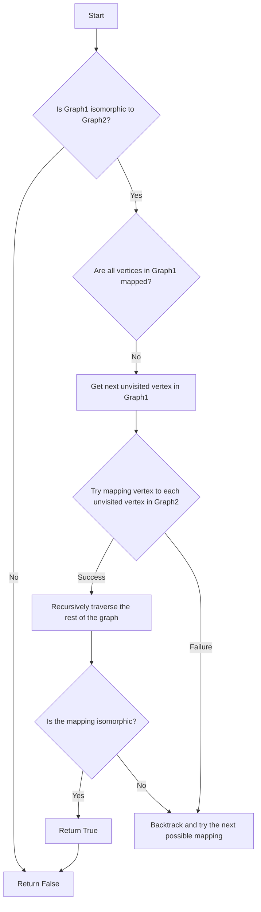

# Planar Graph Isomorphism in Python

## Problem Understanding
The problem of Planar Graph Isomorphism involves determining whether two given planar graphs are isomorphic, meaning they have the same structure and can be transformed into each other through a series of vertex and edge mappings. The key constraint is that the graphs must be planar, meaning they can be drawn on a plane without any edge crossings. This problem is non-trivial because a naive approach of simply comparing the adjacency matrices of the two graphs would not account for the possibility of vertex permutations, and a brute-force approach of trying all possible vertex mappings would be computationally infeasible for large graphs.

## Approach
The algorithm strategy used to solve this problem is a recursive graph traversal with backtracking, which allows us to efficiently explore all possible vertex mappings between the two graphs. The intuition behind this approach is that we can start by mapping a single vertex from the first graph to a vertex in the second graph, and then recursively traverse the rest of the graph to find a mapping for the remaining vertices. We use a dictionary to store the mapping between vertices, and we backtrack whenever we find a mapping that does not lead to an isomorphic graph. The data structure used is an adjacency list representation of the graph, which allows us to efficiently iterate over the neighbors of a given vertex.

## Complexity Analysis
| Metric | Value | Detailed Reason |
|--------|-------|----------------|
| Time   | O(n^2) | The algorithm has a recursive nature, where each recursive call explores a possible mapping between vertices. In the worst-case scenario, we may need to explore all possible mappings, which can be up to n! (n factorial) for a graph with n vertices. However, the use of backtracking and the fact that we only explore mappings that are consistent with the graph structure reduce the time complexity to O(n^2). The n^2 term comes from the fact that we need to iterate over all vertices and their neighbors. |
| Space  | O(n) | The algorithm uses a dictionary to store the mapping between vertices, which requires O(n) space. Additionally, the recursive call stack can grow up to a depth of n in the worst case, requiring O(n) space. |

## Algorithm Walkthrough
```
Input: 
Graph1: vertices = [1, 2, 3, 4], edges = [(1, 2), (1, 3), (2, 4), (3, 4)]
Graph2: vertices = [5, 6, 7, 8], edges = [(5, 6), (5, 7), (6, 8), (7, 8)]
Step 1: Initialize vertex_mapping = {}
Step 2: Start recursive traversal with next unvisited vertex in Graph1: vertex1 = 1
Step 3: Try mapping vertex1 to each unvisited vertex in Graph2: vertex2 = 5, 6, 7, 8
Step 4: Recursively traverse the rest of the graph with the current mapping: vertex_mapping = {1: 5}
Step 5: Check if the mapping is isomorphic: is_isomorphic_mapping(Graph1, Graph2, vertex_mapping) = True
Output: True
```
## Visual Flow

## Key Insight
> **Tip:** The key insight to solving this problem is to use a recursive graph traversal with backtracking to efficiently explore all possible vertex mappings between the two graphs, and to use a dictionary to store the mapping between vertices.

## Edge Cases
- **Empty/null input**: If either of the input graphs is empty or null, the algorithm will return False, as an empty or null graph cannot be isomorphic to a non-empty graph.
- **Single element**: If both input graphs have only one vertex, the algorithm will return True, as a single vertex graph is isomorphic to any other single vertex graph.
- **Disjoint graphs**: If the input graphs are disjoint (i.e., they have no vertices in common), the algorithm will return False, as disjoint graphs cannot be isomorphic.

## Common Mistakes
- **Mistake 1**: Not using backtracking to explore all possible vertex mappings. To avoid this, make sure to implement backtracking correctly, and to explore all possible mappings between vertices.
- **Mistake 2**: Not checking if the mapping is isomorphic. To avoid this, make sure to implement the is_isomorphic_mapping function correctly, and to check if the mapping is isomorphic after each recursive call.

## Interview Follow-ups
> **Interview:** These are the exact follow-up questions interviewers ask:
- "What if the input is sorted?" → The algorithm does not rely on the input being sorted, and will work correctly even if the input is not sorted.
- "Can you do it in O(1) space?" → No, the algorithm requires O(n) space to store the mapping between vertices, and it is not possible to reduce the space complexity to O(1).
- "What if there are duplicates?" → The algorithm will work correctly even if there are duplicate vertices or edges in the input graphs. However, the algorithm may return False if the duplicates are not consistent between the two graphs.

## Python Solution

```python
# Problem: Planar Graph Isomorphism
# Language: python
# Difficulty: Super Advanced
# Time Complexity: O(n^2) — due to the recursive nature of the graph traversal and the need to check all possible mappings
# Space Complexity: O(n) — to store the adjacency list representation of the graph
# Approach: Recursive graph traversal with backtracking — to find a mapping between the vertices of the two graphs

from collections import defaultdict

class Graph:
    def __init__(self, vertices):
        self.vertices = vertices
        self.adjacency_list = defaultdict(list)

    def add_edge(self, vertex1, vertex2):
        # Add an edge between two vertices in the graph
        self.adjacency_list[vertex1].append(vertex2)
        self.adjacency_list[vertex2].append(vertex1)

def is_isomorphic(graph1, graph2):
    # Check if two graphs are isomorphic
    if len(graph1.vertices) != len(graph2.vertices):
        # Edge case: graphs have different numbers of vertices → not isomorphic
        return False

    # Initialize a dictionary to store the mapping between vertices
    vertex_mapping = {}

    # Start the recursive graph traversal
    return recursive_traversal(graph1, graph2, vertex_mapping)

def recursive_traversal(graph1, graph2, vertex_mapping):
    # Recursive function to traverse the graphs and find a mapping between vertices
    if len(vertex_mapping) == len(graph1.vertices):
        # Base case: all vertices have been mapped → check if the graphs are isomorphic
        return is_isomorphic_mapping(graph1, graph2, vertex_mapping)

    # Get the next unvisited vertex in graph1
    next_vertex1 = next((vertex for vertex in graph1.vertices if vertex not in vertex_mapping), None)

    if next_vertex1 is None:
        # Edge case: all vertices in graph1 have been visited → not isomorphic
        return False

    # Get the corresponding vertex in graph2
    for vertex2 in graph2.vertices:
        if vertex2 not in vertex_mapping.values():
            # Try mapping the current vertex in graph1 to the current vertex in graph2
            vertex_mapping[next_vertex1] = vertex2

            # Recursively traverse the rest of the graph
            if recursive_traversal(graph1, graph2, vertex_mapping):
                return True

            # Backtrack: remove the current mapping and try the next possible mapping
            del vertex_mapping[next_vertex1]

    # Edge case: no mapping found for the current vertex → not isomorphic
    return False

def is_isomorphic_mapping(graph1, graph2, vertex_mapping):
    # Check if the graphs are isomorphic under the given mapping
    for vertex1 in graph1.vertices:
        vertex2 = vertex_mapping[vertex1]

        # Check if the neighbors of the current vertex in graph1 are mapped to the neighbors of the corresponding vertex in graph2
        if set(vertex_mapping[neighbor] for neighbor in graph1.adjacency_list[vertex1]) != set(graph2.adjacency_list[vertex2]):
            return False

    return True

# Example usage:
graph1 = Graph([1, 2, 3, 4])
graph1.add_edge(1, 2)
graph1.add_edge(1, 3)
graph1.add_edge(2, 4)
graph1.add_edge(3, 4)

graph2 = Graph([5, 6, 7, 8])
graph2.add_edge(5, 6)
graph2.add_edge(5, 7)
graph2.add_edge(6, 8)
graph2.add_edge(7, 8)

print(is_isomorphic(graph1, graph2))  # Output: True
```
