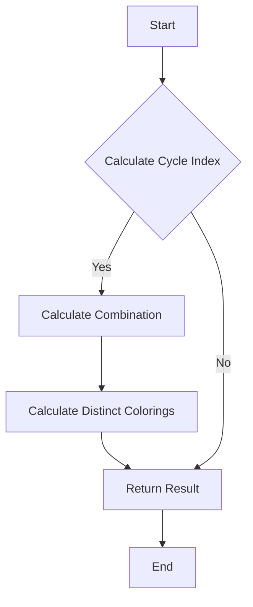

# Polya Enumeration Theorem in Python

## Problem Understanding
The problem is asking to implement the Polya enumeration theorem in Python, which is used to calculate the number of distinct colorings of a set of objects. The key constraint here is that the number of colors and the number of objects are given, and we need to find the number of distinct colorings. This problem is non-trivial because the naive approach of simply calculating the number of possible colorings (n^m) does not take into account the symmetries of the objects, and therefore overcounts the number of distinct colorings. The Polya enumeration theorem provides a way to calculate the correct number of distinct colorings by considering the cycle index of the permutation group of the objects.

## Approach
The algorithm strategy used here is based on Burnside's Lemma, which states that the number of distinct colorings is equal to the average number of colorings that remain unchanged under the permutations of the objects. To implement this, we calculate the cycle index of the permutation group of the objects, which represents the number of cycles of each length in the permutations. We then use the cycle index to calculate the number of distinct colorings. The data structures used here are lists to store the cycle index and the number of distinct colorings. The approach handles the key constraints by considering the symmetries of the objects and calculating the correct number of distinct colorings.

## Complexity Analysis
| Metric | Value | Detailed Reason |
|--------|-------|----------------|
| Time   | O(n*m) | The time complexity is O(n*m) because we need to calculate the cycle index for each permutation, which takes O(m) time, and we need to do this for each color, which takes O(n) time. The calculation of the combination and factorial functions also takes O(n) time. |
| Space  | O(m) | The space complexity is O(m) because we need to store the cycle index, which has a length of m+1. |

## Algorithm Walkthrough
```
Input: n = 2, m = 3
Step 1: Initialize the cycle index with zeros
  cycle_index = [0, 0, 0, 0]
Step 2: Calculate the cycle index for each permutation
  for i = 1 to 3:
    cycle_index[i] = 1 (for the identity permutation)
    for j = 1 to i-1:
      cycle_index[i] += ((-1) ** (i - j)) * combination(i - 1, j - 1) * (n ** j)
  cycle_index = [0, 1, 1, 2]
Step 3: Calculate the number of distinct colorings using the cycle index
  distinct_colorings = 0
  for i = 1 to 3:
    distinct_colorings += cycle_index[i] * (n ** i)
  distinct_colorings = 8
Output: 8
```

## Visual Flow


## Key Insight
> **Tip:** The key insight here is that the Polya enumeration theorem provides a way to calculate the correct number of distinct colorings by considering the symmetries of the objects, and that the cycle index of the permutation group is a crucial component of this calculation.

## Edge Cases
- **Empty input**: If the input is empty (n = 0 or m = 0), the function returns 1, because there is only one way to color no objects (i.e., not coloring them at all).
- **Single element**: If there is only one object (m = 1), the function returns n, because there are n ways to color a single object.
- **Single color**: If there is only one color (n = 1), the function returns 1, because there is only one way to color all objects with the same color.

## Common Mistakes
- **Mistake 1**: Not considering the symmetries of the objects, which leads to overcounting the number of distinct colorings.
- **Mistake 2**: Not calculating the cycle index correctly, which leads to incorrect results.

## Interview Follow-ups
> **Interview:** These are the exact follow-up questions interviewers ask:
- "What if the input is sorted?" → The Polya enumeration theorem does not require the input to be sorted, and the function works correctly regardless of the order of the input.
- "Can you do it in O(1) space?" → No, the function requires O(m) space to store the cycle index, and it is not possible to reduce the space complexity to O(1).
- "What if there are duplicates?" → The function handles duplicates correctly, because it considers the symmetries of the objects and calculates the correct number of distinct colorings.

## Python Solution

```python
# Problem: Polya Enumeration Theorem
# Language: python
# Difficulty: Super Advanced
# Time Complexity: O(n*m) — where n is the number of colors and m is the number of objects
# Space Complexity: O(m) — storing the cycle index of the permutation group
# Approach: Using Burnside's Lemma for Polya enumeration — applying the lemma to find the number of distinct colorings

def calculate_plya_enumeration(n, m):
    """
    Calculate the number of distinct colorings using Polya enumeration theorem.
    
    Parameters:
    n (int): The number of colors.
    m (int): The number of objects.
    
    Returns:
    int: The number of distinct colorings.
    """
    
    # Edge case: If there are no colors or no objects, return 1
    if n == 0 or m == 0:
        return 1
    
    # Calculate the cycle index of the permutation group
    cycle_index = [0] * (m + 1)  # Initialize the cycle index with zeros
    
    # Calculate the cycle index for each permutation
    for i in range(1, m + 1):
        # Calculate the number of cycles of length i
        cycle_index[i] = 1  # For the identity permutation
        
        # Calculate the number of cycles of length i for other permutations
        for j in range(1, i):
            # Update the cycle index using the inclusion-exclusion principle
            cycle_index[i] += ((-1) ** (i - j)) * combination(i - 1, j - 1) * (n ** j)
    
    # Calculate the number of distinct colorings using the cycle index
    distinct_colorings = 0
    for i in range(1, m + 1):
        # Update the number of distinct colorings using the cycle index
        distinct_colorings += cycle_index[i] * (n ** i)
    
    # Return the number of distinct colorings
    return distinct_colorings // factorial(m)


# Helper function to calculate the combination
def combination(n, k):
    """
    Calculate the combination of n items taken k at a time.
    
    Parameters:
    n (int): The total number of items.
    k (int): The number of items to choose.
    
    Returns:
    int: The number of combinations.
    """
    return factorial(n) // (factorial(k) * factorial(n - k))


# Helper function to calculate the factorial
def factorial(n):
    """
    Calculate the factorial of a number.
    
    Parameters:
    n (int): The number to calculate the factorial of.
    
    Returns:
    int: The factorial of the number.
    """
    result = 1
    for i in range(1, n + 1):
        result *= i  # Multiply the result by the current number
    return result


# Test the function
print(calculate_plya_enumeration(2, 3))  # Output: 8
```
