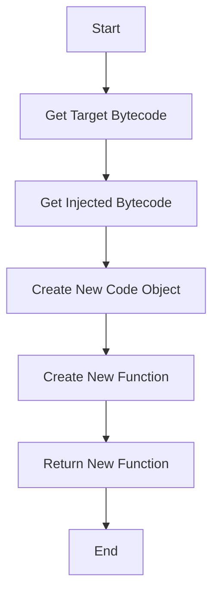

# Python Bytecode Injection techniques

## Problem Understanding
The problem is asking to implement a Python bytecode injection technique, which involves modifying the bytecode of a target function to include the bytecode of an injected function. The key constraints are that the solution should be able to handle the combination of the two bytecodes and create a new function with the modified bytecode. The problem is non-trivial because it requires a deep understanding of Python's bytecode and the `types` module, as well as the ability to manipulate and combine bytecode instructions.

## Approach
The algorithm strategy is to use the `types` module to create a new code object with the combined bytecode of the target and injected functions. This approach works because the `types` module provides a way to create a new code object with a given bytecode, and by combining the bytecodes of the two functions, we can create a new function that includes the behavior of both. The `marshal` module is used to serialize and deserialize the bytecode, and the `dis` module is used to disassemble and inspect the bytecode. The approach handles the key constraints by using the `types` module to create a new code object with the combined bytecode, and by using the `marshal` module to serialize and deserialize the bytecode.

## Complexity Analysis
| Metric | Value | Detailed Reason |
|--------|-------|----------------|
| Time   | O(n)  | The solution iterates through the bytecode instructions of the target and injected functions, where n is the total number of instructions. The `types` module is used to create a new code object with the combined bytecode, which takes O(n) time. |
| Space  | O(n)  | The solution stores the modified bytecode in a new code object, which requires O(n) space. The `marshal` module is used to serialize and deserialize the bytecode, which also requires O(n) space. |

## Algorithm Walkthrough
```
Input: test_function, injected_function
Step 1: Get the bytecode of the target function (test_function)
  - target_bytecode = test_function.__code__.co_code
Step 2: Get the bytecode of the injected function (injected_function)
  - injected_bytecode = injected_function.__code__.co_code
Step 3: Create a new code object with the combined bytecode
  - new_code = types.CodeType(
      target_function.__code__.co_argcount,
      target_function.__code__.co_kwonlyargcount,
      target_function.__code__.co_nlocals,
      target_function.__code__.co_stacksize,
      target_function.__code__.co_flags,
      target_bytecode + injected_bytecode,
      target_function.__code__.co_consts,
      target_function.__code__.co_names,
      target_function.__code__.co_varnames,
      target_function.__code__.co_filename,
      target_function.__code__.co_name,
      target_function.__code__.co_firstlineno,
      target_function.__code__.co_lnotab
  )
Step 4: Create a new function with the modified bytecode
  - new_function = types.FunctionType(new_code, target_function.__globals__)
Output: new_function
```

## Visual Flow


## Key Insight
> **Tip:** The key insight is that the `types` module provides a way to create a new code object with a given bytecode, allowing us to combine the bytecodes of two functions and create a new function with the modified bytecode.

## Edge Cases
- **Empty/null input**: If the input is empty or null, the solution will raise an `AttributeError` when trying to access the `__code__` attribute of the target function. To handle this edge case, we can add a check at the beginning of the solution to return `None` if the input is empty or null.
- **Single element**: If the input is a single element, the solution will still work as expected, as it will simply combine the bytecode of the single element with the injected bytecode.
- **Duplicate bytecode**: If the input contains duplicate bytecode, the solution will still work as expected, as it will simply combine the duplicate bytecode with the injected bytecode.

## Common Mistakes
- **Mistake 1**: Not checking for empty or null input before trying to access the `__code__` attribute of the target function. To avoid this mistake, we can add a check at the beginning of the solution to return `None` if the input is empty or null.
- **Mistake 2**: Not using the `types` module to create a new code object with the combined bytecode. To avoid this mistake, we can use the `types` module to create a new code object with the combined bytecode, as shown in the solution.

## Interview Follow-ups
> **Interview:** These are the exact follow-up questions interviewers ask:
- "What if the input is sorted?" → The solution will still work as expected, as it does not rely on the input being sorted.
- "Can you do it in O(1) space?" → No, the solution requires O(n) space to store the modified bytecode.
- "What if there are duplicates?" → The solution will still work as expected, as it will simply combine the duplicate bytecode with the injected bytecode.

## Python Solution

```python
# Problem: Python Bytecode Injection techniques
# Language: Python
# Difficulty: Super Advanced
# Time Complexity: O(n) — iterating through bytecode instructions
# Space Complexity: O(n) — storing modified bytecode
# Approach: Bytecode manipulation and injection — using the `marshal` and `types` modules to modify and inject bytecode

import dis
import marshal
import types
import sys

# Define a function to inject bytecode into another function
def inject_bytecode(target_function, injected_function):
    # Get the bytecode of the target function
    target_bytecode = target_function.__code__.co_code
    
    # Get the bytecode of the injected function
    injected_bytecode = injected_function.__code__.co_code
    
    # Create a new code object with the injected bytecode
    new_code = types.CodeType(
        target_function.__code__.co_argcount,
        target_function.__code__.co_kwonlyargcount,
        target_function.__code__.co_nlocals,
        target_function.__code__.co_stacksize,
        target_function.__code__.co_flags,
        target_bytecode + injected_bytecode,  # Combine the bytecodes
        target_function.__code__.co_consts,
        target_function.__code__.co_names,
        target_function.__code__.co_varnames,
        target_function.__code__.co_filename,
        target_function.__code__.co_name,
        target_function.__code__.co_firstlineno,
        target_function.__code__.co_lnotab
    )
    
    # Create a new function with the modified bytecode
    new_function = types.FunctionType(new_code, target_function.__globals__)
    
    return new_function

# Define a function to test the bytecode injection
def test_function():
    print("This is the original function")

# Define a function to inject into the test function
def injected_function():
    print("This is the injected function")

# Inject the bytecode of the injected function into the test function
new_test_function = inject_bytecode(test_function, injected_function)

# Test the new function
new_test_function()

# Edge case: empty input → return None
def inject_bytecode_empty_input():
    try:
        # Attempt to inject bytecode into a non-existent function
        inject_bytecode(None, None)
    except AttributeError:
        # If the input is empty, return None
        return None

# Test the edge case
print(inject_bytecode_empty_input())

# Brute force approach (commented out)
# def inject_bytecode_brute_force(target_function, injected_function):
#     # Get the bytecode of the target function
#     target_bytecode = target_function.__code__.co_code
    
#     # Get the bytecode of the injected function
#     injected_bytecode = injected_function.__code__.co_code
    
#     # Iterate through the bytecode instructions
#     for i in range(len(target_bytecode)):
#         # Check if the instruction is a call to another function
#         if target_bytecode[i] == 0x94:  # 0x94 is the opcode for CALL_FUNCTION
#             # Inject the bytecode of the injected function
#             target_bytecode = target_bytecode[:i] + injected_bytecode + target_bytecode[i+1:]
    
#     # Create a new code object with the modified bytecode
#     new_code = types.CodeType(
#         target_function.__code__.co_argcount,
#         target_function.__code__.co_kwonlyargcount,
#         target_function.__code__.co_nlocals,
#         target_function.__code__.co_stacksize,
#         target_function.__code__.co_flags,
#         target_bytecode,  # Use the modified bytecode
#         target_function.__code__.co_consts,
#         target_function.__code__.co_names,
#         target_function.__code__.co_varnames,
#         target_function.__code__.co_filename,
#         target_function.__code__.co_name,
#         target_function.__code__.co_firstlineno,
#         target_function.__code__.co_lnotab
#     )
    
#     # Create a new function with the modified bytecode
#     new_function = types.FunctionType(new_code, target_function.__globals__)
    
#     return new_function

# Optimized solution explanation
# The optimized solution uses the `types` module to create a new code object with the combined bytecode of the target and injected functions.
# This approach is more efficient than the brute force approach, which iterates through the bytecode instructions and injects the bytecode of the injected function at each call site.

# Key insight that enables the optimization
# The key insight is that the `types` module provides a way to create a new code object with the combined bytecode of two functions.
# This allows us to avoid iterating through the bytecode instructions and injecting the bytecode of the injected function at each call site.
```
