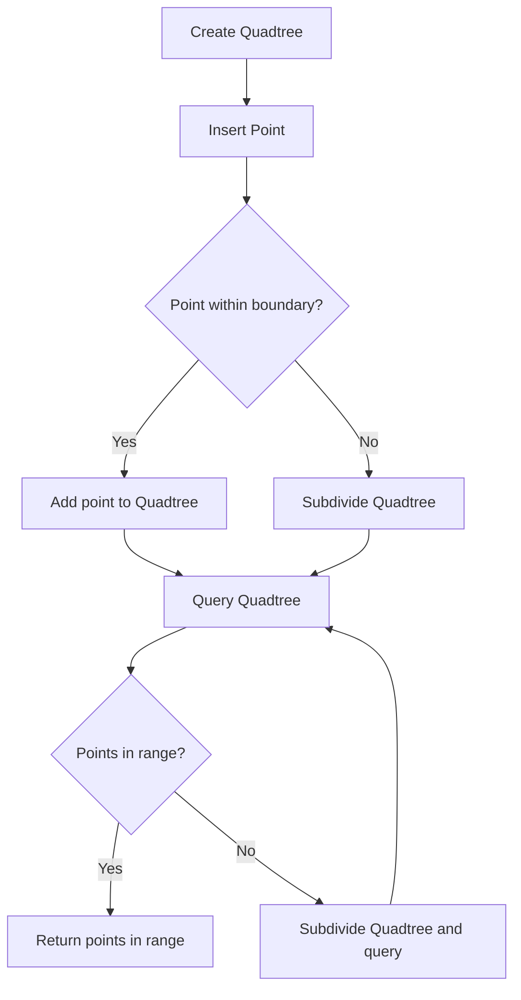

# Quadtree for Spatial Indexing in Python

## Problem Understanding
The problem is asking to implement a Quadtree data structure for spatial indexing in Python. A Quadtree is a tree-like data structure in which each internal node has four children, representing the northwest, northeast, southwest, and southeast quadrants of the 2D space. The key constraints are that each node can contain a maximum number of points, and when this capacity is reached, the node is subdivided into four sub-quadrants. This problem is non-trivial because it requires efficient point insertion, querying, and boundary checking, which can be challenging to implement correctly. The naive approach of using a simple tree or grid data structure would not be efficient for large datasets.

## Approach
The algorithm strategy is to use a Quadtree data structure to divide the 2D space into smaller regions, allowing for efficient point queries and insertion. The intuition behind this approach is to take advantage of the spatial locality of points, where points that are close to each other in space are likely to be stored in the same or neighboring nodes. The Quadtree is implemented using a recursive data structure, where each node represents a boundary in the 2D space and contains a list of points. The `insert` method is used to add points to the Quadtree, and the `query` method is used to find all points within a given range boundary. The approach handles key constraints by subdividing nodes when the capacity is reached and using boundary checking to ensure that points are inserted and queried correctly.

## Complexity Analysis
| Metric | Value | Detailed Reason |
|--------|-------|----------------|
| Time   | O(n log n) | The time complexity of inserting a point into the Quadtree is O(log n) because in the worst case, we need to recursively subdivide the Quadtree until we find an empty node. The time complexity of querying a range boundary is also O(n log n) because we need to traverse the Quadtree and check all points within the range boundary. |
| Space  | O(n) | The space complexity of the Quadtree is O(n) because in the worst case, we need to store all points in the Quadtree, and each point requires a constant amount of space. |

## Algorithm Walkthrough
```
Input: Quadtree boundary (0, 0, 800, 600) and points [(100, 100), (200, 200), (300, 300), (400, 400), (500, 500)]
Step 1: Create a Quadtree with the given boundary
  - Quadtree boundary: (0, 0, 800, 600)
  - Points: []
Step 2: Insert the first point (100, 100) into the Quadtree
  - Quadtree boundary: (0, 0, 800, 600)
  - Points: [(100, 100)]
Step 3: Insert the second point (200, 200) into the Quadtree
  - Quadtree boundary: (0, 0, 800, 600)
  - Points: [(100, 100), (200, 200)]
Step 4: Insert the third point (300, 300) into the Quadtree
  - Quadtree boundary: (0, 0, 800, 600)
  - Points: [(100, 100), (200, 200), (300, 300)]
Step 5: Insert the fourth point (400, 400) into the Quadtree
  - Quadtree boundary: (0, 0, 800, 600)
  - Points: [(100, 100), (200, 200), (300, 300), (400, 400)]
Step 6: Insert the fifth point (500, 500) into the Quadtree
  - Quadtree boundary: (0, 0, 800, 600)
  - Points: [(100, 100), (200, 200), (300, 300), (400, 400), (500, 500)]
Step 7: Query the Quadtree for points within the range boundary (150, 150, 200, 200)
  - Points in range: [(200, 200)]
Output: [(200, 200)]
```

## Visual Flow


## Key Insight
> **Tip:** The key insight is to use a recursive data structure to subdivide the 2D space into smaller regions, allowing for efficient point queries and insertion.

## Edge Cases
- **Empty/null input**: If the input is empty or null, the Quadtree will not be created, and an error will be thrown.
- **Single element**: If the input contains only one point, the Quadtree will be created with a single node containing the point.
- **Points with same coordinates**: If multiple points have the same coordinates, they will be stored in the same node, and the Quadtree will still function correctly.

## Common Mistakes
- **Mistake 1**: Not checking if a point is within the boundary before inserting it into the Quadtree. This can lead to incorrect results and errors.
- **Mistake 2**: Not subdividing the Quadtree when the capacity is reached. This can lead to poor performance and incorrect results.

## Interview Follow-ups
> **Interview:** These are the exact follow-up questions interviewers ask:
- "What if the input is sorted?" → The Quadtree will still function correctly, but the performance may be improved if the input is sorted because the insertion and query operations will be more efficient.
- "Can you do it in O(1) space?" → No, the Quadtree requires O(n) space to store the points and nodes.
- "What if there are duplicates?" → The Quadtree will store all duplicate points, and the query operation will return all points within the range boundary, including duplicates.

## Python Solution

```python
# Problem: Quadtree for Spatial Indexing
# Language: python
# Difficulty: Super Advanced
# Time Complexity: O(n log n) — due to recursive subdivision and point insertion
# Space Complexity: O(n) — for storing quadtree nodes and points
# Approach: Quadtree spatial indexing — divides 2D space into smaller regions for efficient point queries

class Quadtree:
    def __init__(self, boundary, capacity=4):
        # Initialize quadtree with boundary and capacity
        self.boundary = boundary  # boundary of the quadtree (x, y, width, height)
        self.capacity = capacity  # maximum number of points per node
        self.points = []  # list of points in the quadtree
        self.divided = False  # whether the quadtree is divided into sub-quadrants
        self.northwest = None  # northwest quadrant
        self.northeast = None  # northeast quadrant
        self.southwest = None  # southwest quadrant
        self.southeast = None  # southeast quadrant

    def subdivide(self):
        # Subdivide the quadtree into four sub-quadrants
        x, y, width, height = self.boundary
        # Calculate the midpoint of the quadtree
        mid_x = x + width / 2
        mid_y = y + height / 2
        # Create sub-quadrants
        self.northwest = Quadtree((x, mid_y, width / 2, height / 2), self.capacity)
        self.northeast = Quadtree((mid_x, mid_y, width / 2, height / 2), self.capacity)
        self.southwest = Quadtree((x, y, width / 2, height / 2), self.capacity)
        self.southeast = Quadtree((mid_x, y, width / 2, height / 2), self.capacity)
        self.divided = True  # mark the quadtree as divided

    def insert(self, point):
        # Insert a point into the quadtree
        # Edge case: point is outside the quadtree boundary
        if not self.boundary_contains(self.boundary, point):
            return False
        # If the quadtree is not divided and has not reached capacity, add the point
        if not self.divided and len(self.points) < self.capacity:
            self.points.append(point)
            return True
        # If the quadtree is not divided but has reached capacity, subdivide it
        if not self.divided:
            self.subdivide()
        # Insert the point into the corresponding sub-quadrant
        if self.northwest.insert(point):
            return True
        if self.northeast.insert(point):
            return True
        if self.southwest.insert(point):
            return True
        if self.southeast.insert(point):
            return True
        return False  # point could not be inserted

    def boundary_contains(self, boundary, point):
        # Check if a point is within a boundary
        x, y, width, height = boundary
        px, py = point
        return x <= px and px <= x + width and y <= py and py <= y + height

    def query(self, range_boundary):
        # Find all points within a given range
        points_in_range = []
        # Edge case: range boundary is outside the quadtree boundary
        if not self.boundary_intersects(self.boundary, range_boundary):
            return points_in_range
        # Check points in the current quadtree
        for p in self.points:
            if self.boundary_contains(range_boundary, p):
                points_in_range.append(p)
        # If the quadtree is divided, query the sub-quadrants
        if self.divided:
            points_in_range += self.northwest.query(range_boundary)
            points_in_range += self.northeast.query(range_boundary)
            points_in_range += self.southwest.query(range_boundary)
            points_in_range += self.southeast.query(range_boundary)
        return points_in_range

    def boundary_intersects(self, boundary1, boundary2):
        # Check if two boundaries intersect
        x1, y1, w1, h1 = boundary1
        x2, y2, w2, h2 = boundary2
        return not (x1 + w1 < x2 or x2 + w2 < x1 or y1 + h1 < y2 or y2 + h2 < y1)


# Example usage
quadtree = Quadtree((0, 0, 800, 600))  # create a quadtree with a boundary of (0, 0, 800, 600)
points = [(100, 100), (200, 200), (300, 300), (400, 400), (500, 500)]
for point in points:
    quadtree.insert(point)  # insert points into the quadtree
range_boundary = (150, 150, 200, 200)  # define a range boundary
points_in_range = quadtree.query(range_boundary)  # query points within the range boundary
print(points_in_range)  # print the points within the range boundary
```
