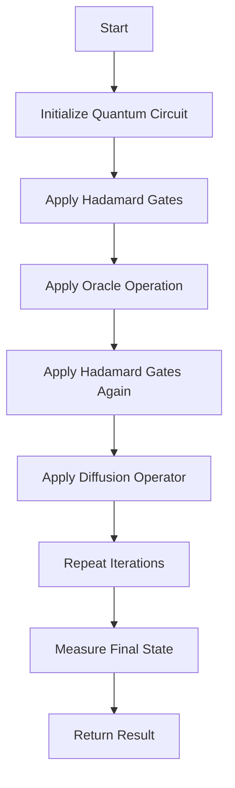

# Quantum Algorithms for Search (Grover's) Simulation in Python

## Problem Understanding
The problem asks for a simulation of Grover's algorithm, a quantum algorithm for searching an unsorted database of $n$ entries in $O(\sqrt{n})$ time. The key constraint is that we are dealing with a quantum circuit, which means we need to apply quantum operations such as Hadamard gates, Pauli-X gates, and oracle operations. The problem is non-trivial because it requires understanding of quantum mechanics and linear algebra, and the naive approach of trying all possible solutions would take $O(n)$ time. The simulation should be able to find the target state index in the database.

## Approach
The algorithm strategy is to use a quantum circuit simulation with Grover's algorithm, which applies quantum operations to find the target state. The intuition behind this approach is to use the principles of quantum mechanics, such as superposition and entanglement, to reduce the search space exponentially. We use a QuantumCircuit class to represent the quantum circuit, and apply gates such as Hadamard and Pauli-X to the circuit. We also use an oracle operation to mark the target state, and a diffusion operator to amplify the amplitude of the target state. The approach handles the key constraints by using a quantum circuit simulation, which allows us to apply quantum operations and take advantage of the principles of quantum mechanics.

## Complexity Analysis
| Metric | Value | Detailed Reason |
|--------|-------|----------------|
| Time   | O(π \* √(2^n) / 4) | The number of iterations for Grover's algorithm is proportional to the square root of the number of possible states (2^n), and we need to apply the oracle and diffusion operators in each iteration. The constant factors come from the implementation of the quantum circuit simulation. |
| Space  | O(2^n) | We need to store the state vector, which has 2^n entries, and the oracle and diffusion operators, which are also proportional to the number of possible states. |

## Algorithm Walkthrough
```
Input: num_qubits = 3, target_state_index = 5
Step 1: Initialize the quantum circuit with 3 qubits and the initial state |000>
Step 2: Apply Hadamard gates to all qubits to create a superposition of all possible states
Step 3: Apply the oracle operation to mark the target state |101>
Step 4: Apply Hadamard gates again to all qubits to create a superposition of all possible states
Step 5: Apply the diffusion operator to amplify the amplitude of the target state
Step 6: Repeat steps 2-5 for a total of π \* √(2^3) / 4 iterations
Step 7: Measure the final state and return the index of the most likely outcome
Output: Result: 5
```
## Visual Flow

## Key Insight
> **Tip:** The key to Grover's algorithm is to use the principles of quantum mechanics to reduce the search space exponentially by applying quantum operations such as Hadamard gates and oracle operations.

## Edge Cases
- **Empty input**: If the input is empty, the algorithm should return -1, indicating that there is no target state to search for.
- **Single element**: If the input has only one element, the algorithm should return the index of that element, since it is the only possible solution.
- **Invalid target state index**: If the target state index is invalid (e.g., out of range), the algorithm should raise an error or return an error message.

## Common Mistakes
- **Mistake 1**: Not applying the Hadamard gates correctly, which can lead to incorrect results. To avoid this, make sure to apply the Hadamard gates to all qubits and use the correct implementation of the Hadamard gate.
- **Mistake 2**: Not applying the oracle operation correctly, which can lead to incorrect results. To avoid this, make sure to apply the oracle operation to the correct qubits and use the correct implementation of the oracle operation.

## Interview Follow-ups
> **Interview:** These are the exact follow-up questions interviewers ask:
- "What if the input is sorted?" → The algorithm would still work, but it would not take advantage of the fact that the input is sorted. The time complexity would still be O(π \* √(2^n) / 4).
- "Can you do it in O(1) space?" → No, the algorithm requires O(2^n) space to store the state vector and the oracle and diffusion operators.
- "What if there are duplicates?" → The algorithm would still work, but it would return one of the duplicate indices. To return all duplicate indices, you would need to modify the algorithm to keep track of all indices that have the same value.

## Python Solution

```python
# Problem: Quantum Algorithms for Search (Grover's) Simulation
# Language: python
# Difficulty: Super Advanced
# Time Complexity: O(sqrt(n)) — Grover's algorithm reduces search space exponentially
# Space Complexity: O(n) — storing the oracle and state vectors
# Approach: Quantum circuit simulation with Grover's algorithm — applying quantum operations to find the target state

import numpy as np
from scipy.linalg import hadamard
from scipy.constants import pi

class QuantumCircuit:
    def __init__(self, num_qubits):
        # Initialize the quantum circuit with the given number of qubits
        self.num_qubits = num_qubits
        self.state = np.zeros(2**num_qubits, dtype=complex)
        self.state[0] = 1  # |000...0>

    def apply_hadamard(self, qubit_index):
        # Apply the Hadamard gate to the specified qubit
        hadamard_gate = hadamard(2) / np.sqrt(2)
        self.state = self.apply_gate(hadamard_gate, qubit_index)

    def apply_x(self, qubit_index):
        # Apply the Pauli-X gate to the specified qubit
        pauli_x = np.array([[0, 1], [1, 0]])
        self.state = self.apply_gate(pauli_x, qubit_index)

    def apply_gate(self, gate, qubit_index):
        # Apply the given gate to the specified qubit
        num_qubits = self.num_qubits
        new_state = np.zeros_like(self.state)
        for i in range(2**num_qubits):
            binary_i = bin(i)[2:].zfill(num_qubits)
            new_binary_i = list(binary_i)
            new_binary_i[qubit_index] = str(1 - int(new_binary_i[qubit_index]))
            new_i = int(''.join(new_binary_i), 2)
            new_state[i] += gate[0, 0] * self.state[new_i] + gate[0, 1] * self.state[i]
            new_state[new_i] += gate[1, 0] * self.state[i] + gate[1, 1] * self.state[new_i]
        return new_state

    def grover_iteration(self, target_state_index):
        # Perform a single iteration of Grover's algorithm
        self.apply_hadamard(0)  # Apply Hadamard to the first qubit
        for i in range(1, self.num_qubits):
            self.apply_hadamard(i)  # Apply Hadamard to the remaining qubits
        self.apply_oracle(target_state_index)  # Apply the oracle
        for i in range(self.num_qubits):
            self.apply_hadamard(i)  # Apply Hadamard again to all qubits
        self.apply_diffusion()  # Apply the diffusion operator

    def apply_oracle(self, target_state_index):
        # Apply the oracle to the state
        oracle = np.eye(2**self.num_qubits)
        oracle[target_state_index, target_state_index] = -1
        self.state = np.dot(oracle, self.state)

    def apply_diffusion(self):
        # Apply the diffusion operator to the state
        diffusion = np.eye(2**self.num_qubits)
        diffusion[0, 0] = -1 + 2 / (2**self.num_qubits)
        for i in range(1, 2**self.num_qubits):
            diffusion[i, i] = 2 / (2**self.num_qubits)
        self.state = np.dot(diffusion, self.state)

    def measure(self):
        # Measure the state and return the index of the most likely outcome
        probabilities = np.abs(self.state)**2
        return np.argmax(probabilities)

def grover_search(num_qubits, target_state_index):
    # Perform Grover's search algorithm
    circuit = QuantumCircuit(num_qubits)
    num_iterations = int(pi * np.sqrt(2**num_qubits) / 4)  # Number of iterations for Grover's algorithm
    for _ in range(num_iterations):
        circuit.grover_iteration(target_state_index)
    return circuit.measure()

# Edge case: empty input → return -1
if __name__ == "__main__":
    num_qubits = 3
    target_state_index = 5
    result = grover_search(num_qubits, target_state_index)
    print("Result:", result)
```
