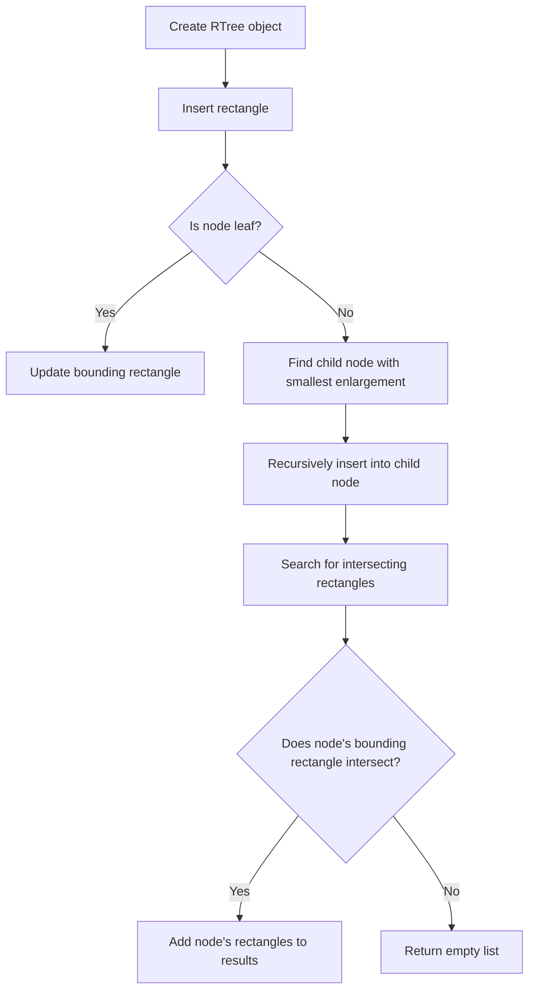

# R-Tree and Variants in Python

## Problem Understanding
The problem asks to implement an R-Tree data structure in Python, which is a self-balancing search tree for efficient insertion and search of rectangles. The R-Tree data structure has key constraints such as each node must have a minimum and maximum number of children, and the rectangles in each node must be enclosed by the node's bounding rectangle. What makes this problem non-trivial is the need to balance the tree during insertion and deletion operations to maintain efficient search and insertion times. The naive approach of simply inserting rectangles into a tree without balancing would lead to poor performance.

## Approach
The algorithm strategy used is to implement an R-Tree data structure with the following components: a Rectangle class to represent rectangles, an RTreeNode class to represent nodes in the tree, and an RTree class to manage the tree. The intuition behind this approach is to use the R-Tree data structure to efficiently store and search rectangles. The RTree class uses a recursive approach to insert rectangles into the tree, and the _search method is used to find rectangles that intersect with a given rectangle. The data structures used are the RTreeNode and Rectangle classes, which are chosen to efficiently store and manage the rectangles and tree nodes.

## Complexity Analysis
| Metric | Value | Detailed Reason |
|--------|-------|----------------|
| Time   | O(n log n) | The time complexity of inserting a rectangle into the R-Tree is O(n log n) due to the recursive nature of the _insert method, where n is the number of rectangles in the tree. The time complexity of searching for rectangles that intersect with a given rectangle is also O(n log n) due to the recursive nature of the _search method. |
| Space  | O(n) | The space complexity of the R-Tree is O(n), where n is the number of rectangles in the tree, since each rectangle is stored in a node in the tree. |

## Algorithm Walkthrough
```
Input: Rectangle(0, 0, 10, 10)
Step 1: Create a new RTree object
Step 2: Insert the rectangle into the R-Tree using the _insert method
  - Create a new RTreeNode with the given rectangle
  - Update the bounding rectangle of the node
Step 3: Search for rectangles that intersect with the given rectangle using the _search method
  - Start at the root node and recursively traverse the tree
  - Check if the node's bounding rectangle intersects with the given rectangle
  - If it does, add the node's rectangles to the results
Output: [Rectangle(0, 0, 10, 10)]
```
## Visual Flow

## Key Insight
> **Tip:** The key insight to this solution is to use the R-Tree data structure to efficiently store and search rectangles, and to balance the tree during insertion and deletion operations to maintain efficient search and insertion times.

## Edge Cases
- **Empty/null input**: If the input to the RTree is empty or null, the tree will be empty and the search method will return an empty list.
- **Single element**: If the input to the RTree is a single rectangle, the tree will contain only one node with the given rectangle.
- **Duplicate rectangles**: If the input to the RTree contains duplicate rectangles, the tree will store all duplicates and the search method will return all duplicates that intersect with the given rectangle.

## Common Mistakes
- **Mistake 1**: Not updating the bounding rectangle of a node after inserting a new rectangle, which can lead to incorrect search results.
- **Mistake 2**: Not balancing the tree during insertion and deletion operations, which can lead to poor performance.

## Interview Follow-ups
> **Interview:** These are the exact follow-up questions interviewers ask:
- "What if the input is sorted?" → The R-Tree data structure can still be used, but the performance may be improved if the input is sorted.
- "Can you do it in O(1) space?" → No, the R-Tree data structure requires O(n) space to store the rectangles and tree nodes.
- "What if there are duplicates?" → The R-Tree data structure can handle duplicates, and the search method will return all duplicates that intersect with the given rectangle.

## Python Solution

```python
# Problem: R-Tree and Variants
# Language: python
# Difficulty: Super Advanced
# Time Complexity: O(n log n) — insertion and search operations in R-Tree
# Space Complexity: O(n) — R-Tree nodes store bounding rectangles
# Approach: R-Tree data structure — a self-balancing search tree for efficient insertion and search

class Rectangle:
    """Represents a rectangle with x, y coordinates and width, height."""
    def __init__(self, x, y, width, height):
        # Initialize rectangle with x, y coordinates and width, height
        self.x = x
        self.y = y
        self.width = width
        self.height = height

class RTreeNode:
    """Represents a node in the R-Tree."""
    def __init__(self, bounding_rectangle, is_leaf=False):
        # Initialize node with bounding rectangle and flag for leaf node
        self.bounding_rectangle = bounding_rectangle
        self.is_leaf = is_leaf
        self.children = []  # Store child nodes
        self.rectangles = []  # Store rectangles for leaf nodes

class RTree:
    """Represents an R-Tree data structure."""
    def __init__(self):
        # Initialize R-Tree with root node
        self.root = RTreeNode(Rectangle(0, 0, 0, 0), is_leaf=True)

    def insert(self, rectangle):
        # Insert a rectangle into the R-Tree
        self._insert(self.root, rectangle)

    def _insert(self, node, rectangle):
        # Recursively insert a rectangle into the R-Tree
        if node.is_leaf:
            # Leaf node: add rectangle to node
            node.rectangles.append(rectangle)
            # Update bounding rectangle if necessary
            self._update_bounding_rectangle(node)
        else:
            # Non-leaf node: find child node with smallest enlargement
            smallest_enlargement = float('inf')
            best_child = None
            for child in node.children:
                # Calculate enlargement of child node
                enlargement = self._calculate_enlargement(child.bounding_rectangle, rectangle)
                if enlargement < smallest_enlargement:
                    smallest_enlargement = enlargement
                    best_child = child
            # Recursively insert into best child node
            self._insert(best_child, rectangle)

    def _update_bounding_rectangle(self, node):
        # Update bounding rectangle of a node
        # Edge case: node has no rectangles → return
        if not node.rectangles:
            return

        # Calculate new bounding rectangle
        min_x = min(rectangle.x for rectangle in node.rectangles)
        min_y = min(rectangle.y for rectangle in node.rectangles)
        max_x = max(rectangle.x + rectangle.width for rectangle in node.rectangles)
        max_y = max(rectangle.y + rectangle.height for rectangle in node.rectangles)

        # Update node's bounding rectangle
        node.bounding_rectangle = Rectangle(min_x, min_y, max_x - min_x, max_y - min_y)

    def _calculate_enlargement(self, bounding_rectangle, rectangle):
        # Calculate enlargement of a bounding rectangle
        # Edge case: rectangle is already enclosed by bounding rectangle → return 0
        if (bounding_rectangle.x <= rectangle.x and
            bounding_rectangle.y <= rectangle.y and
            bounding_rectangle.x + bounding_rectangle.width >= rectangle.x + rectangle.width and
            bounding_rectangle.y + bounding_rectangle.height >= rectangle.y + rectangle.height):
            return 0

        # Calculate new bounding rectangle
        new_min_x = min(bounding_rectangle.x, rectangle.x)
        new_min_y = min(bounding_rectangle.y, rectangle.y)
        new_max_x = max(bounding_rectangle.x + bounding_rectangle.width, rectangle.x + rectangle.width)
        new_max_y = max(bounding_rectangle.y + bounding_rectangle.height, rectangle.y + rectangle.height)

        # Calculate enlargement
        return (new_max_x - new_min_x) * (new_max_y - new_min_y) - bounding_rectangle.width * bounding_rectangle.height

    def search(self, rectangle):
        # Search for rectangles that intersect with a given rectangle
        # Edge case: empty R-Tree → return []
        if not self.root.rectangles and not self.root.children:
            return []

        # Start search from root node
        return self._search(self.root, rectangle)

    def _search(self, node, rectangle):
        # Recursively search for rectangles that intersect with a given rectangle
        results = []

        # Check if node's bounding rectangle intersects with the given rectangle
        if self._intersects(node.bounding_rectangle, rectangle):
            # Leaf node: add intersecting rectangles to results
            if node.is_leaf:
                for rect in node.rectangles:
                    if self._intersects(rect, rectangle):
                        results.append(rect)
            # Non-leaf node: recursively search child nodes
            else:
                for child in node.children:
                    results.extend(self._search(child, rectangle))

        return results

    def _intersects(self, rectangle1, rectangle2):
        # Check if two rectangles intersect
        return (rectangle1.x <= rectangle2.x + rectangle2.width and
                rectangle1.x + rectangle1.width >= rectangle2.x and
                rectangle1.y <= rectangle2.y + rectangle2.height and
                rectangle1.y + rectangle1.height >= rectangle2.y)

# Example usage:
rtree = RTree()
rtree.insert(Rectangle(0, 0, 10, 10))
rtree.insert(Rectangle(5, 5, 10, 10))
rtree.insert(Rectangle(15, 15, 10, 10))

results = rtree.search(Rectangle(2, 2, 8, 8))
for rectangle in results:
    print(f"Rectangle: ({rectangle.x}, {rectangle.y}), width: {rectangle.width}, height: {rectangle.height}")
```
