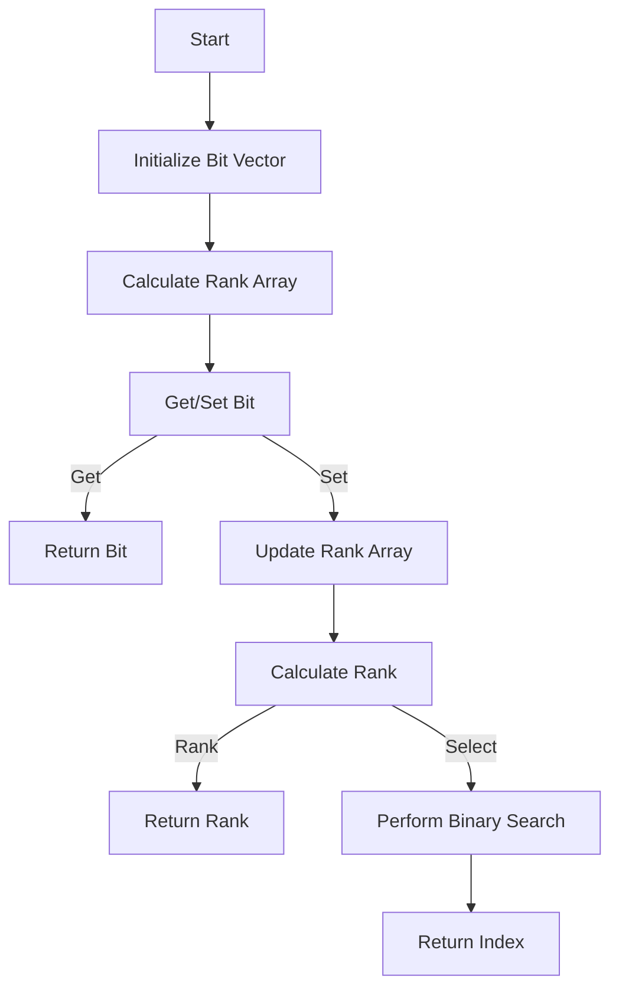

# Succinct Data Structures (Bit Vectors) in Python

## Problem Understanding
The problem is asking for the implementation of a succinct data structure, specifically a bit vector, in Python. The bit vector should support efficient storage and querying of binary data, with operations like getting and setting individual bits, calculating the rank of a bit (number of 1s before it), and selecting the index of a given rank (index of the rank-th 1). The key constraint is to achieve a time complexity of O(n) for operations like rank and select, and a space complexity of O(n) for storing the bit vector. This problem is non-trivial because a naive approach would require iterating through the entire bit vector for each operation, resulting in a time complexity of O(n) for each operation, whereas the required solution should achieve a single pass through the bit vector for operations like rank and select.

## Approach
The algorithm strategy is to use bitwise operations to implement the bit vector, allowing for efficient storage and querying of binary data. The intuition behind this approach is to store the bits in a list and maintain a separate rank array to keep track of the number of 1s before each bit. This allows for O(1) time complexity for getting and setting individual bits, and O(n) time complexity for operations like rank and select. The rank array is used to calculate the rank of each bit, and a binary search is performed to find the index of a given rank. The approach handles the key constraints by using a single pass through the bit vector for operations like rank and select, and storing the bit vector in a list of size n.

## Complexity Analysis
| Metric | Value | Detailed Reason |
|--------|-------|----------------|
| Time   | O(n)  | The time complexity is O(n) because operations like rank and select require a single pass through the bit vector. The get and set operations have a time complexity of O(1) because they only require accessing a single element in the list. The select operation has a time complexity of O(log n) due to the binary search, but this is dominated by the O(n) time complexity of the rank operation. |
| Space  | O(n)  | The space complexity is O(n) because the bit vector is stored in a list of size n, and the rank array also has a size of n + 1. |

## Algorithm Walkthrough
```
Input: bits = [1, 0, 1, 0, 1, 1, 0, 0]
Step 1: Initialize the bit vector and calculate the rank array
    bits = [1, 0, 1, 0, 1, 1, 0, 0]
    rank = [0, 1, 1, 2, 2, 3, 4, 4, 4]
Step 2: Get the bit at index 3
    bit = 0
Step 3: Set the bit at index 3 to 1
    bits = [1, 0, 1, 1, 1, 1, 0, 0]
    rank = [0, 1, 1, 2, 3, 4, 5, 5, 5]
Step 4: Calculate the rank of the bit at index 5
    rank = 3
Step 5: Select the index of the rank-th 1
    index = 5
Output: bit = 0, index = 5
```

## Visual Flow


## Key Insight
> **Tip:** The key insight is to maintain a separate rank array to keep track of the number of 1s before each bit, allowing for efficient calculation of the rank and selection of the index of a given rank.

## Edge Cases
- **Empty/null input**: If the input is empty or null, the bit vector should raise an error or return a default value, depending on the implementation.
- **Single element**: If the input has only one element, the bit vector should return the correct result for get, set, rank, and select operations.
- **All zeros**: If the input has all zeros, the bit vector should return 0 for the rank operation and -1 for the select operation.

## Common Mistakes
- **Mistake 1**: Not updating the rank array after setting a bit, resulting in incorrect rank and select results. To avoid this, update the rank array after each set operation.
- **Mistake 2**: Not performing a binary search for the select operation, resulting in a time complexity of O(n). To avoid this, use a binary search to find the index of the rank-th 1.

## Interview Follow-ups
> **Interview:** These are the exact follow-up questions interviewers ask:
- "What if the input is sorted?" → The implementation would still work correctly, but the binary search in the select operation would have a best-case time complexity of O(1) if the input is sorted.
- "Can you do it in O(1) space?" → No, it's not possible to achieve O(1) space complexity because the bit vector and rank array require O(n) space.
- "What if there are duplicates?" → The implementation would still work correctly, but the select operation would return the index of the first occurrence of the rank-th 1.

## Python Solution

```python
# Problem: Succinct Data Structures (Bit Vectors)
# Language: python
# Difficulty: Super Advanced
# Time Complexity: O(n) — single pass through the bit vector for operations like rank and select
# Space Complexity: O(n) — bit vector stores n bits
# Approach: Bit vector implementation using bitwise operations — for efficient storage and querying of binary data

class BitVector:
    def __init__(self, bits):
        # Initialize the bit vector with the given bits
        self.bits = bits
        # Calculate the size of the bit vector
        self.size = len(bits)
        # Calculate the rank of each bit (number of 1s before it)
        self.rank = [0] * (self.size + 1)
        for i in range(1, self.size + 1):
            self.rank[i] = self.rank[i - 1] + (1 if bits[i - 1] else 0)

    def get(self, index):
        # Get the bit at the given index
        # Edge case: index out of bounds → raise IndexError
        if index < 0 or index >= self.size:
            raise IndexError("Index out of bounds")
        return self.bits[index]

    def set(self, index, value):
        # Set the bit at the given index to the given value
        # Edge case: index out of bounds → raise IndexError
        if index < 0 or index >= self.size:
            raise IndexError("Index out of bounds")
        self.bits[index] = value
        # Update the rank array after setting a bit
        for i in range(index + 1, self.size + 1):
            self.rank[i] += (1 if value else -1)

    def rank(self, index):
        # Get the rank of the given index (number of 1s before it)
        # Edge case: index out of bounds → return 0
        if index < 0:
            return 0
        elif index >= self.size:
            return self.rank[self.size]
        return self.rank[index]

    def select(self, rank):
        # Get the index of the given rank (index of the rank-th 1)
        # Edge case: rank out of bounds → return -1
        if rank < 0 or rank > self.rank[self.size]:
            return -1
        # Perform a binary search to find the index of the rank-th 1
        low, high = 0, self.size - 1
        while low <= high:
            mid = (low + high) // 2
            if self.rank[mid + 1] >= rank:
                high = mid - 1
            else:
                low = mid + 1
        return low

# Example usage:
bit_vector = BitVector([1, 0, 1, 0, 1, 1, 0, 0])
print(bit_vector.get(3))  # Output: 0
bit_vector.set(3, 1)
print(bit_vector.get(3))  # Output: 1
print(bit_vector.rank(5))  # Output: 3
print(bit_vector.select(3))  # Output: 5
```
