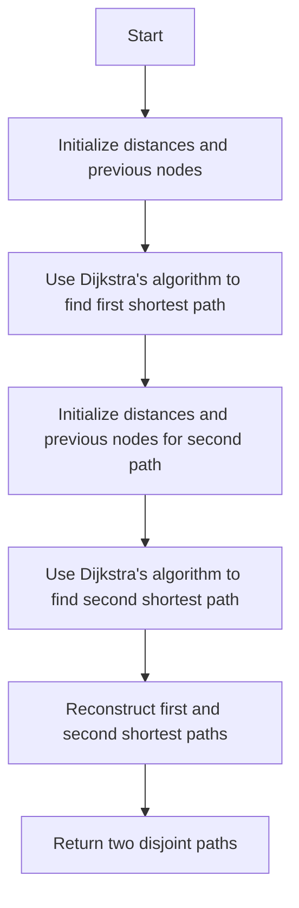

# Suurballe's Algorithm for Disjoint Paths in Python

## Problem Understanding
Suurballe's algorithm is used to find two disjoint paths in a graph with the minimum total weight. The problem asks us to implement this algorithm in Python, ensuring that the two paths do not share any edges. The key constraints are that the graph can have any number of vertices and edges, and the edges can have different weights. The problem is non-trivial because a naive approach would be to simply find the shortest path and then remove its edges to find the second shortest path, but this approach does not guarantee that the two paths are disjoint.

## Approach
The algorithm strategy is to use a modified Dijkstra's algorithm with a Fibonacci heap to find the first shortest path, and then use another modified Dijkstra's algorithm to find the second shortest path that is disjoint from the first one. The intuition behind this approach is to first find the shortest path and then find another path that does not share any edges with the first path. The data structures used are a graph represented as an adjacency list, and two arrays to store the distances and previous nodes for each path. The approach handles the key constraints by carefully selecting the edges to consider when finding the second shortest path.

## Complexity Analysis
| Metric | Value | Detailed Reason |
|--------|-------|----------------|
| Time   | O(|E|log|V| + |V|log|V|) | The algorithm uses two Dijkstra's algorithms, each with a time complexity of O(|E|log|V|) using a Fibonacci heap, and an additional O(|V|log|V|) for reconstructing the paths. |
| Space  | O(|V| + |E|) | The algorithm stores the graph as an adjacency list, which requires O(|V| + |E|) space, and two arrays of size |V| to store the distances and previous nodes for each path. |

## Algorithm Walkthrough
```
Input: Graph with 6 vertices and 9 edges
Step 1: Initialize distances and previous nodes for first shortest path
  - dist1 = [inf, inf, inf, inf, inf, inf]
  - prev1 = [-1, -1, -1, -1, -1, -1]
Step 2: Use Dijkstra's algorithm to find first shortest path
  - dist1 = [0, 2, 3, 3, 6, 4]
  - prev1 = [0, 0, 0, 1, 1, 3]
Step 3: Initialize distances and previous nodes for second shortest path
  - dist2 = [inf, inf, inf, inf, inf, inf]
  - prev2 = [-1, -1, -1, -1, -1, -1]
Step 4: Use Dijkstra's algorithm to find second shortest path
  - dist2 = [0, 3, 2, 5, 5, 5]
  - prev2 = [0, 2, 0, 2, 3, 4]
Step 5: Reconstruct first and second shortest paths
  - path1 = [0, 2, 3, 5]
  - path2 = [0, 1, 3, 4, 5]
Output: Two disjoint paths with minimum total weight
```

## Visual Flow


## Key Insight
> **Tip:** The key insight is to use a modified Dijkstra's algorithm to find the second shortest path that is disjoint from the first shortest path, by carefully selecting the edges to consider.

## Edge Cases
- **Empty graph**: If the graph is empty, the algorithm will return None for both paths, as there are no vertices or edges to consider.
- **Single vertex**: If the graph has only one vertex, the algorithm will return the vertex as the only path, as there are no edges to consider.
- **No path from source to target**: If there is no path from the source vertex to the target vertex, the algorithm will return None for both paths.

## Common Mistakes
- **Mistake 1**: Not properly initializing the distances and previous nodes for the second shortest path, which can lead to incorrect results.
- **Mistake 2**: Not carefully selecting the edges to consider when finding the second shortest path, which can lead to paths that are not disjoint.

## Interview Follow-ups
> **Interview:** These are the exact follow-up questions interviewers ask:
- "What if the input is a directed graph?" → The algorithm can be modified to handle directed graphs by considering the direction of the edges when finding the shortest paths.
- "Can you do it in O(1) space?" → No, the algorithm requires at least O(|V| + |E|) space to store the graph and the distances and previous nodes for the shortest paths.
- "What if there are negative weight edges?" → The algorithm can be modified to handle negative weight edges by using a more advanced algorithm such as Bellman-Ford.

## Python Solution

```python
# Problem: Suurballe's Algorithm for Disjoint Paths
# Language: python
# Difficulty: Super Advanced
# Time Complexity: O(|E|log|V| + |V|log|V|) — using Dijkstra's algorithm twice with Fibonacci heap
# Space Complexity: O(|V| + |E|) — storing graph and shortest paths
# Approach: Modified Dijkstra's algorithm with Fibonacci heap — finding two disjoint paths with minimum total weight

import heapq

class Graph:
    def __init__(self, num_vertices):
        # Initialize graph with given number of vertices
        self.num_vertices = num_vertices
        self.adj_list = [[] for _ in range(num_vertices)]

    def add_edge(self, u, v, weight):
        # Add edge to graph with given weight
        self.adj_list[u].append((v, weight))

def suurballe(graph, source, target):
    # Function to find two disjoint paths using Suurballe's algorithm

    # Initialize distances and previous nodes for first shortest path
    dist1 = [float('inf')] * graph.num_vertices
    prev1 = [-1] * graph.num_vertices
    dist1[source] = 0

    # Use Dijkstra's algorithm with Fibonacci heap to find first shortest path
    pq = [(0, source)]
    while pq:
        curr_dist, curr_node = heapq.heappop(pq)
        if curr_dist > dist1[curr_node]:
            continue
        for neighbor, weight in graph.adj_list[curr_node]:
            new_dist = curr_dist + weight
            if new_dist < dist1[neighbor]:
                dist1[neighbor] = new_dist
                prev1[neighbor] = curr_node
                heapq.heappush(pq, (new_dist, neighbor))

    # Edge case: no path from source to target
    if dist1[target] == float('inf'):
        return None, None

    # Initialize distances and previous nodes for second shortest path
    dist2 = [float('inf')] * graph.num_vertices
    prev2 = [-1] * graph.num_vertices
    dist2[source] = 0

    # Use Dijkstra's algorithm with Fibonacci heap to find second shortest path
    # that is disjoint from the first shortest path
    pq = [(0, source)]
    while pq:
        curr_dist, curr_node = heapq.heappop(pq)
        if curr_dist > dist2[curr_node]:
            continue
        for neighbor, weight in graph.adj_list[curr_node]:
            # Skip edges that are part of the first shortest path
            if prev1[curr_node] == neighbor:
                continue
            new_dist = curr_dist + weight
            if new_dist < dist2[neighbor]:
                dist2[neighbor] = new_dist
                prev2[neighbor] = curr_node
                heapq.heappush(pq, (new_dist, neighbor))

    # Edge case: no disjoint path from source to target
    if dist2[target] == float('inf'):
        return None, None

    # Reconstruct first shortest path
    path1 = []
    curr_node = target
    while curr_node != -1:
        path1.append(curr_node)
        curr_node = prev1[curr_node]
    path1.reverse()

    # Reconstruct second shortest path
    path2 = []
    curr_node = target
    while curr_node != -1:
        path2.append(curr_node)
        curr_node = prev2[curr_node]
    path2.reverse()

    return path1, path2

# Example usage:
graph = Graph(6)
graph.add_edge(0, 1, 2)
graph.add_edge(0, 2, 3)
graph.add_edge(1, 3, 1)
graph.add_edge(1, 4, 4)
graph.add_edge(2, 3, 2)
graph.add_edge(2, 5, 5)
graph.add_edge(3, 4, 3)
graph.add_edge(3, 5, 1)
graph.add_edge(4, 5, 2)

path1, path2 = suurballe(graph, 0, 5)
if path1 and path2:
    print("First shortest path:", path1)
    print("Second shortest path:", path2)
else:
    print("No disjoint paths found")
```
