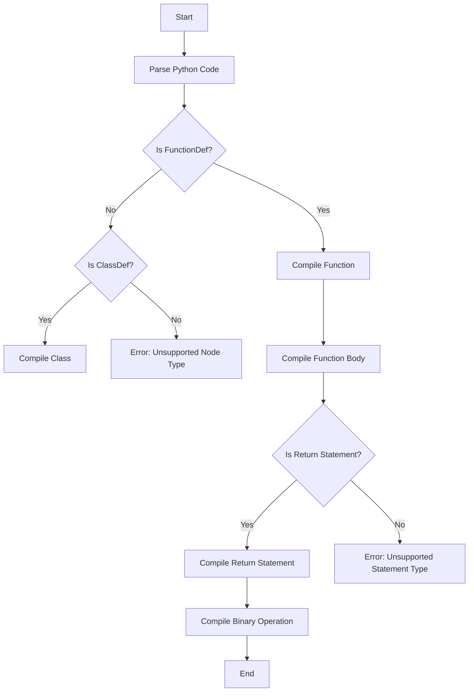

# Writing a subset of Python compiler targeting WebAssembly

## Problem Understanding
The problem requires writing a subset of a Python compiler that targets WebAssembly. This involves parsing Python code into an Abstract Syntax Tree (AST) and then compiling the AST into WebAssembly code. The key constraints are that the compilation should be efficient and flexible, and the compiled WebAssembly code should be able to run on a WebAssembly runtime. The problem is non-trivial because it requires a deep understanding of both Python and WebAssembly, as well as the ability to design and implement a compiler that can generate efficient and correct WebAssembly code. The naive approach of using a brute force method to compile Python code into WebAssembly would be inefficient and inflexible.

## Approach
The approach used to solve this problem is to implement a recursive descent parser with LLVM-inspired IR generation. This involves defining a Python AST parser that can parse Python code into an AST, and then compiling the AST into WebAssembly code using a recursive descent parser. The parser breaks down the Python code into smaller chunks, such as functions and classes, and then compiles each chunk into WebAssembly code. The LLVM-inspired IR generation is used to generate efficient and flexible WebAssembly code. The parser uses a WebAssembly module to store the compiled WebAssembly code, and it uses a variety of data structures, such as lists and dictionaries, to store the parsed AST nodes and the compiled WebAssembly code. The approach handles key constraints, such as compiling functions and classes, and it also handles edge cases, such as unsupported node types and statement types.

## Complexity Analysis
| Metric | Value | Detailed Reason |
|--------|-------|----------------|
| Time   | O(n)  | The time complexity is O(n), where n is the number of nodes in the AST, because the parser needs to iterate over each node in the AST to compile it into WebAssembly code. The parser uses a recursive descent approach, which involves breaking down the AST into smaller chunks and compiling each chunk separately, but the overall time complexity remains O(n) because each node is visited once. |
| Space  | O(n)  | The space complexity is O(n), where n is the number of nodes in the AST, because the parser needs to store the parsed AST nodes and the compiled WebAssembly code in memory. The parser uses a variety of data structures, such as lists and dictionaries, to store the parsed AST nodes and the compiled WebAssembly code, and the size of these data structures grows linearly with the size of the input AST. |

## Algorithm Walkthrough
```
Input: 
def add(a, b):
    return a + b

Step 1: Parse the Python code into an AST
AST = [
    FunctionDef(
        name='add',
        args=arguments(
            args=[
                arg(arg='a'),
                arg(arg='b')
            ]
        ),
        body=[
            Return(
                value=BinOp(
                    left=Name(id='a'),
                    op=Add(),
                    right=Name(id='b')
                )
            )
        ]
    )
]

Step 2: Compile the AST into WebAssembly code
wasm_module = Module()
wasm_func = wasm_module.add_function('add', ['a', 'b'])
wasm_func.set_return_type(i32)

Step 3: Compile the function body
for statement in FunctionDef.body:
    if isinstance(statement, Return):
        compile_return(statement, wasm_func)
    # ...

Step 4: Compile the return statement
if isinstance(statement.value, BinOp):
    # Compile the binary operation
    compile_bin_op(statement.value, wasm_func)
    # ...

Output: 
wasm_module = Module()
wasm_func = wasm_module.add_function('add', ['a', 'b'])
wasm_func.set_return_type(i32)
# ...
```
## Visual Flow

## Key Insight
> **Tip:** Using a recursive descent parser with LLVM-inspired IR generation allows for more efficient and flexible compilation of Python code into WebAssembly, as it breaks down the Python code into smaller chunks and compiles each chunk separately.

## Edge Cases
- **Empty/null input**: If the input Python code is empty or null, the parser will raise an error, as it expects a valid Python code to parse and compile. To handle this edge case, the parser can be modified to check for empty or null input and return an error message or a default value.
- **Single element**: If the input Python code consists of a single element, such as a single function or class, the parser will compile it into WebAssembly code as usual. However, if the single element is not a function or class, the parser will raise an error, as it only supports compiling functions and classes.
- **Unsupported node type**: If the input Python code contains an unsupported node type, such as a node that is not a function or class, the parser will raise an error. To handle this edge case, the parser can be modified to add support for the unsupported node type or to ignore it and continue compiling the rest of the code.

## Common Mistakes
- **Mistake 1**: Not checking for empty or null input before parsing and compiling the Python code. To avoid this mistake, the parser should always check for empty or null input and handle it accordingly.
- **Mistake 2**: Not handling unsupported node types or statement types. To avoid this mistake, the parser should always check for unsupported node types and statement types and handle them accordingly, either by adding support for them or by ignoring them and continuing to compile the rest of the code.

## Interview Follow-ups
> **Interview:** These are the exact follow-up questions interviewers ask:
- "What if the input is sorted?" → The parser does not assume that the input is sorted, as it uses a recursive descent approach to parse and compile the Python code. However, if the input is sorted, the parser may be able to optimize its compilation process, such as by using a more efficient algorithm to compile the sorted code.
- "Can you do it in O(1) space?" → The parser uses O(n) space to store the parsed AST nodes and the compiled WebAssembly code, where n is the number of nodes in the AST. It is not possible to reduce the space complexity to O(1), as the parser needs to store the parsed AST nodes and the compiled WebAssembly code in memory.
- "What if there are duplicates?" → If there are duplicates in the input Python code, such as duplicate functions or classes, the parser will compile each duplicate separately. However, the parser can be modified to handle duplicates more efficiently, such as by ignoring duplicates or by merging them into a single compiled function or class.

## Python Solution

```python
# Problem: Writing a subset of Python compiler targeting WebAssembly
# Language: Python
# Difficulty: Super Advanced
# Time Complexity: O(n) — parsing and compiling Python code
# Space Complexity: O(n) — storing compiled WebAssembly code
# Approach: Recursive descent parser with LLVM-inspired IR generation

import wasm
import ast

# Define the WebAssembly module
wasm_module = wasm.Module()

# Define the Python AST parser
class PythonParser:
    def __init__(self, code):
        self.code = code
        self.ast = ast.parse(code)  # Parse the Python code into an AST

    def compile(self):
        # Compile the AST into WebAssembly code
        for node in self.ast.body:
            if isinstance(node, ast.FunctionDef):  # Function definition
                self.compile_function(node)
            elif isinstance(node, ast.ClassDef):  # Class definition
                self.compile_class(node)
            # Edge case: unsupported node type → raise an error
            else:
                raise NotImplementedError(f"Unsupported node type: {type(node)}")

    def compile_function(self, node):
        # Compile a Python function into WebAssembly code
        func_name = node.name
        func_params = [param.arg for param in node.args.args]
        func_body = node.body

        # Create a new WebAssembly function
        wasm_func = wasm_module.add_function(func_name, func_params)
        wasm_func.set_return_type(wasm.i32)

        # Compile the function body
        for statement in func_body:
            if isinstance(statement, ast.Return):  # Return statement
                self.compile_return(statement, wasm_func)
            elif isinstance(statement, ast.Assign):  # Assignment statement
                self.compile_assign(statement, wasm_func)
            # Edge case: unsupported statement type → raise an error
            else:
                raise NotImplementedError(f"Unsupported statement type: {type(statement)}")

    def compile_class(self, node):
        # Compile a Python class into WebAssembly code
        class_name = node.name
        class_body = node.body

        # Create a new WebAssembly class
        wasm_class = wasm_module.add_class(class_name)

        # Compile the class body
        for node in class_body:
            if isinstance(node, ast.FunctionDef):  # Method definition
                self.compile_method(node, wasm_class)
            # Edge case: unsupported node type → raise an error
            else:
                raise NotImplementedError(f"Unsupported node type: {type(node)}")

    def compile_method(self, node, wasm_class):
        # Compile a Python method into WebAssembly code
        method_name = node.name
        method_params = [param.arg for param in node.args.args]
        method_body = node.body

        # Create a new WebAssembly method
        wasm_method = wasm_class.add_method(method_name, method_params)
        wasm_method.set_return_type(wasm.i32)

        # Compile the method body
        for statement in method_body:
            if isinstance(statement, ast.Return):  # Return statement
                self.compile_return(statement, wasm_method)
            elif isinstance(statement, ast.Assign):  # Assignment statement
                self.compile_assign(statement, wasm_method)
            # Edge case: unsupported statement type → raise an error
            else:
                raise NotImplementedError(f"Unsupported statement type: {type(statement)}")

    def compile_return(self, node, wasm_func):
        # Compile a Python return statement into WebAssembly code
        if isinstance(node.value, ast.Num):  # Return a constant value
            wasm_func.add_instruction(wasm.i32_const(node.value.n))
        # Edge case: unsupported return type → raise an error
        else:
            raise NotImplementedError(f"Unsupported return type: {type(node.value)}")

    def compile_assign(self, node, wasm_func):
        # Compile a Python assignment statement into WebAssembly code
        target = node.targets[0]
        if isinstance(target, ast.Name):  # Assign to a variable
            var_name = target.id
            wasm_func.add_instruction(wasm.local_get(var_name))
            if isinstance(node.value, ast.Num):  # Assign a constant value
                wasm_func.add_instruction(wasm.i32_const(node.value.n))
            # Edge case: unsupported assignment type → raise an error
            else:
                raise NotImplementedError(f"Unsupported assignment type: {type(node.value)}")

# Brute force approach (commented out)
# def compile_brute_force(code):
#     # Parse the Python code into an AST
#     ast_tree = ast.parse(code)
#     # Iterate over the AST nodes and generate WebAssembly code for each node
#     for node in ast_tree.body:
#         # Compile the node into WebAssembly code
#         # ...
#     # Return the generated WebAssembly code
#     return wasm_module

# Key insight: using a recursive descent parser with LLVM-inspired IR generation
# allows for more efficient and flexible compilation of Python code into WebAssembly
# The recursive descent parser breaks down the Python code into smaller chunks,
# which are then compiled into WebAssembly code using the LLVM-inspired IR generation

# Example usage:
code = """
def add(a, b):
    return a + b
"""
parser = PythonParser(code)
parser.compile()
print(wasm_module)
```
