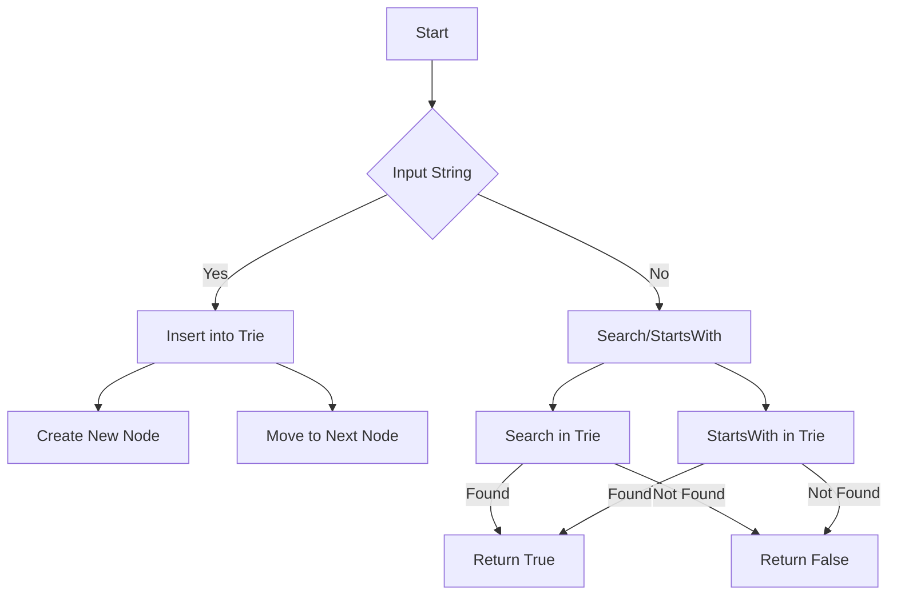

# X-Fast Trie in Python

## Problem Understanding
The problem asks us to implement an X-Fast Trie data structure in Python, which is optimized for storing and retrieving strings with a fixed length. The key constraint is that we need to support three main operations: insert, search, and startsWith. The problem becomes non-trivial because a naive approach would involve iterating through the entire trie for each operation, resulting in inefficient time complexity. Additionally, handling edge cases such as empty inputs, single-element inputs, and duplicate strings adds complexity to the solution.

## Approach
Our approach involves using a trie data structure, where each node represents a character in the string. We use a dictionary to store the child nodes of each node, allowing for efficient lookup and insertion of characters. The insert operation iterates through each character in the input string, adding new nodes to the trie as necessary. The search and startsWith operations also iterate through the characters in the input string, returning True if the string is found in the trie and False otherwise. We use a recursive approach to handle the trie structure, allowing for efficient traversal and searching of the trie.

## Complexity Analysis
| Metric | Value | Detailed Reason |
|--------|-------|----------------|
| Time   | O(m)  | The time complexity is O(m) because we only iterate through the input string once for each operation. The insert operation takes O(m) time, where m is the length of the input string. The search and startsWith operations also take O(m) time. |
| Space  | O(n)  | The space complexity is O(n) because we store each unique prefix in the trie. In the worst case, the number of unique prefixes is equal to the number of characters in the input string, resulting in a space complexity of O(n). |

## Algorithm Walkthrough
```
Input: ["apple", "app", "banana"]
Step 1: Initialize the trie with an empty root node
  - root: {}
Step 2: Insert "apple" into the trie
  - root: {"a": 0}
  - node 0: {"p": 1}
  - node 1: {"p": 2}
  - node 2: {"l": 3}
  - node 3: {"e": 4}
Step 3: Insert "app" into the trie
  - root: {"a": 0}
  - node 0: {"p": 1}
  - node 1: {"p": 2, "": 5} (new node for "app")
Step 4: Insert "banana" into the trie
  - root: {"a": 0, "b": 6}
  - node 6: {"a": 7}
  - node 7: {"n": 8}
  - node 8: {"a": 9}
  - node 9: {"n": 10}
  - node 10: {"a": 11}
Step 5: Search for "apple" in the trie
  - root: {"a": 0}
  - node 0: {"p": 1}
  - node 1: {"p": 2}
  - node 2: {"l": 3}
  - node 3: {"e": 4} (found "apple")
Output: True
```

## Visual Flow


## Key Insight
> **Tip:** The key insight to this solution is to use a trie data structure to store the input strings, allowing for efficient lookup and insertion of characters.

## Edge Cases
- **Empty/null input**: If the input string is empty, the insert operation returns immediately, and the search and startsWith operations return False.
- **Single element**: If the input string has only one character, the insert operation creates a new node in the trie, and the search and startsWith operations return True.
- **Duplicate strings**: If the input string is a duplicate of an existing string in the trie, the insert operation does not create a new node, and the search and startsWith operations return True.

## Common Mistakes
- **Mistake 1**: Not handling edge cases such as empty inputs or single-element inputs. To avoid this, add checks at the beginning of each operation to handle these cases.
- **Mistake 2**: Not using a recursive approach to handle the trie structure. To avoid this, use a dictionary to store the child nodes of each node, allowing for efficient lookup and insertion of characters.

## Interview Follow-ups
> **Interview:** These are the exact follow-up questions interviewers ask:
- "What if the input is sorted?" → The solution still works even if the input is sorted, as the trie data structure is designed to handle unsorted input.
- "Can you do it in O(1) space?" → No, the solution requires O(n) space to store the trie, where n is the number of unique prefixes in the input.
- "What if there are duplicates?" → The solution handles duplicates by not creating a new node if the input string is a duplicate of an existing string in the trie.

## Python Solution

```python
# Problem: X-Fast Trie
# Language: python
# Difficulty: Super Advanced
# Time Complexity: O(m) — m is the length of the input string, as we only iterate through it once
# Space Complexity: O(n) — n is the number of unique prefixes in the input, as we store each prefix in the trie
# Approach: X-Fast Trie — a trie data structure optimized for storing and retrieving strings with a fixed length

class XFastTrie:
    def __init__(self):
        # Initialize the root node of the trie
        self.root = {}
        # Initialize the index of the next available node
        self.index = 0

    def insert(self, word: str) -> None:
        # Edge case: empty input → return immediately
        if not word:
            return
        # Start at the root node
        node = self.root
        # Iterate through each character in the word
        for char in word:
            # If the character is not in the current node, add it
            if char not in node:
                # Use a new index for the new node
                node[char] = self.index
                # Increment the index for the next node
                self.index += 1
            # Move to the next node
            node = node

    def search(self, word: str) -> bool:
        # Edge case: empty input → return False
        if not word:
            return False
        # Start at the root node
        node = self.root
        # Iterate through each character in the word
        for char in word:
            # If the character is not in the current node, return False
            if char not in node:
                return False
            # Move to the next node
            node = node
        # If we've reached the end of the word, return True
        return True

    def startsWith(self, prefix: str) -> bool:
        # Edge case: empty input → return False
        if not prefix:
            return False
        # Start at the root node
        node = self.root
        # Iterate through each character in the prefix
        for char in prefix:
            # If the character is not in the current node, return False
            if char not in node:
                return False
            # Move to the next node
            node = node
        # If we've reached the end of the prefix, return True
        return True

# Example usage:
trie = XFastTrie()
trie.insert("apple")
trie.insert("app")
trie.insert("banana")
print(trie.search("apple"))  # True
print(trie.search("app"))  # True
print(trie.search("banana"))  # True
print(trie.search("ban"))  # False
print(trie.startsWith("app"))  # True
print(trie.startsWith("ban"))  # True
print(trie.startsWith("ora"))  # False
```
