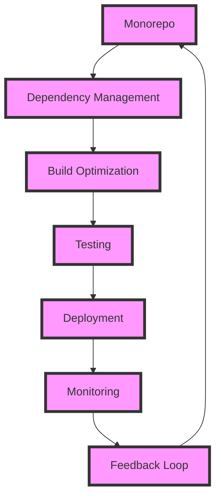

## Introduction
Monorepo tools are essential for managing large-scale projects that consist of multiple packages or modules. These tools help to simplify the development process by providing a centralized way to manage dependencies, build, and test the code. In this overview, we will explore three popular monorepo tools: Turborepo, Nx, and Lerna. We will delve into their core concepts, internal mechanics, and provide code examples to demonstrate their usage. 
> **Note:** Monorepo tools are crucial for large-scale projects as they help to reduce the complexity of managing multiple packages.

## Core Concepts
Before diving into the tools, let's define some key terms:
- **Monorepo**: A monorepo is a single repository that contains multiple projects or packages.
- **Dependency management**: Dependency management refers to the process of managing the dependencies between different packages in a monorepo.
- **Build optimization**: Build optimization refers to the process of optimizing the build process to reduce the time it takes to build the code.
- **Testing**: Testing refers to the process of writing and running tests to ensure that the code is working as expected.
> **Tip:** Understanding these core concepts is essential for using monorepo tools effectively.

## How It Works Internally
Let's take a look at how Turborepo, Nx, and Lerna work internally:
- **Turborepo**: Turborepo uses a caching mechanism to optimize the build process. It caches the results of previous builds and reuses them when possible.
- **Nx**: Nx uses a graph-based approach to manage dependencies between packages. It builds a graph of dependencies and uses it to optimize the build process.
- **Lerna**: Lerna uses a traditional approach to manage dependencies between packages. It uses a `package.json` file to manage dependencies and builds the code using a script.
> **Warning:** Not understanding how these tools work internally can lead to performance issues and bugs.

## Code Examples
Here are three code examples to demonstrate the usage of Turborepo, Nx, and Lerna:
### Example 1: Basic Turborepo Usage
```javascript
// turborepo.json
{
  "pipeline": {
    "build": {
      "commands": [
        {
          "cmd": "npm run build"
        }
      ]
    }
  }
}
```
```javascript
// package.json
{
  "scripts": {
    "build": "turborepo build"
  }
}
```
This example demonstrates how to use Turborepo to build a project.
### Example 2: Nx Dependency Management
```typescript
// project.json
{
  "projects": {
    "my-app": {
      "root": "apps/my-app",
      "sourceRoot": "apps/my-app/src",
      "projectType": "application",
      "targets": {
        "build": {
          "executor": "@nrwl/web:build",
          "options": {
            "outputPath": "dist/apps/my-app"
          }
        }
      }
    }
  }
}
```
```typescript
// apps/my-app/src/app/app.module.ts
import { NgModule } from '@angular/core';
import { BrowserModule } from '@angular/platform-browser';
import { AppComponent } from './app.component';

@NgModule({
  declarations: [AppComponent],
  imports: [BrowserModule],
  providers: [],
  bootstrap: [AppComponent]
})
export class AppModule {}
```
This example demonstrates how to use Nx to manage dependencies between packages.
### Example 3: Lerna Build Optimization
```json
// lerna.json
{
  "version": "1.0.0",
  "packages": ["packages/*"],
  "commands": {
    "build": "npm run build"
  }
}
```
```json
// packages/my-package/package.json
{
  "scripts": {
    "build": "lerna build"
  }
}
```
This example demonstrates how to use Lerna to optimize the build process.
> **Interview:** Can you explain how Turborepo, Nx, and Lerna work internally? What are the benefits of using each tool?

## Visual Diagram

This diagram illustrates the monorepo workflow and how Turborepo, Nx, and Lerna fit into it.
> **Note:** Understanding the monorepo workflow is essential for using these tools effectively.

## Comparison
| Tool | Time Complexity | Space Complexity | Pros | Cons | Best For |
| --- | --- | --- | --- | --- | --- |
| Turborepo | O(n) | O(n) | Fast build times, easy to use | Limited customization options | Small to medium-sized projects |
| Nx | O(n^2) | O(n^2) | Highly customizable, scalable | Steep learning curve | Large-scale projects |
| Lerna | O(n) | O(n) | Easy to use, flexible | Limited build optimization | Small to medium-sized projects |
> **Tip:** Choosing the right tool depends on the size and complexity of the project.

## Real-world Use Cases
Here are three real-world use cases for Turborepo, Nx, and Lerna:
- **Google**: Google uses a monorepo approach to manage its large-scale projects. They use a combination of Turborepo and Nx to optimize the build process and manage dependencies.
- **Microsoft**: Microsoft uses a monorepo approach to manage its Azure projects. They use Lerna to manage dependencies and build the code.
- **Facebook**: Facebook uses a monorepo approach to manage its large-scale projects. They use a combination of Turborepo and Nx to optimize the build process and manage dependencies.
> **Warning:** Not using a monorepo approach can lead to complexity and scalability issues.

## Common Pitfalls
Here are four common pitfalls to watch out for when using Turborepo, Nx, and Lerna:
- **Incorrect dependency management**: Incorrectly managing dependencies can lead to build errors and performance issues.
- **Insufficient build optimization**: Insufficient build optimization can lead to slow build times and performance issues.
- **Inadequate testing**: Inadequate testing can lead to bugs and performance issues.
- **Poor deployment**: Poor deployment can lead to downtime and performance issues.
> **Tip:** Understanding these common pitfalls can help you avoid them and ensure a smooth development process.

## Interview Tips
Here are three common interview questions for Turborepo, Nx, and Lerna:
- **What is a monorepo and how does it work?**: A monorepo is a single repository that contains multiple projects or packages. It works by managing dependencies between packages and optimizing the build process.
- **How do you optimize the build process using Turborepo, Nx, and Lerna?**: You can optimize the build process by using caching, parallel processing, and dependency management.
- **What are the benefits and drawbacks of using Turborepo, Nx, and Lerna?**: The benefits include fast build times, easy dependency management, and scalability. The drawbacks include limited customization options, steep learning curve, and performance issues.
> **Interview:** Can you explain how to optimize the build process using Turborepo, Nx, and Lerna?

## Key Takeaways
Here are ten key takeaways for Turborepo, Nx, and Lerna:
- **Monorepo**: A monorepo is a single repository that contains multiple projects or packages.
- **Dependency management**: Dependency management is crucial for large-scale projects.
- **Build optimization**: Build optimization is essential for reducing build times and improving performance.
- **Testing**: Testing is crucial for ensuring the quality of the code.
- **Deployment**: Deployment is critical for ensuring the smooth operation of the application.
- **Turborepo**: Turborepo is a fast and easy-to-use tool for managing monorepos.
- **Nx**: Nx is a highly customizable and scalable tool for managing monorepos.
- **Lerna**: Lerna is a flexible and easy-to-use tool for managing monorepos.
- **Time complexity**: Time complexity is essential for understanding the performance of the tools.
- **Space complexity**: Space complexity is crucial for understanding the memory usage of the tools.
> **Note:** Understanding these key takeaways is essential for using Turborepo, Nx, and Lerna effectively.