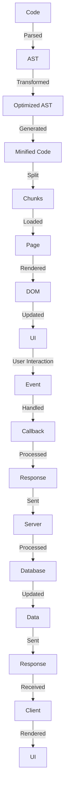

## Introduction
The evolution of frontend tooling has been a remarkable journey, from the early days of no build tools to the current era of highly optimized and efficient tools like Webpack, Vite, esbuild, and Turbopack. In this section, we will explore the history of frontend tooling, from the basics of Grunt and Gulp to the modern era of Webpack and beyond. We will also discuss the importance of understanding these tools and their role in modern frontend development. 
> **Note:** Understanding the evolution of frontend tooling is crucial for any frontend developer, as it helps to appreciate the complexity and challenges of modern web development.

Frontend tooling has become an essential part of modern web development, enabling developers to write efficient, modular, and scalable code. The evolution of these tools has been driven by the need for faster development, better performance, and improved maintainability. In this article, we will delve into the world of frontend tooling, exploring the history, core concepts, and internal workings of these tools.

## Core Concepts
Before diving into the details of frontend tooling, it's essential to understand some core concepts:

* **Module bundling**: The process of combining multiple JavaScript files into a single file, making it easier to manage and optimize code.
* **Minification**: The process of reducing the size of code files by removing unnecessary characters and whitespace.
* **Tree shaking**: The process of removing unused code from a project, reducing the overall size of the codebase.
* **Code splitting**: The process of dividing a large codebase into smaller, more manageable chunks, improving page load times and performance.

> **Warning:** Failure to understand these core concepts can lead to inefficient and poorly optimized code, resulting in slower page loads and a poor user experience.

## How It Works Internally
Let's take a closer look at how some of these tools work internally:

* **Grunt**: Grunt uses a configuration file (Gruntfile) to define tasks and dependencies. It then uses a plugin system to execute these tasks, making it a flexible and customizable tool.
* **Gulp**: Gulp uses a similar approach to Grunt, but with a focus on streams and pipelines. This allows for more efficient and concurrent task execution.
* **Webpack**: Webpack uses a modular approach, with each module being a separate file or chunk. It then uses a resolver to determine the dependencies between modules and creates a dependency graph.
* **Vite**: Vite uses a similar approach to Webpack, but with a focus on speed and performance. It uses a plugin system to extend its functionality and supports features like code splitting and tree shaking.

> **Tip:** Understanding how these tools work internally can help you optimize your code and improve performance.

## Code Examples
Here are three complete and runnable examples of frontend tooling in action:

### Example 1: Basic Gulp Setup
```javascript
// gulpfile.js
const gulp = require('gulp');
const uglify = require('gulp-uglify');
const rename = require('gulp-rename');

gulp.task('minify', () => {
  return gulp.src('src/script.js')
    .pipe(uglify())
    .pipe(rename({ suffix: '.min' }))
    .pipe(gulp.dest('dist'));
});
```
This example demonstrates a basic Gulp setup, using the `gulp-uglify` plugin to minify a JavaScript file.

### Example 2: Webpack Configuration
```javascript
// webpack.config.js
const path = require('path');

module.exports = {
  entry: './src/index.js',
  output: {
    filename: 'bundle.js',
    path: path.resolve(__dirname, 'dist'),
  },
  module: {
    rules: [
      {
        test: /\.js$/,
        use: 'babel-loader',
        exclude: /node_modules/,
      },
    ],
  },
};
```
This example demonstrates a basic Webpack configuration, using the `babel-loader` to transpile JavaScript code.

### Example 3: Vite Setup
```javascript
// vite.config.js
import { defineConfig } from 'vite';

export default defineConfig({
  build: {
    outDir: 'dist',
  },
  plugins: [
    // Add plugins here
  ],
});
```
This example demonstrates a basic Vite setup, using the `defineConfig` function to define the build configuration.

## Visual Diagram

This diagram illustrates the process of frontend tooling, from code parsing to UI rendering.

## Comparison
| Tool | Time Complexity | Space Complexity | Pros | Cons | Best For |
| --- | --- | --- | --- | --- | --- |
| Grunt | O(n) | O(n) | Flexible, customizable | Steep learning curve | Small to medium-sized projects |
| Gulp | O(n) | O(n) | Fast, concurrent | Limited plugin ecosystem | Medium to large-sized projects |
| Webpack | O(n^2) | O(n) | Modular, scalable | Complex configuration | Large-sized projects |
| Vite | O(n) | O(n) | Fast, lightweight | Limited plugin ecosystem | Small to medium-sized projects |
| esbuild | O(n) | O(n) | Fast, lightweight | Limited plugin ecosystem | Small to medium-sized projects |
> **Interview:** What are the trade-offs between using Grunt, Gulp, Webpack, and Vite? How would you choose the best tool for a project?

## Real-world Use Cases
* **Google**: Uses Webpack for its Google Maps project, taking advantage of its modular and scalable architecture.
* **Facebook**: Uses a combination of Webpack and Rollup for its React projects, leveraging the strengths of both tools.
* **Microsoft**: Uses Vite for its TypeScript projects, benefiting from its fast and lightweight build process.

## Common Pitfalls
* **Incorrect configuration**: Failure to configure tools correctly can lead to errors and performance issues.
* **Over-optimization**: Over-optimizing code can lead to decreased readability and maintainability.
* **Inadequate testing**: Failing to test code thoroughly can lead to bugs and errors.
* **Insufficient documentation**: Failing to document code and configuration can lead to knowledge gaps and difficulties with maintenance.

> **Warning:** Be careful when optimizing code, as it can lead to decreased readability and maintainability.

## Interview Tips
* **What is your experience with frontend tooling?**: Be prepared to discuss your experience with different tools and how you have used them in projects.
* **How do you optimize code for performance?**: Discuss your approach to optimizing code, including techniques such as minification, tree shaking, and code splitting.
* **What are the trade-offs between different frontend tools?**: Be prepared to discuss the pros and cons of different tools and how you would choose the best tool for a project.

## Key Takeaways
* Frontend tooling is essential for modern web development, enabling developers to write efficient, modular, and scalable code.
* Understanding the evolution of frontend tooling is crucial for appreciating the complexity and challenges of modern web development.
* Core concepts such as module bundling, minification, tree shaking, and code splitting are essential for optimizing code and improving performance.
* Tools like Grunt, Gulp, Webpack, and Vite have different strengths and weaknesses, and choosing the right tool for a project is critical.
* Incorrect configuration, over-optimization, inadequate testing, and insufficient documentation are common pitfalls to avoid when using frontend tooling.
* When interviewing, be prepared to discuss your experience with frontend tooling, how you optimize code for performance, and the trade-offs between different tools.