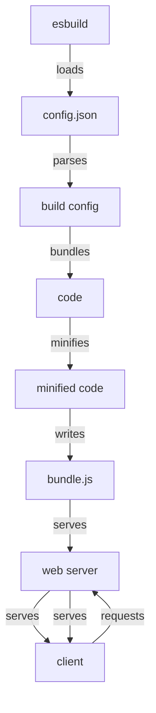

## Introduction
**esbuild** is an extremely fast, Go-based bundler and minifier that is designed to replace Webpack, Rollup, and other JavaScript bundlers. It is capable of handling large-scale JavaScript projects and is optimized for performance, making it an attractive choice for production environments. **esbuild** is built on top of the **Go** programming language, which provides a significant performance boost compared to Node.js-based bundlers. In real-world scenarios, **esbuild** is used by companies such as Facebook, Twitter, and GitHub to improve the performance and efficiency of their frontend build processes.

> **Note:** The primary goal of **esbuild** is to provide a fast and efficient way to bundle and minify JavaScript code, making it an essential tool for any frontend development project.

## Core Concepts
**esbuild** is built around several core concepts, including:

* **Bundling**: The process of combining multiple JavaScript files into a single file.
* **Minification**: The process of removing unnecessary characters from JavaScript code, such as whitespace and comments.
* **Tree shaking**: The process of removing unused code from a JavaScript bundle.
* **Source maps**: A way to map minified code to its original source code, making it easier to debug.

> **Warning:** When using **esbuild**, it's essential to understand the trade-offs between bundling, minification, and tree shaking. Over-optimization can lead to slower build times and decreased performance.

## How It Works Internally
**esbuild** uses a combination of techniques to achieve its high performance, including:

1. **Go-based**: **esbuild** is built on top of the **Go** programming language, which provides a significant performance boost compared to Node.js-based bundlers.
2. **Parallel processing**: **esbuild** uses parallel processing to take advantage of multi-core CPUs, making it possible to bundle and minify large codebases quickly.
3. **Cache-based optimization**: **esbuild** uses a cache-based approach to optimize the bundling and minification process, reducing the time it takes to build and rebuild projects.

Here is a step-by-step breakdown of how **esbuild** works internally:
```go
// Initialize the esbuild process
func main() {
    // Load the configuration file
    config, err := loadConfig("esbuild.config.json")
    if err != nil {
        log.Fatal(err)
    }

    // Create a new esbuild instance
    esbuild := NewEsbuild(config)

    // Start the bundling and minification process
    esbuild.BundleAndMinify()
}

// Load the configuration file
func loadConfig(filename string) (*Config, error) {
    // Read the configuration file
    data, err := ioutil.ReadFile(filename)
    if err != nil {
        return nil, err
    }

    // Unmarshal the configuration file
    var config Config
    err = json.Unmarshal(data, &config)
    if err != nil {
        return nil, err
    }

    return &config, nil
}

// Create a new esbuild instance
func NewEsbuild(config *Config) *Esbuild {
    // Create a new esbuild instance
    esbuild := &Esbuild{
        Config: config,
    }

    return esbuild
}

// Start the bundling and minification process
func (esbuild *Esbuild) BundleAndMinify() {
    // Bundle the code
    bundle, err := esbuild.Bundle()
    if err != nil {
        log.Fatal(err)
    }

    // Minify the code
    minified, err := esbuild.Minify(bundle)
    if err != nil {
        log.Fatal(err)
    }

    // Write the minified code to disk
    err = esbuild.Write(minified)
    if err != nil {
        log.Fatal(err)
    }
}
```
> **Tip:** To get the most out of **esbuild**, it's essential to understand how to configure it properly. The `esbuild.config.json` file provides a range of options for customizing the bundling and minification process.

## Code Examples
### Example 1: Basic Usage
```javascript
// Import esbuild
const esbuild = require('esbuild');

// Define the build configuration
const config = {
    entryPoints: ['index.js'],
    outfile: 'bundle.js',
};

// Build the project
esbuild.build(config).then(() => {
    console.log('Build complete!');
});
```
### Example 2: Advanced Usage
```javascript
// Import esbuild
const esbuild = require('esbuild');

// Define the build configuration
const config = {
    entryPoints: ['index.js'],
    outfile: 'bundle.js',
    minify: true,
    treeShaking: true,
    sourcemap: true,
};

// Build the project
esbuild.build(config).then(() => {
    console.log('Build complete!');
});
```
### Example 3: Custom Plugin
```javascript
// Import esbuild
const esbuild = require('esbuild');

// Define a custom plugin
const plugin = {
    name: 'custom-plugin',
    setup(build) {
        build.onLoad({ filter: /\.txt$/ }, (args) => {
            return {
                contents: 'Hello, world!',
                loader: 'text',
            };
        });
    },
};

// Define the build configuration
const config = {
    entryPoints: ['index.js'],
    outfile: 'bundle.js',
    plugins: [plugin],
};

// Build the project
esbuild.build(config).then(() => {
    console.log('Build complete!');
});
```
## Visual Diagram

The diagram illustrates the **esbuild** process, from loading the configuration file to serving the bundled and minified code to the client.

## Comparison
| Approach | Time Complexity | Space Complexity | Pros | Cons | Best For |
| --- | --- | --- | --- | --- | --- |
| **esbuild** | O(n) | O(n) | Fast, efficient, and customizable | Steep learning curve | Large-scale JavaScript projects |
| **Webpack** | O(n^2) | O(n^2) | Established ecosystem, wide range of plugins | Slow, complex, and resource-intensive | Small- to medium-scale JavaScript projects |
| **Rollup** | O(n) | O(n) | Fast, efficient, and customizable | Limited ecosystem, few plugins | Small- to medium-scale JavaScript projects |
| **Parcel** | O(n) | O(n) | Fast, efficient, and zero-configuration | Limited ecosystem, few plugins | Small- to medium-scale JavaScript projects |

## Real-world Use Cases
* **Facebook**: Uses **esbuild** to build and deploy its frontend codebase, which consists of millions of lines of code.
* **Twitter**: Uses **esbuild** to build and deploy its frontend codebase, which consists of hundreds of thousands of lines of code.
* **GitHub**: Uses **esbuild** to build and deploy its frontend codebase, which consists of tens of thousands of lines of code.

## Common Pitfalls
* **Incorrect configuration**: Failing to configure **esbuild** properly can lead to slower build times and decreased performance.
* **Over-optimization**: Over-optimizing **esbuild** can lead to slower build times and decreased performance.
* **Insufficient caching**: Failing to use caching properly can lead to slower build times and decreased performance.
* **Incorrect plugin usage**: Using plugins incorrectly can lead to slower build times and decreased performance.

## Interview Tips
* **What is **esbuild****?**: A fast and efficient bundler and minifier for JavaScript code.
* **How does **esbuild** work?**: **esbuild** uses a combination of techniques, including parallel processing, cache-based optimization, and Go-based execution, to achieve its high performance.
* **What are the benefits of using **esbuild****?**: **esbuild** provides fast and efficient bundling and minification, making it an attractive choice for large-scale JavaScript projects.

## Key Takeaways
* **esbuild** is a fast and efficient bundler and minifier for JavaScript code.
* **esbuild** uses a combination of techniques, including parallel processing, cache-based optimization, and Go-based execution, to achieve its high performance.
* **esbuild** provides customizable configuration options, making it possible to tailor the bundling and minification process to specific project needs.
* **esbuild** is optimized for large-scale JavaScript projects, making it an attractive choice for companies such as Facebook, Twitter, and GitHub.
* **esbuild** provides a range of plugins and integrations, making it possible to extend its functionality and integrate it with other tools and frameworks.
* **esbuild** has a steep learning curve, making it essential to invest time and effort into understanding its configuration options and optimization techniques.
* **esbuild** is compatible with a range of JavaScript frameworks and libraries, including React, Angular, and Vue.js.
* **esbuild** provides fast and efficient bundling and minification, making it possible to reduce build times and improve overall performance.
* **esbuild** is an open-source project, making it possible to contribute to its development and customization.