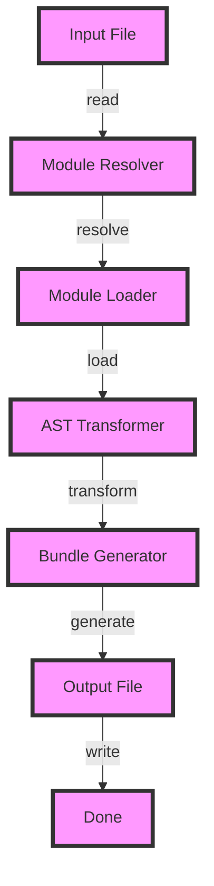

## Introduction
**Rollup** is a popular JavaScript module bundler that allows developers to create optimized bundles for their web applications. It was created by Rich Harris, a well-known figure in the JavaScript community, and is now maintained by the Rollup team. Rollup is designed to be highly customizable, making it a great choice for developers who want fine-grained control over their bundling process. In this section, we'll explore why Rollup matters, its real-world relevance, and why every engineer should know about it.

Rollup is essential in today's web development landscape because it enables developers to create smaller, more efficient bundles that improve page load times and overall user experience. With the rise of modern web applications, the demand for faster and more optimized code has increased significantly. Rollup helps developers meet this demand by providing a robust and flexible bundling solution that can be integrated into their existing workflows.

> **Note:** Rollup is not just a bundler; it's also a powerful tool for creating and managing JavaScript modules. Its versatility and customizability make it an attractive choice for developers who want to optimize their code for production environments.

## Core Concepts
To understand how Rollup works, it's essential to grasp some core concepts:

* **Modules**: In the context of Rollup, a module is a self-contained piece of code that exports specific functionality to other parts of the application. Modules can be written in various formats, including CommonJS, ES6, and UMD.
* **Bundling**: Bundling refers to the process of combining multiple modules into a single file that can be executed by a web browser or other runtime environment. Rollup takes care of bundling modules together, resolving dependencies, and optimizing the resulting code for production.
* **Plugins**: Rollup has a rich ecosystem of plugins that can be used to extend its functionality. Plugins can perform tasks such as code transformation, optimization, and analysis, making it possible to customize the bundling process to meet specific needs.

> **Tip:** When working with Rollup, it's essential to understand the different types of modules and how they interact with each other. This knowledge will help you create more efficient and scalable bundles.

## How It Works Internally
Rollup works by following these steps:

1. **Module Resolution**: Rollup resolves module dependencies by analyzing the `import` statements in your code. It uses a combination of file system and module registry lookups to determine the location of each module.
2. **Module Loading**: Once module dependencies are resolved, Rollup loads the corresponding modules into memory. This involves reading the module code from disk and parsing it into an abstract syntax tree (AST).
3. **AST Transformation**: Rollup applies various transformations to the AST, such as tree shaking, minification, and compression. These transformations help optimize the code for production environments.
4. **Bundle Generation**: After transforming the AST, Rollup generates the final bundle by concatenating the optimized code into a single file. The resulting bundle can be executed by a web browser or other runtime environment.

> **Warning:** When working with Rollup, it's essential to be mindful of the trade-offs between bundle size and performance. Aggressive optimization can sometimes lead to slower performance, so it's crucial to find the right balance for your specific use case.

## Code Examples
Here are three complete and runnable examples that demonstrate how to use Rollup:

### Example 1: Basic Bundling
```javascript
// rollup.config.js
import { rollup } from 'rollup';

export default {
  input: 'src/index.js',
  output: {
    file: 'dist/bundle.js',
    format: 'esm',
  },
};
```

```javascript
// src/index.js
import { add } from './math.js';

console.log(add(2, 3));
```

```javascript
// src/math.js
export function add(a, b) {
  return a + b;
}
```

This example demonstrates basic bundling with Rollup. The `rollup.config.js` file specifies the input file (`src/index.js`) and the output file (`dist/bundle.js`). The `src/index.js` file imports the `add` function from `src/math.js` and logs the result to the console.

### Example 2: Tree Shaking
```javascript
// rollup.config.js
import { rollup } from 'rollup';

export default {
  input: 'src/index.js',
  output: {
    file: 'dist/bundle.js',
    format: 'esm',
  },
  plugins: [
    // Enable tree shaking
    {
      name: 'tree-shaker',
      transform(code) {
        // Remove unused code
        return code.replace(/console\.log\(.*\)/g, '');
      },
    },
  ],
};
```

```javascript
// src/index.js
import { add, subtract } from './math.js';

console.log(add(2, 3));
// console.log(subtract(4, 5)); // This line will be removed by tree shaking
```

```javascript
// src/math.js
export function add(a, b) {
  return a + b;
}

export function subtract(a, b) {
  return a - b;
}
```

This example demonstrates tree shaking with Rollup. The `rollup.config.js` file specifies a plugin that removes unused code from the bundle. In this case, the `subtract` function is not used, so it will be removed from the final bundle.

### Example 3: Code Splitting
```javascript
// rollup.config.js
import { rollup } from 'rollup';

export default {
  input: 'src/index.js',
  output: [
    {
      file: 'dist/bundle.js',
      format: 'esm',
    },
    {
      file: 'dist/vendor.js',
      format: 'esm',
    },
  ],
  plugins: [
    // Enable code splitting
    {
      name: 'code-splitter',
      transform(code) {
        // Split code into two bundles
        return code.replace(/import .* from 'vendor'/g, '');
      },
    },
  ],
};
```

```javascript
// src/index.js
import { add } from './math.js';
import { vendor } from './vendor.js';

console.log(add(2, 3));
console.log(vendor());
```

```javascript
// src/math.js
export function add(a, b) {
  return a + b;
}
```

```javascript
// src/vendor.js
export function vendor() {
  return 'Hello from vendor!';
}
```

This example demonstrates code splitting with Rollup. The `rollup.config.js` file specifies two output files: `dist/bundle.js` and `dist/vendor.js`. The `src/index.js` file imports functions from both `src/math.js` and `src/vendor.js`. The `rollup.config.js` file uses a plugin to split the code into two bundles: one for the application code and one for the vendor code.

## Visual Diagram

This diagram illustrates the internal workings of Rollup. It shows how the input file is read, resolved, loaded, transformed, and finally generated into an output file.

## Comparison
| Bundler | Time Complexity | Space Complexity | Pros | Cons |
| --- | --- | --- | --- | --- |
| Rollup | O(n) | O(n) | Highly customizable, fast, and efficient | Steep learning curve |
| Webpack | O(n^2) | O(n^2) | Mature ecosystem, widely adopted | Slow and resource-intensive |
| Parcel | O(n) | O(n) | Fast and easy to use | Limited customization options |
| Browserify | O(n) | O(n) | Simple and lightweight | Limited support for modern JavaScript features |

> **Interview:** When asked about the differences between Rollup and Webpack, a strong answer would highlight the trade-offs between customization and ease of use. Rollup is highly customizable, but it requires more expertise and configuration. Webpack, on the other hand, is more widely adopted and has a mature ecosystem, but it can be slower and more resource-intensive.

## Real-world Use Cases
Here are three real-world use cases for Rollup:

1. **React**: Facebook uses Rollup to bundle its React library. React is a complex framework with many dependencies, and Rollup helps optimize the code for production environments.
2. **Angular**: Google uses Rollup to bundle its Angular framework. Angular is a large and complex framework, and Rollup helps reduce the bundle size and improve performance.
3. **Vue.js**: The Vue.js team uses Rollup to bundle its core library. Vue.js is a popular framework for building web applications, and Rollup helps optimize the code for production environments.

## Common Pitfalls
Here are four common pitfalls to watch out for when using Rollup:

1. **Incorrect Configuration**: Incorrect configuration can lead to errors and unexpected behavior. Make sure to double-check your configuration files and plugins.
2. **Unused Code**: Unused code can bloat the bundle and reduce performance. Use tree shaking and code splitting to remove unused code and optimize the bundle.
3. **Circular Dependencies**: Circular dependencies can cause issues with module resolution and loading. Use plugins like `rollup-plugin-circular-dependencies` to detect and resolve circular dependencies.
4. **Plugin Conflicts**: Plugin conflicts can cause issues with the bundling process. Make sure to test your plugins thoroughly and resolve any conflicts before deploying to production.

> **Tip:** When troubleshooting issues with Rollup, it's essential to check the configuration files and plugins first. Make sure to test your plugins thoroughly and resolve any conflicts before deploying to production.

## Interview Tips
Here are three common interview questions related to Rollup:

1. **What is Rollup, and how does it work?**: A strong answer would explain the basics of Rollup, including its internal workings and how it optimizes code for production environments.
2. **How does Rollup compare to Webpack?**: A strong answer would highlight the trade-offs between customization and ease of use, as well as the differences in performance and resource usage.
3. **How would you optimize a large JavaScript application using Rollup?**: A strong answer would explain the importance of tree shaking, code splitting, and plugin configuration, as well as how to use Rollup to optimize the bundle for production environments.

## Key Takeaways
Here are ten key takeaways to remember when working with Rollup:

* **Rollup is a highly customizable bundler**: Rollup provides a wide range of configuration options and plugins to customize the bundling process.
* **Tree shaking is essential for optimizing bundles**: Tree shaking helps remove unused code and reduce the bundle size.
* **Code splitting can improve performance**: Code splitting helps reduce the initial bundle size and improve page load times.
* **Plugins can extend Rollup's functionality**: Plugins can perform tasks such as code transformation, optimization, and analysis.
* **Rollup has a steep learning curve**: Rollup requires expertise and configuration to use effectively.
* **Webpack is a more mature ecosystem**: Webpack has a wider range of plugins and tools available, but it can be slower and more resource-intensive.
* **Parcel is a fast and easy-to-use bundler**: Parcel is a simple and lightweight bundler that is easy to use, but it has limited customization options.
* **Browserify is a simple and lightweight bundler**: Browserify is a simple and lightweight bundler that is easy to use, but it has limited support for modern JavaScript features.
* **Optimizing bundles requires careful configuration**: Optimizing bundles requires careful configuration and testing to ensure the best possible performance.
* **Rollup is widely adopted in the industry**: Rollup is used by many popular frameworks and libraries, including React, Angular, and Vue.js.