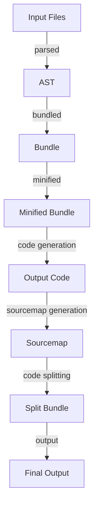

## Introduction
**esbuild** is an extremely fast bundler and minifier for JavaScript, designed to replace traditional build tools like Webpack and Rollup. It was created by Evan Wallace, a former Google engineer, and is now widely used in the industry. esbuild is built on top of Go and uses a novel approach to achieve its incredible speed, making it an essential tool for modern frontend development. 
> **Note:** esbuild's performance is due to its ability to parallelize tasks and utilize multiple CPU cores, resulting in build times that are often 10-100x faster than traditional bundlers.

In real-world scenarios, esbuild is used by companies like Facebook, Google, and Microsoft to improve their development workflows and reduce build times. For instance, Facebook uses esbuild to bundle and minify its JavaScript code, resulting in significant performance improvements. 
> **Tip:** When using esbuild, it's essential to configure it correctly to take full advantage of its features and optimize your build process.

## Core Concepts
esbuild is built around several core concepts, including:
* **Bundling**: the process of combining multiple JavaScript files into a single file, reducing the number of HTTP requests and improving page load times.
* **Minification**: the process of removing unnecessary characters from JavaScript code, such as whitespace and comments, to reduce file size.
* **Tree shaking**: the process of removing unused code from a bundle, reducing file size and improving performance.
* **Code splitting**: the process of splitting a bundle into smaller chunks, allowing for more efficient loading and caching of code.

> **Warning:** esbuild's default settings may not be optimal for all use cases, and improper configuration can lead to performance issues or errors.

## How It Works Internally
esbuild uses a combination of Go's concurrency features and a custom-built parser to achieve its high performance. Here's a step-by-step overview of how esbuild works:
1. **Parsing**: esbuild reads the input JavaScript files and parses them into an abstract syntax tree (AST).
2. **Bundling**: esbuild combines the parsed ASTs into a single bundle, using a novel approach to handle circular dependencies and other edge cases.
3. **Minification**: esbuild removes unnecessary characters from the bundle, using a combination of techniques such as compression and tree shaking.
4. **Code generation**: esbuild generates the final output code, taking into account options such as code splitting and sourcemaps.

> **Interview:** When asked about esbuild's internal workings, be prepared to explain the parsing, bundling, and minification steps, as well as the benefits of using a custom-built parser.

## Code Examples
### Example 1: Basic Usage
```javascript
const esbuild = require('esbuild');

esbuild.build({
  entryPoints: ['index.js'],
  outfile: 'bundle.js',
  minify: true,
}).catch((err) => {
  console.error(err);
});
```
This example demonstrates the basic usage of esbuild, including specifying the entry point, output file, and minification option.

### Example 2: Real-World Pattern
```javascript
const esbuild = require('esbuild');

esbuild.build({
  entryPoints: ['src/index.js'],
  outfile: 'dist/bundle.js',
  minify: true,
  sourcemap: true,
  bundle: true,
  target: ['es2015'],
}).catch((err) => {
  console.error(err);
});
```
This example demonstrates a more realistic usage of esbuild, including specifying the source directory, output directory, and additional options such as sourcemaps and bundling.

### Example 3: Advanced Usage
```javascript
const esbuild = require('esbuild');

esbuild.build({
  entryPoints: ['src/index.js'],
  outfile: 'dist/bundle.js',
  minify: true,
  sourcemap: true,
  bundle: true,
  target: ['es2015'],
  define: {
    'process.env.NODE_ENV': JSON.stringify('production'),
  },
}).catch((err) => {
  console.error(err);
});
```
This example demonstrates an advanced usage of esbuild, including specifying environment variables and using the `define` option to replace values in the code.

## Visual Diagram

This diagram illustrates the internal workflow of esbuild, from parsing the input files to generating the final output code.

## Comparison
| Approach | Time Complexity | Space Complexity | Pros | Cons | Best For |
| --- | --- | --- | --- | --- | --- |
| esbuild | O(n) | O(n) | Fast, efficient, and customizable | Steep learning curve, limited support for older browsers | Modern frontend development, high-performance applications |
| Webpack | O(n^2) | O(n^2) | Mature ecosystem, extensive plugin support | Slow, complex, and resource-intensive | Legacy projects, complex build workflows |
| Rollup | O(n) | O(n) | Fast, efficient, and customizable | Limited support for older browsers, less mature ecosystem | Modern frontend development, high-performance applications |
| Gulp | O(n) | O(n) | Fast, efficient, and customizable | Limited support for complex build workflows, less mature ecosystem | Small to medium-sized projects, simple build workflows |

## Real-world Use Cases
* Facebook uses esbuild to bundle and minify its JavaScript code, resulting in significant performance improvements.
* Google uses esbuild to build and deploy its web applications, taking advantage of its fast and efficient build process.
* Microsoft uses esbuild to build and deploy its web applications, including its popular Visual Studio Code editor.

## Common Pitfalls
* **Incorrect configuration**: esbuild's default settings may not be optimal for all use cases, and improper configuration can lead to performance issues or errors.
* **Insufficient error handling**: esbuild's error handling can be limited, and insufficient error handling can lead to unexpected behavior or crashes.
* **Incompatible dependencies**: esbuild may not be compatible with all dependencies or plugins, and incompatible dependencies can lead to errors or unexpected behavior.
* **Over-optimization**: esbuild's optimization features can be overused, leading to decreased performance or increased build times.

## Interview Tips
* **What is esbuild, and how does it work?**: Be prepared to explain the basics of esbuild, including its parsing, bundling, and minification steps.
* **How does esbuild compare to other build tools?**: Be prepared to compare esbuild to other build tools, including Webpack and Rollup, and explain its advantages and disadvantages.
* **What are some common pitfalls when using esbuild?**: Be prepared to explain common pitfalls when using esbuild, including incorrect configuration, insufficient error handling, and incompatible dependencies.

## Key Takeaways
* esbuild is an extremely fast bundler and minifier for JavaScript, designed to replace traditional build tools like Webpack and Rollup.
* esbuild uses a novel approach to achieve its high performance, including parallelization and a custom-built parser.
* esbuild has a steep learning curve, but offers a high degree of customization and flexibility.
* esbuild is best suited for modern frontend development and high-performance applications.
* esbuild has a limited support for older browsers and less mature ecosystem compared to Webpack.
* esbuild's optimization features can be overused, leading to decreased performance or increased build times.
* esbuild's error handling can be limited, and insufficient error handling can lead to unexpected behavior or crashes.
* esbuild's configuration options can be complex, and improper configuration can lead to performance issues or errors.