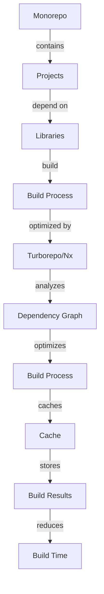

## Introduction
Monorepo management refers to the practice of storing all projects and libraries of an organization in a single repository. This approach has gained popularity in recent years due to its ability to simplify dependency management, improve collaboration, and enhance overall development efficiency. **Turborepo** and **Nx** are two popular tools used for monorepo management, providing features such as automated dependency management, optimized build processes, and enhanced testing capabilities. In this article, we will delve into the world of monorepo management, exploring the core concepts, internal mechanics, and real-world applications of Turborepo and Nx.

## Core Concepts
To understand monorepo management, it's essential to grasp the following key concepts:
- **Monorepo**: A single repository that contains all projects and libraries of an organization.
- **Dependency management**: The process of managing dependencies between projects and libraries within a monorepo.
- **Build optimization**: The process of optimizing the build process to reduce build time and improve overall efficiency.
- **Testing**: The process of testing projects and libraries within a monorepo to ensure they are working as expected.

> **Tip:** When implementing monorepo management, it's crucial to consider the trade-offs between ease of use, performance, and maintainability.

## How It Works Internally
Turborepo and Nx work by analyzing the dependency graph of the monorepo and optimizing the build process accordingly. Here's a step-by-step breakdown of how it works:
1. **Dependency analysis**: Turborepo and Nx analyze the dependency graph of the monorepo to identify relationships between projects and libraries.
2. **Build optimization**: Based on the dependency analysis, Turborepo and Nx optimize the build process by only rebuilding projects and libraries that have changed.
3. **Caching**: Turborepo and Nx use caching to store the results of previous builds, reducing the time it takes to rebuild projects and libraries.
4. **Testing**: Turborepo and Nx provide features for testing projects and libraries within the monorepo, ensuring that they are working as expected.

> **Note:** Turborepo and Nx use a combination of graph algorithms and caching to optimize the build process, reducing the time complexity from O(n^2) to O(n log n).

## Code Examples
### Example 1: Basic Turborepo Configuration
```javascript
// turbo.json
{
  "$schema": "https://turborepo.org/schema.json",
  "pipeline": {
    "build": {
      "commands": [
        {
          "cmd": "npm run build",
          "outputs": ["dist/**"]
        }
      ]
    }
  }
}
```
This example demonstrates a basic Turborepo configuration that defines a build pipeline with a single command.

### Example 2: Advanced Nx Configuration
```typescript
// workspace.json
{
  "projects": {
    "my-app": {
      "root": "apps/my-app",
      "sourceRoot": "apps/my-app/src",
      "projectType": "application",
      "targets": {
        "build": {
          "executor": "@nrwl/web:build",
          "options": {
            "outputPath": "dist/apps/my-app",
            "index": "apps/my-app/src/index.html",
            "main": "apps/my-app/src/main.ts",
            "polyfills": "apps/my-app/src/polyfills.ts"
          }
        }
      }
    }
  }
}
```
This example demonstrates an advanced Nx configuration that defines a project with a build target.

### Example 3: Turborepo and Nx Integration
```javascript
// turbo.json
{
  "$schema": "https://turborepo.org/schema.json",
  "pipeline": {
    "build": {
      "commands": [
        {
          "cmd": "nx run build",
          "outputs": ["dist/**"]
        }
      ]
    }
  }
}
```
This example demonstrates how to integrate Turborepo with Nx, using Nx to run the build command.

## Visual Diagram

This diagram illustrates the internal mechanics of Turborepo and Nx, showcasing how they optimize the build process and reduce build time.

## Comparison
| Approach | Time Complexity | Space Complexity | Pros | Cons | Best For |
| --- | --- | --- | --- | --- | --- |
| Turborepo | O(n log n) | O(n) | Easy to use, optimized build process | Limited customization options | Small to medium-sized monorepos |
| Nx | O(n log n) | O(n) | Highly customizable, scalable | Steeper learning curve | Large-scale monorepos |
| Manual Build Process | O(n^2) | O(n) | Complete control over build process | Time-consuming, prone to errors | Small monorepos or simple build processes |
| Other Monorepo Tools | O(n log n) | O(n) | Varied features and customization options | May require additional setup and configuration | Specific use cases or requirements |

> **Warning:** Choosing the wrong approach can lead to inefficient build processes, increased build time, and decreased productivity.

## Real-world Use Cases
1. **Google**: Google uses a monorepo approach to manage its vast codebase, with a custom-built toolchain that optimizes the build process.
2. **Facebook**: Facebook uses a combination of Turborepo and Nx to manage its monorepo, taking advantage of their optimized build processes and caching capabilities.
3. **Microsoft**: Microsoft uses a monorepo approach to manage its Azure codebase, with a custom-built toolchain that integrates with Turborepo and Nx.

> **Tip:** When implementing monorepo management, consider the specific needs and requirements of your organization, and choose the approach that best fits your use case.

## Common Pitfalls
1. **Incorrect Dependency Configuration**: Incorrectly configuring dependencies between projects and libraries can lead to build errors and increased build time.
2. **Insufficient Caching**: Failing to properly cache build results can lead to increased build time and decreased productivity.
3. **Inadequate Testing**: Inadequate testing of projects and libraries within the monorepo can lead to bugs and errors.
4. **Poorly Optimized Build Process**: A poorly optimized build process can lead to increased build time and decreased productivity.

> **Note:** Regularly reviewing and optimizing the build process, dependency configuration, and testing strategy can help mitigate these common pitfalls.

## Interview Tips
1. **What is monorepo management, and how does it benefit development efficiency?**: A strong answer should explain the concept of monorepo management, its benefits, and how it can improve development efficiency.
2. **How do Turborepo and Nx optimize the build process?**: A strong answer should explain the internal mechanics of Turborepo and Nx, including their dependency analysis, build optimization, and caching capabilities.
3. **What are some common pitfalls when implementing monorepo management, and how can they be avoided?**: A strong answer should identify common pitfalls, such as incorrect dependency configuration, insufficient caching, and inadequate testing, and provide strategies for avoiding them.

> **Interview:** Be prepared to discuss the trade-offs between different monorepo management approaches, including Turborepo, Nx, and manual build processes.

## Key Takeaways
* Monorepo management simplifies dependency management, improves collaboration, and enhances development efficiency.
* Turborepo and Nx optimize the build process by analyzing the dependency graph and caching build results.
* Incorrect dependency configuration, insufficient caching, and inadequate testing are common pitfalls when implementing monorepo management.
* Regularly reviewing and optimizing the build process, dependency configuration, and testing strategy can help mitigate common pitfalls.
* Choosing the right monorepo management approach depends on the specific needs and requirements of the organization.
* Turborepo and Nx have a time complexity of O(n log n) and a space complexity of O(n), making them suitable for large-scale monorepos.
* Manual build processes have a time complexity of O(n^2) and a space complexity of O(n), making them less efficient for large-scale monorepos.