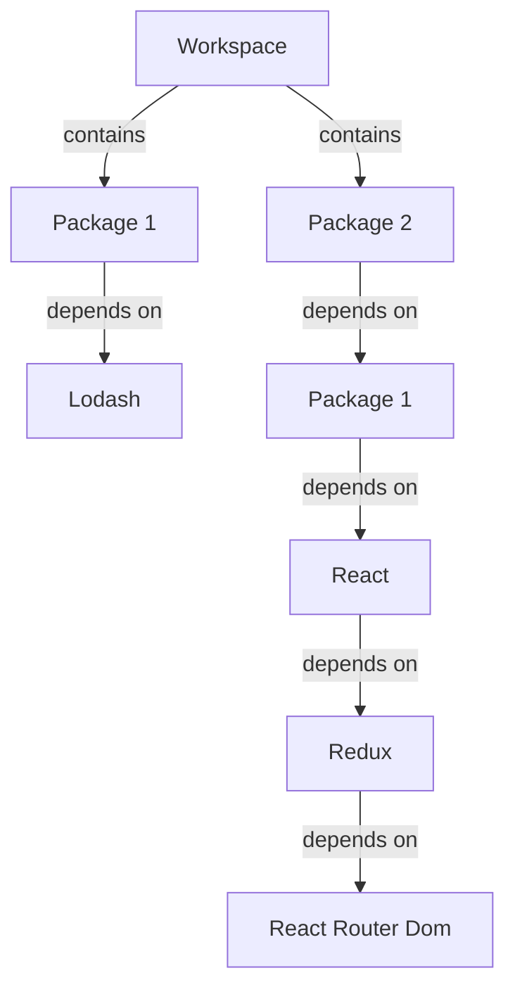

## Introduction
Yarn is a package manager that allows developers to manage dependencies for their projects. It provides a way to install, update, and manage packages, making it easier to work on large-scale projects. One of the key features of Yarn is its support for workspaces and Plug'n'Play (PnP), which enables developers to work on multiple projects simultaneously and manage dependencies more efficiently. In this section, we will explore the concept of Yarn workspaces and PnP, their importance, and real-world relevance.

Yarn workspaces and PnP are essential for frontend development, as they enable developers to manage complex projects with multiple dependencies. With the rise of micro-frontends and modular architecture, Yarn workspaces and PnP have become a crucial tool for managing dependencies and optimizing build times. > **Note:** Yarn workspaces and PnP are not limited to frontend development and can be used in any type of project that requires dependency management.

## Core Concepts
To understand Yarn workspaces and PnP, it's essential to grasp the core concepts and terminology. Here are some key definitions:

* **Workspace**: A workspace is a directory that contains multiple packages. It's a way to group related projects together and manage dependencies between them.
* **Package**: A package is a project that contains its own dependencies and configuration.
* **Plug'n'Play (PnP)**: PnP is a feature of Yarn that allows developers to use packages without installing them locally. Instead, Yarn creates a virtual package that points to the original package.

> **Tip:** Using Yarn workspaces and PnP can simplify dependency management and reduce the size of your project's `node_modules` directory.

## How It Works Internally
Yarn workspaces and PnP work by using a combination of configuration files and internal mechanics. Here's a step-by-step breakdown of how it works:

1. **Configuration**: When you create a new workspace, Yarn generates a `package.json` file that contains metadata about the workspace.
2. **Dependency Resolution**: When you add a dependency to a package, Yarn resolves the dependency and creates a virtual package that points to the original package.
3. **Package Installation**: When you run `yarn install`, Yarn installs the dependencies for each package in the workspace.
4. **PnP**: When you use PnP, Yarn creates a virtual package that points to the original package, instead of installing it locally.

> **Warning:** Using PnP can lead to issues if not configured correctly. Make sure to follow the official Yarn documentation for configuration and troubleshooting.

## Code Examples
Here are three complete and runnable code examples that demonstrate the use of Yarn workspaces and PnP:

### Example 1: Basic Workspace
```javascript
// package.json
{
  "name": "my-workspace",
  "version": "1.0.0",
  "workspaces": [
    "packages/*"
  ]
}

// packages/pkg1/package.json
{
  "name": "pkg1",
  "version": "1.0.0",
  "dependencies": {
    "lodash": "^4.17.21"
  }
}

// packages/pkg2/package.json
{
  "name": "pkg2",
  "version": "1.0.0",
  "dependencies": {
    "pkg1": "^1.0.0"
  }
}
```
This example demonstrates a basic workspace with two packages, `pkg1` and `pkg2`, that depend on each other.

### Example 2: PnP with Dependencies
```javascript
// package.json
{
  "name": "my-workspace",
  "version": "1.0.0",
  "workspaces": [
    "packages/*"
  ],
  "pnp": {
    "enabled": true
  }
}

// packages/pkg1/package.json
{
  "name": "pkg1",
  "version": "1.0.0",
  "dependencies": {
    "lodash": "^4.17.21"
  }
}

// packages/pkg2/package.json
{
  "name": "pkg2",
  "version": "1.0.0",
  "dependencies": {
    "pkg1": "^1.0.0"
  }
}
```
This example demonstrates a workspace with PnP enabled, where dependencies are resolved using virtual packages.

### Example 3: Advanced Workspace with Multiple Dependencies
```javascript
// package.json
{
  "name": "my-workspace",
  "version": "1.0.0",
  "workspaces": [
    "packages/*"
  ],
  "pnp": {
    "enabled": true
  }
}

// packages/pkg1/package.json
{
  "name": "pkg1",
  "version": "1.0.0",
  "dependencies": {
    "lodash": "^4.17.21",
    "react": "^17.0.2"
  }
}

// packages/pkg2/package.json
{
  "name": "pkg2",
  "version": "1.0.0",
  "dependencies": {
    "pkg1": "^1.0.0",
    "redux": "^4.1.0"
  }
}

// packages/pkg3/package.json
{
  "name": "pkg3",
  "version": "1.0.0",
  "dependencies": {
    "pkg2": "^1.0.0",
    "react-router-dom": "^5.2.0"
  }
}
```
This example demonstrates an advanced workspace with multiple dependencies and PnP enabled.

## Visual Diagram

This diagram illustrates a workspace with multiple packages and dependencies.

## Comparison
Here's a comparison table between different approaches to dependency management:

| Approach | Time Complexity | Space Complexity | Pros | Cons | Best For |
| --- | --- | --- | --- | --- | --- |
| Yarn Workspaces | O(n) | O(n) | Simplifies dependency management, reduces `node_modules` size | Can be complex to configure | Large-scale projects with multiple dependencies |
| npm | O(n) | O(n) | Easy to use, widely supported | Can lead to `node_modules` bloat | Small-scale projects with few dependencies |
| Pnpm | O(n) | O(n) | Fast and efficient, supports workspaces | Limited support for some packages | Large-scale projects with multiple dependencies |
| Yarn PnP | O(n) | O(1) | Reduces `node_modules` size, improves performance | Can be complex to configure, limited support for some packages | Large-scale projects with multiple dependencies and performance-critical code |

> **Interview:** Can you explain the difference between Yarn workspaces and npm? How would you choose between the two for a large-scale project?

## Real-world Use Cases
Here are three real-world use cases for Yarn workspaces and PnP:

1. **Facebook**: Facebook uses Yarn workspaces to manage dependencies for its large-scale projects, including React and Instagram.
2. **Google**: Google uses Yarn workspaces to manage dependencies for its Chrome browser and other projects.
3. **Microsoft**: Microsoft uses Yarn workspaces to manage dependencies for its Visual Studio Code editor and other projects.

> **Tip:** Using Yarn workspaces and PnP can simplify dependency management and improve performance for large-scale projects.

## Common Pitfalls
Here are four common pitfalls to watch out for when using Yarn workspaces and PnP:

1. **Incorrect Configuration**: Incorrect configuration of Yarn workspaces and PnP can lead to issues with dependency resolution and package installation.
2. **Package Version Conflicts**: Package version conflicts can occur when using Yarn workspaces and PnP, especially when multiple packages depend on the same package.
3. **Performance Issues**: Performance issues can occur when using Yarn workspaces and PnP, especially when dealing with large-scale projects and complex dependencies.
4. **Limited Support**: Limited support for some packages and dependencies can occur when using Yarn workspaces and PnP.

> **Warning:** Make sure to follow the official Yarn documentation for configuration and troubleshooting to avoid common pitfalls.

## Interview Tips
Here are three common interview questions related to Yarn workspaces and PnP, along with weak and strong answers:

1. **What is the difference between Yarn workspaces and npm?**
	* Weak answer: Yarn workspaces is just a new version of npm.
	* Strong answer: Yarn workspaces is a feature of Yarn that allows developers to manage dependencies for multiple projects simultaneously, while npm is a package manager that installs dependencies locally.
2. **How do you configure Yarn workspaces and PnP?**
	* Weak answer: You just need to add a `workspaces` field to your `package.json` file.
	* Strong answer: You need to add a `workspaces` field to your `package.json` file and configure the `pnp` field to enable PnP.
3. **What are the benefits of using Yarn workspaces and PnP?**
	* Weak answer: It's just a new feature of Yarn.
	* Strong answer: Yarn workspaces and PnP simplify dependency management, reduce `node_modules` size, and improve performance for large-scale projects.

## Key Takeaways
Here are ten key takeaways to remember when using Yarn workspaces and PnP:

* Yarn workspaces is a feature of Yarn that allows developers to manage dependencies for multiple projects simultaneously.
* PnP is a feature of Yarn that allows developers to use packages without installing them locally.
* Yarn workspaces and PnP simplify dependency management and reduce `node_modules` size.
* Yarn workspaces and PnP improve performance for large-scale projects.
* Incorrect configuration of Yarn workspaces and PnP can lead to issues with dependency resolution and package installation.
* Package version conflicts can occur when using Yarn workspaces and PnP.
* Performance issues can occur when using Yarn workspaces and PnP.
* Limited support for some packages and dependencies can occur when using Yarn workspaces and PnP.
* Yarn workspaces and PnP are essential for large-scale projects with multiple dependencies.
* Yarn workspaces and PnP can be complex to configure and require careful planning and management.