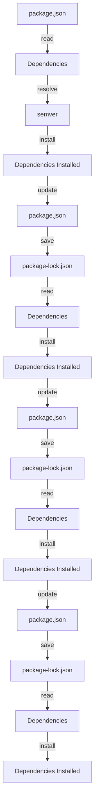

## Introduction
**npm (Node Package Manager)** is the package manager for JavaScript, and it's an essential tool for any JavaScript developer. It allows you to easily install and manage dependencies for your projects. In this section, we'll explore what npm is, why it matters, and its real-world relevance.

npm is a crucial part of the JavaScript ecosystem, and it's used by millions of developers worldwide. It provides a vast repository of packages that can be easily installed and managed, making it an essential tool for building robust and scalable applications. With npm, you can easily install dependencies, manage versions, and even publish your own packages.

> **Note:** npm is not just a package manager; it's also a registry of packages. This means that you can search for and install packages from the npm registry, which contains over 1 million packages.

## Core Concepts
In this section, we'll cover the core concepts of npm, including **package.json**, **scripts**, and **semver**.

* **package.json**: This is the file that contains metadata for your project, including its name, version, dependencies, and scripts. It's used by npm to install dependencies and manage your project.
* **scripts**: These are commands that can be run using npm. They're defined in the **package.json** file and can be used to automate tasks, such as building and testing your application.
* **semver**: This stands for **semantic versioning**, which is a way of versioning packages that allows you to specify the version of a package that your project depends on. It's used by npm to manage dependencies and ensure that your project uses the correct versions of packages.

> **Tip:** When working with npm, it's essential to understand the concept of **semver**. This allows you to specify the version of a package that your project depends on, ensuring that your project uses the correct versions of packages.

## How It Works Internally
In this section, we'll take a look at how npm works internally.

When you run `npm install`, npm reads the **package.json** file and installs the dependencies specified in it. It uses the **semver** system to ensure that the correct versions of packages are installed.

Here's a step-by-step breakdown of how npm works internally:

1. **Read package.json**: npm reads the **package.json** file to determine the dependencies required by your project.
2. **Resolve dependencies**: npm resolves the dependencies specified in **package.json** using the **semver** system.
3. **Install dependencies**: npm installs the dependencies required by your project.
4. **Update package.json**: npm updates the **package.json** file to reflect the versions of packages that were installed.

> **Warning:** When working with npm, it's essential to be careful when updating the **package.json** file. If you update the file manually, you may accidentally introduce errors that can cause issues with your project.

## Code Examples
In this section, we'll take a look at some code examples that demonstrate how to use npm.

### Example 1: Basic Usage
```javascript
// package.json
{
  "name": "my-project",
  "version": "1.0.0",
  "dependencies": {
    "express": "^4.17.1"
  },
  "scripts": {
    "start": "node server.js"
  }
}

// server.js
const express = require('express');
const app = express();

app.get('/', (req, res) => {
  res.send('Hello World!');
});

app.listen(3000, () => {
  console.log('Server started on port 3000');
});
```
In this example, we define a **package.json** file that specifies the dependencies required by our project. We also define a **start** script that runs the **server.js** file.

### Example 2: Real-World Pattern
```javascript
// package.json
{
  "name": "my-project",
  "version": "1.0.0",
  "dependencies": {
    "react": "^17.0.2",
    "react-dom": "^17.0.2"
  },
  "scripts": {
    "start": "react-scripts start",
    "build": "react-scripts build",
    "test": "react-scripts test"
  }
}

// App.js
import React from 'react';
import ReactDOM from 'react-dom';

function App() {
  return <div>Hello World!</div>;
}

ReactDOM.render(<App />, document.getElementById('root'));
```
In this example, we define a **package.json** file that specifies the dependencies required by our React application. We also define **start**, **build**, and **test** scripts that use the **react-scripts** package to manage our application.

### Example 3: Advanced Usage
```javascript
// package.json
{
  "name": "my-project",
  "version": "1.0.0",
  "dependencies": {
    "webpack": "^5.51.1",
    "webpack-cli": "^4.9.1"
  },
  "scripts": {
    "build": "webpack --mode production",
    "start": "webpack serve --mode development"
  }
}

// webpack.config.js
const path = require('path');

module.exports = {
  entry: './src/index.js',
  output: {
    path: path.resolve(__dirname, 'dist'),
    filename: 'bundle.js'
  },
  module: {
    rules: [
      {
        test: /\.js$/,
        use: 'babel-loader',
        exclude: /node_modules/
      }
    ]
  }
};
```
In this example, we define a **package.json** file that specifies the dependencies required by our project. We also define **build** and **start** scripts that use the **webpack** package to manage our application.

## Visual Diagram

This diagram illustrates the process of how npm works internally. It shows how npm reads the **package.json** file, resolves dependencies using **semver**, installs dependencies, and updates the **package.json** file.

## Comparison
| Approach | Time Complexity | Space Complexity | Pros | Cons | Best For |
|----------|----------------|-----------------|------|------|----------|
| npm | O(n) | O(n) | Easy to use, large community, vast repository of packages | Can be slow, prone to dependency hell | Small to medium-sized projects |
| yarn | O(n) | O(n) | Fast, reliable, and secure | Steep learning curve, limited community | Large-scale projects that require high performance |
| pnpm | O(n) | O(n) | Fast, efficient, and scalable | Limited community, not as widely adopted as npm | Large-scale projects that require high performance and scalability |
| bower | O(n) | O(n) | Simple, easy to use, and lightweight | Limited package repository, not as widely adopted as npm | Small projects that require a simple package manager |

## Real-world Use Cases
Here are some real-world use cases of npm:

* **Facebook**: Facebook uses npm to manage its dependencies for its React applications.
* **Google**: Google uses npm to manage its dependencies for its Angular applications.
* **Microsoft**: Microsoft uses npm to manage its dependencies for its TypeScript applications.

## Common Pitfalls
Here are some common pitfalls to watch out for when using npm:

* **Dependency hell**: This occurs when you have conflicting dependencies in your project. To avoid this, make sure to use the **--save** flag when installing dependencies.
* **Outdated dependencies**: This can cause security vulnerabilities and compatibility issues. To avoid this, make sure to regularly update your dependencies using the **npm update** command.
* **Incorrect package.json file**: This can cause issues with your project's dependencies. To avoid this, make sure to double-check your **package.json** file for errors.
* **Insufficient testing**: This can cause issues with your project's stability and reliability. To avoid this, make sure to write comprehensive tests for your project.

> **Warning:** When working with npm, it's essential to be careful when updating the **package.json** file. If you update the file manually, you may accidentally introduce errors that can cause issues with your project.

## Interview Tips
Here are some common interview questions related to npm:

* **What is npm?**: This is a basic question that tests your understanding of npm. A good answer should include a brief overview of what npm is and how it works.
* **How do you manage dependencies with npm?**: This question tests your understanding of how to manage dependencies with npm. A good answer should include a brief overview of how to use the **--save** flag and the **npm update** command.
* **What is semver?**: This question tests your understanding of semantic versioning. A good answer should include a brief overview of what semver is and how it works.

> **Interview:** When answering interview questions related to npm, make sure to show your understanding of the concepts and how they apply to real-world scenarios. A good answer should include a brief overview of the concept, an example of how it works, and a discussion of its pros and cons.

## Key Takeaways
Here are the key takeaways from this section:

* **npm is a package manager for JavaScript**: It provides a vast repository of packages that can be easily installed and managed.
* **package.json is the file that contains metadata for your project**: It's used by npm to install dependencies and manage your project.
* **scripts are commands that can be run using npm**: They're defined in the **package.json** file and can be used to automate tasks, such as building and testing your application.
* **semver is a way of versioning packages**: It allows you to specify the version of a package that your project depends on, ensuring that your project uses the correct versions of packages.
* **npm uses a recursive dependency resolution algorithm**: It resolves dependencies recursively, ensuring that all dependencies are installed correctly.
* **npm provides a range of commands for managing dependencies**: These include **npm install**, **npm update**, and **npm uninstall**.
* **npm provides a range of commands for managing scripts**: These include **npm start**, **npm build**, and **npm test**.
* **npm is widely adopted and has a large community**: It's used by millions of developers worldwide and has a large community of contributors and maintainers.
* **npm has a range of tools and integrations**: It integrates with a range of tools, including **webpack**, **babel**, and **jest**.